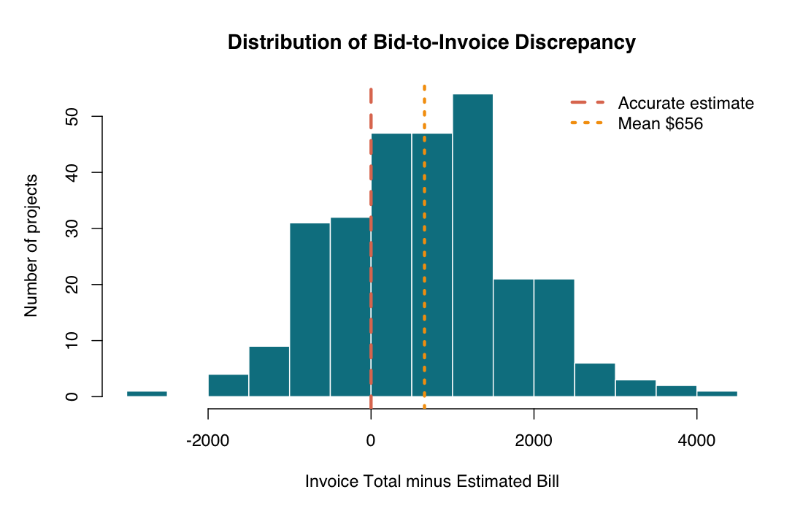
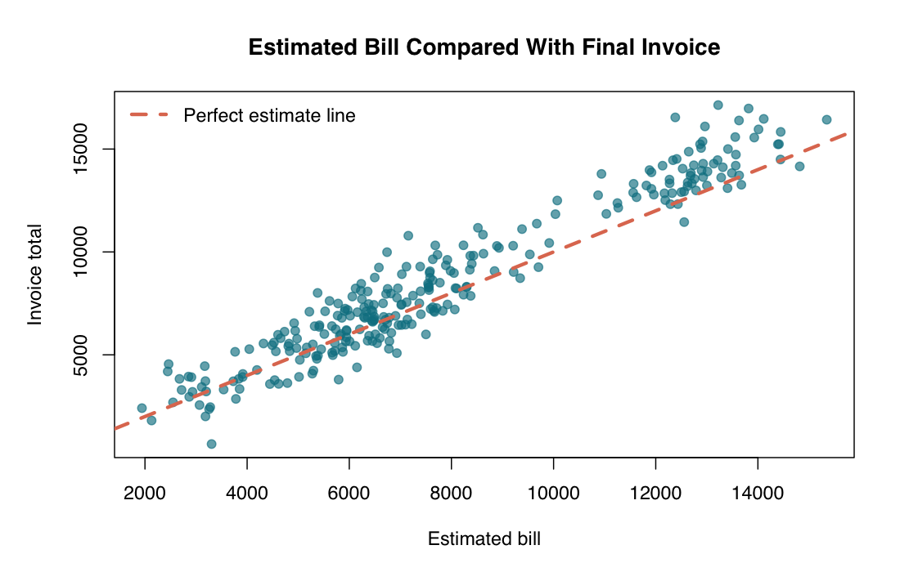
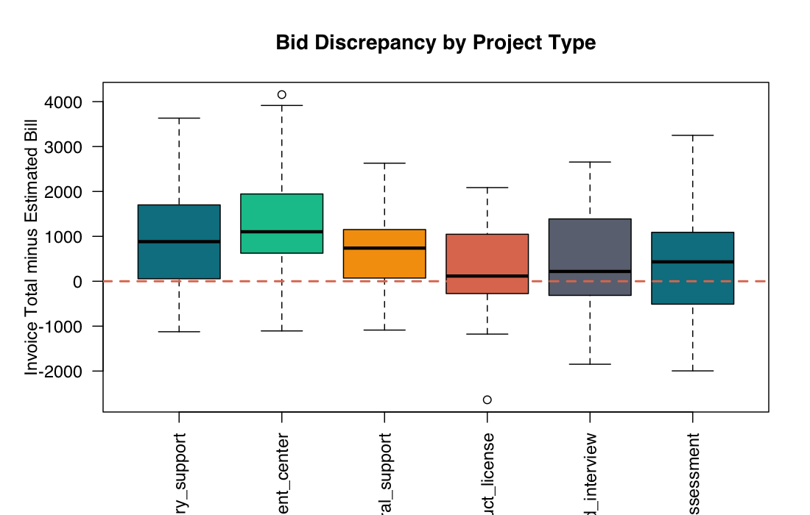
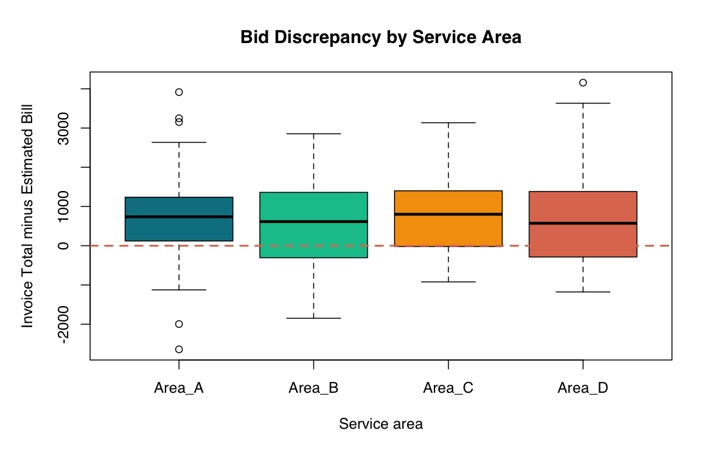
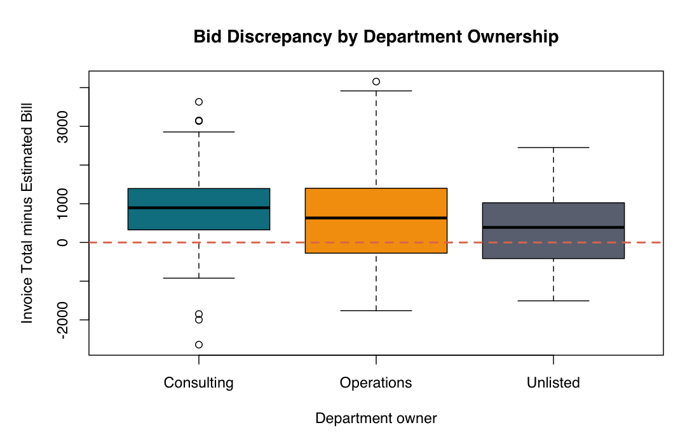
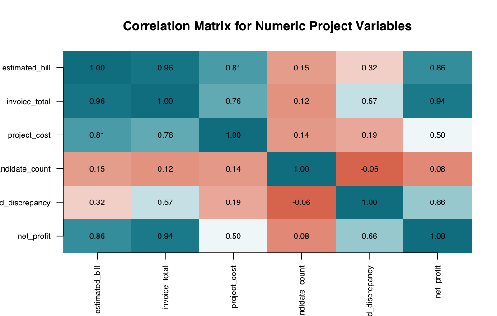
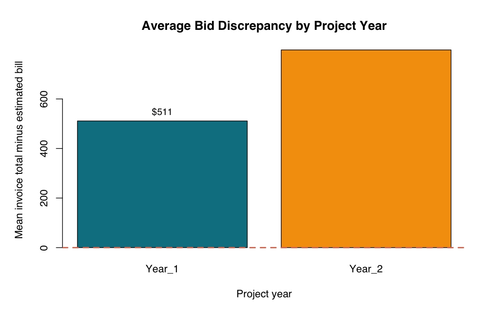
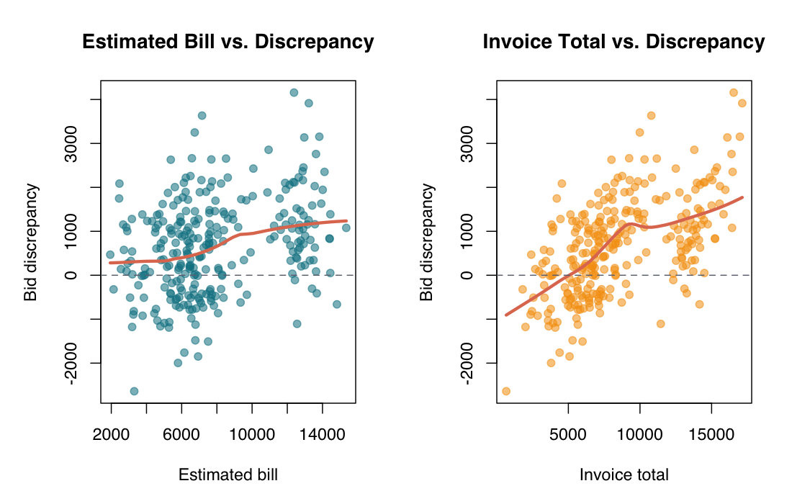
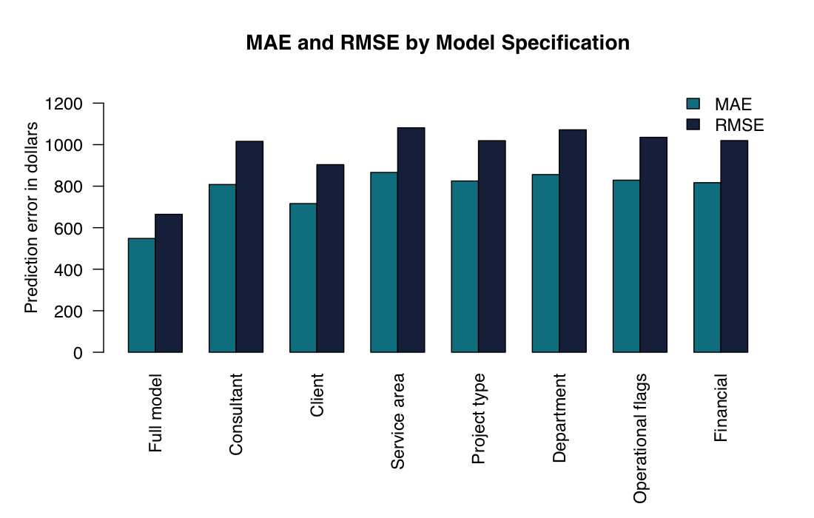

# Consulting Bid Accuracy Analysis — Analysis Workflow

This rendered workflow summarizes the analysis produced by `04_Source_Report.Rmd`. The source file contains the executable R Markdown code; this file documents the analytical path and stable figure outputs without requiring a local R run.

## 1. Data Setup

The project begins by loading the synthetic, anonymized public dataset (`data.csv`) and factor-encoding categorical predictors so that the regression models treat project lead, client account, service area, project type, and department ownership as grouped categories rather than continuous numeric values. The outcome variable is `bid_discrepancy`, defined as:

```text
invoice_total - estimated_bill
```

Positive values indicate underestimation, negative values indicate overestimation, and values near zero indicate accurate estimation.

## 2. Exploratory Analysis



The discrepancy distribution is centered near zero but spreads in both directions. This is the first signal that the firm did not have a simple "always too high" or "always too low" problem; instead, accuracy varied meaningfully by project.



The diagonal line represents perfect estimate accuracy. The visible spread above and below the line shows why the analysis focused on explaining where estimation broke down rather than only describing average error.



Project type has some patterning, but there is substantial overlap across categories. That means project type alone is not enough to explain estimation accuracy.



Service area does not separate the discrepancy pattern cleanly. This helped rule out broad repricing by service category as the main recommendation.



Unlisted department ownership is associated with less stable estimation. In the consulting context, that suggests intake completeness and estimation discipline are linked.



The financial variables are strongly related, which is expected because invoice total, estimated bill, project cost, discrepancy, and net profit are mathematically connected. This informed the decision to compare separate model specifications rather than overloading one model with overlapping financial predictors.



The issue appears across both project years, supporting the interpretation that bid accuracy was a recurring process issue rather than a one-year anomaly.

## 3. Assumption Testing



The lowess lines show non-linear relationships between financial predictors and bid discrepancy. Combined with residual normality and independence concerns documented in the report, this is why the final results are interpreted conservatively.

## 4. Model Comparison



The model comparison points to the full model as the strongest prediction tool and the client-account model as one of the most useful diagnostic views. Comparing MAE and RMSE also shows where extreme-discrepancy projects are driving additional error.

## 5. Interpretation

The strongest pattern is that estimation error was more concentrated around specific client and consultant patterns than around broad service categories. That matters because it changes the intervention: instead of redesigning the entire pricing model, the firm could begin with targeted account review, project-lead debriefs, travel-estimate recalibration, and required department ownership at intake.
