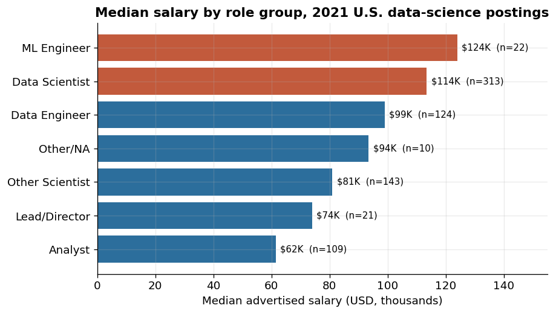
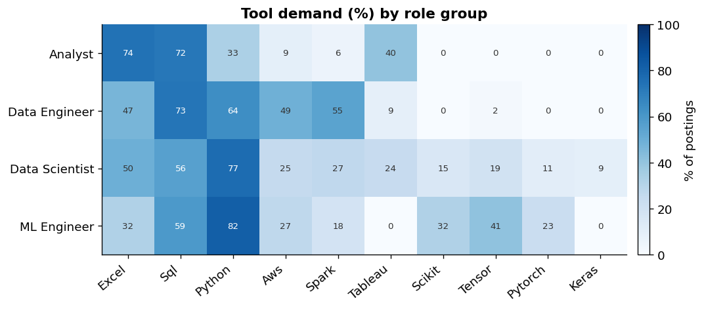

# U.S. Data Scientist Market Analysis (2021) — Summary

**The question:** When you look at salary, location, employer type, and skill demand together — not one at a time — what does the 2021 U.S. data-science hiring market actually look like, and what would that tell a team planning hiring or workforce strategy?

**The data:** 742 U.S. job postings from a public extract of a Glassdoor scrape, covering role type, advertised salary, location, company profile, required degree, and 16 tool/skill flags.

## What was found

**Pay tracked role and level more than anything else.** Median advertised salary across the sample was $97.5K, but it spread widely by role: machine-learning engineer postings led at a median of $124K, data scientists at $114K, and data engineers at $99K, while analyst roles trailed at $62K — roughly $50K below the scientist roles. Credentials and seniority pushed pay further: postings requiring a PhD had a median of $120K versus $89K where no degree was specified, and senior-labeled roles paid $122K versus $88K for unspecified-level roles.

**A small set of tools carried the market.** Python, Excel, and SQL each showed up in about half of all postings (52.8%, 52.3%, and 51.2%), forming a clear core stack. After that, demand dropped off quickly — AWS and Spark sat near a quarter of postings, and specialized tools like Flink and Google Analytics barely registered (under 2%).

**But the *mix* of skills depended on the role.** Analyst postings leaned on Excel (74%) and SQL (72%) and asked for Python far less often (33%). Data scientist and machine-learning roles flipped that: Python appeared in 77% and 82% of those postings, and the deep-learning libraries (TensorFlow, scikit-learn, PyTorch) that were essentially absent from analyst roles became common.

**Demand clustered in a few places, run by a familiar type of employer.** California (152 postings), Massachusetts (103), and New York (72) dominated posting volume, and California also paid the most (median $121K). The typical hiring organization was private (410 of 742 postings) rather than public, and concentrated in Information Technology, Biotech/Pharma, and Business Services.

## What it means

For workforce or talent planning, the signal is consistent: in 2021, employer demand rewarded a familiar core stack (Python, SQL, and a spreadsheet baseline) rather than a long tail of niche tools, and it concentrated geographically and by role level. A team using this to plan hiring or upskilling would prioritize the core stack broadly, treat deep-learning tooling as role-specific to scientist and ML positions, and expect compensation and location pressure to rise steeply for senior and PhD-level roles.

These are directional signals from a single 2021 public posting snapshot, not a definitive compensation benchmark — salaries are employer-estimated ranges, and the market has shifted since. The value here is the combined view: salary, skills, geography, and employer profile read together as one market picture.
