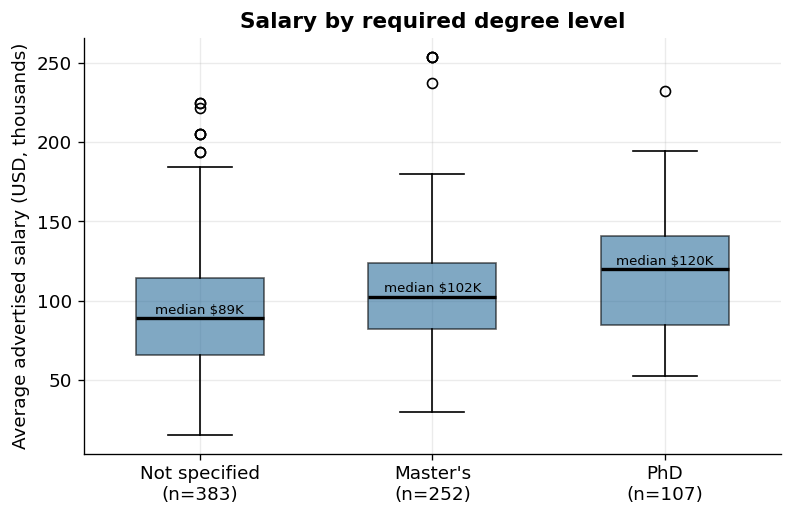
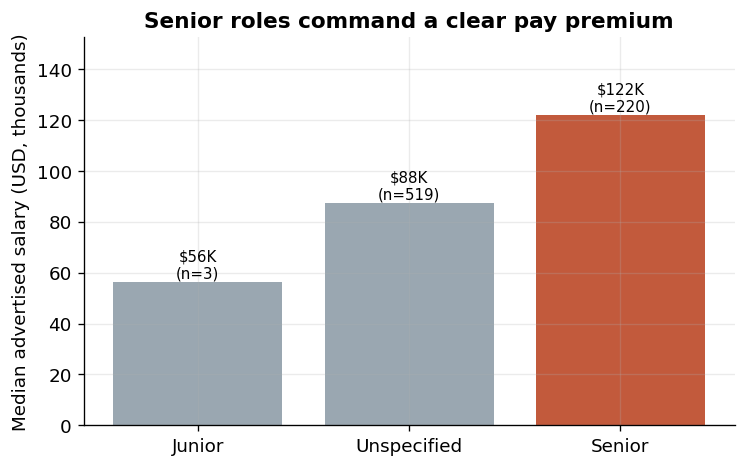
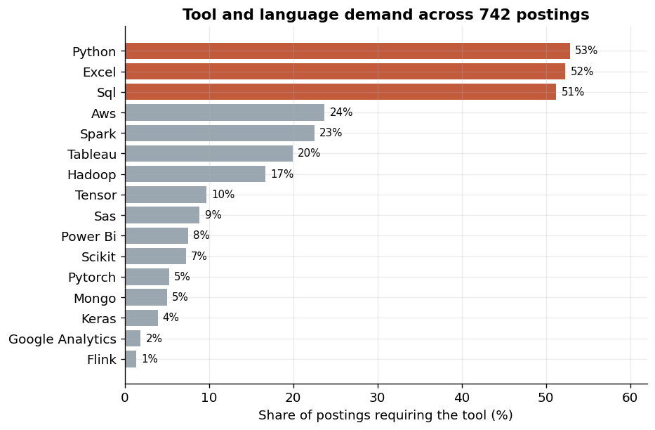
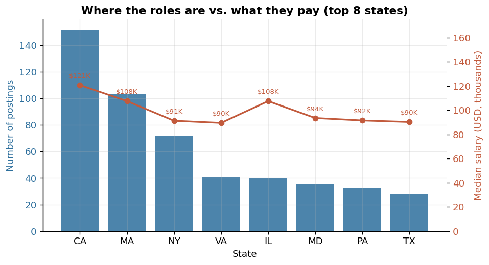
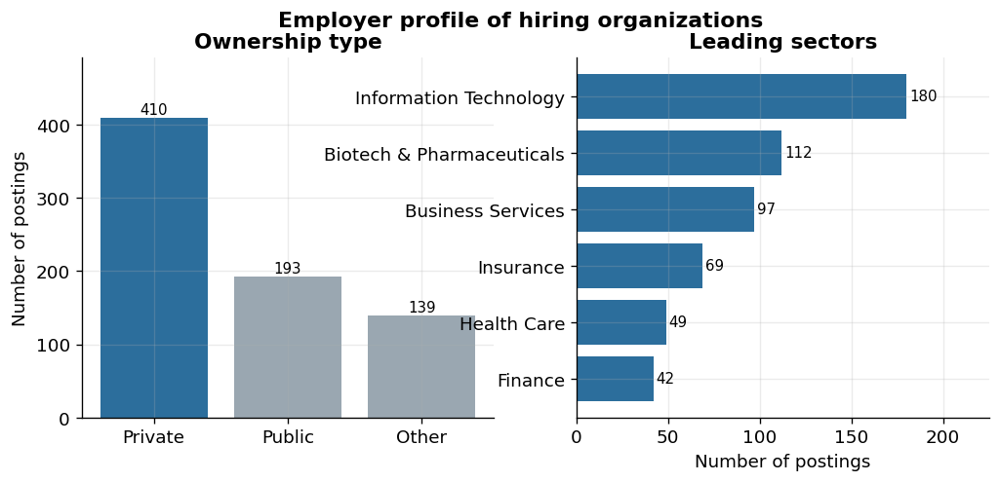

# U.S. Data Scientist Market Analysis (2021) — Project Report
### Salary, Geography, Employer Profile, Degree, and Tool Demand in a Public Job-Posting Dataset

**Tools:** Python (pandas, matplotlib); original cleaning in RapidMiner and Jamovi; original dashboards in Power BI
**Dataset:** Public feature-level extract derived from a Kaggle Glassdoor scrape — N = 742 postings, 36 analysis fields

---

## Abstract

This report examines the 2021 United States data-science labor market using a public, feature-level extract of a Kaggle Glassdoor job-posting dataset. It addresses three questions: which roles and credentials commanded the highest advertised pay, which technical tools were most in demand and how that demand varied by role, and where hiring concentrated geographically and by employer type. The analysis is descriptive and exploratory by design — the unit of observation is a job posting, and the salary fields are employer-estimated ranges rather than verified compensation — so the goal is to characterize visible structure in the market, not to estimate causal effects. The clearest patterns were a steep pay gradient by role and seniority (median advertised salary of $124K for machine-learning-engineer postings versus $62K for analyst postings), a compact core tool stack of Python, Excel, and SQL each present in roughly half of postings, role-specific skill bundles, and a concentration of demand in California, Massachusetts, and New York among predominantly private employers in technology-related sectors.

---

## 1. Introduction and Problem

The data-science labor market is frequently described through single headline averages, but a single average obscures how pay, required skills, geography, and employer type fit together. A team planning hiring, compensation bands, or upskilling needs the joint structure: which roles pay what, which skills are genuinely in demand for which roles, and where that demand sits. Public job-posting data offers an imperfect but useful window onto that structure.

Three research questions organize the analysis:

1. **Compensation structure** — how does advertised pay vary across role type, seniority, and degree requirement?
2. **Skill demand** — which tools and languages are most frequently required, and does that demand differ by role?
3. **Market geography and employers** — where do postings concentrate, and what kinds of organizations are hiring?

---

## 2. Data

### 2.1 Source and provenance

The dataset originates from a Kaggle release of job postings scraped from Glassdoor using Selenium during 2021. The repository stores a feature-level analysis extract of 742 rows and 36 fields. Raw job-description text, company names, headquarters, competitor lists, and any contact-bearing free text are intentionally excluded at the source, so the published data carries no identifying or contact information. Salary fields are Glassdoor-estimated or employer-provided ranges, summarized here by their midpoint (`avg_salary_k`, in thousands of USD).

### 2.2 Feature overview

| Domain | Fields |
|--------|--------|
| Role | `job_title`, `role_family` (normalized to a `role_grp`), `seniority`, `degree_required` |
| Salary | `salary_estimate`, `lower_salary_k`, `upper_salary_k`, `avg_salary_k`, `hourly_flag`, `employer_provided_flag` |
| Employer | `company_rating`, `company_size`, `founded_year`, `company_age`, `ownership_type`, `industry`, `sector`, `revenue_band` |
| Location | `job_state` |
| Tools (16 boolean flags) | `python`, `spark`, `aws`, `excel`, `sql`, `sas`, `keras`, `pytorch`, `scikit`, `tensor`, `hadoop`, `tableau`, `power_bi`, `flink`, `mongo`, `google_analytics` |

### 2.3 Known limits of the source

Because the data is scraped from a self-reported platform, several cautions apply throughout. Salary figures are estimated ranges, not verified compensation, and are best treated as directional. The scrape is a moment-in-time snapshot with an unknown sampling frame, so the 742 postings are a convenience sample rather than a probability sample of the market. A more authoritative compensation benchmark, such as the U.S. Bureau of Labor Statistics Occupational Employment and Wage Statistics program (U.S. Bureau of Labor Statistics, 2021), would be required for any claim about true market wages. These limits motivate the descriptive framing in Section 3.

---

## 3. Methods

### 3.1 Analytic approach and alternatives considered

The analysis is deliberately **descriptive and exploratory**: it summarizes central tendency and proportions within subgroups and visualizes them, rather than fitting an inferential model. This choice follows the logic of exploratory data analysis, in which the first task with an unfamiliar dataset is to expose its distributions, groupings, and visible structure before any modeling (Tukey, 1977). Two alternatives were considered. A **multiple regression** of salary on role, degree, location, and tools would estimate adjusted associations and partial effects; it was not used here because the outcome is an employer-estimated range from a non-probability sample, which would give such coefficients a false air of precision, and because the project's purpose is to map structure rather than to estimate effects. A **classification model** predicting role from tool flags (the logic behind Power BI's Key Influencers visual) was likewise treated as descriptive: any "driver" it surfaces is an association within this sample, not a causal account of hiring. The descriptive approach keeps the interpretation honest about what posting data can support.

### 3.2 Data preparation

Preparation, originally performed in RapidMiner and validated in Jamovi, is reproduced in `04_Source_Code.py`. The 16 tool indicators are cast from 0/1 integers to booleans so that a column mean reads directly as the share of postings requiring that tool. Salary midpoints are coerced to numeric. The noisy `role_family` field — which contains inconsistent labels such as `data analitics`, `na`, and `Data scientist project manager` — is normalized into seven analysis groups (`role_grp`) so that role-level comparisons are legible while every posting is retained. Degree and seniority codes are mapped to plain labels (`M` → Master's, `P` → PhD, `na` → Not specified; `sr` → Senior, `jr` → Junior).

### 3.3 Metric definitions

Three summary metrics carry the results below; each is defined here before it appears.

- **Median.** The 50th percentile — the value with half of observations above and half below. For advertised salary, the median is preferred over the mean because salary distributions are right-skewed (a minority of very high ranges pull the mean upward), and the median is robust to that skew and to outliers (Field, 2018). In this sample the gap is visible: the salary mean is $101.5K while the median is $97.5K. Medians are therefore used for all pay comparisons.
- **Mean.** The arithmetic average, reported alongside the median only to show the direction and size of skew, not as the primary pay summary.
- **Share (proportion).** For a boolean tool flag, the share is the fraction of postings in which the tool is required, expressed as a percentage. A share of 52.8% for Python means 392 of 742 postings flagged Python. When computed within a role group, the share describes that role's skill profile; differences in shares across roles describe how skill bundles differ. Shares are sample frequencies, not population estimates.

No model-fit metrics (R², RMSE, AIC, etc.) are reported because no predictive model is fit; that absence is intentional given the descriptive design.

---

## 4. Results

### 4.1 Compensation by role

**What to inspect:** the ordered length of the bars and the per-group sample sizes. **Pattern:** advertised pay falls monotonically from machine-learning and data-scientist roles down to analyst roles. **Values:** ML Engineer postings show the highest median at **$124K** (n=22), followed by Data Scientist at **$114K** (n=313) and Data Engineer at **$99K** (n=124); Analyst roles sit lowest at **$62K** (n=109), roughly $50–60K below the scientist roles. The small ML Engineer group (n=22) means its lead should be read as suggestive rather than precise. **Why it matters:** role type is the single strongest organizing factor for pay in this market, so any compensation banding or talent-cost model should treat "data scientist" and "analyst" as distinct markets rather than a single job family.

### 4.2 Pay by degree and seniority

**What to inspect:** the box centers (medians) and the overlap of the boxes across degree levels. **Pattern:** the median rises with credential level, but the distributions overlap substantially. **Values:** postings requiring a PhD have a median of **$120K** (n=107) and Master's-required postings **$102.5K** (n=252), versus **$89K** (n=383) where no degree is specified. **Why it matters:** the credential premium is real (a ~$31K median gap between PhD-required and unspecified postings) but the overlap shows that degree alone does not determine pay — it co-varies with role and seniority, so it should not be modeled as an independent lever.

**What to inspect:** the senior bar relative to the unspecified bar, and the sample sizes beneath each. **Pattern and values:** senior-labeled postings carry a median of **$122K** (n=220) against **$88K** (n=519) for unspecified-level postings — a ~$34K seniority premium. The Junior bar ($56.5K) is shown for completeness but rests on only **3 postings** and is too small to interpret. **Why it matters:** seniority and degree premia are similar in magnitude and point the same direction, reinforcing that the steep part of the pay curve is the senior/advanced-credential tier.

### 4.3 Skill demand overall

**What to inspect:** the cluster of three bars at the top versus the long tail below. **Pattern:** demand is concentrated in a compact core stack and decays quickly. **Values:** **Python 52.8%**, **Excel 52.3%**, and **SQL 51.2%** form the core, each in roughly half of postings; AWS (23.7%) and Spark (22.5%) form a second tier; and specialized tools fall away to near-irrelevance — Google Analytics (1.9%) and Flink (1.3%) anchor the bottom. **Why it matters:** broad upskilling investment is best directed at the core stack, since it generalizes across the market, whereas the long-tail tools are too rare to justify general training and signal role-specific niches instead.

### 4.4 Skill demand by role

**What to inspect:** read across each role's row and compare the dark cells. **Pattern:** the core stack is shared, but the *emphasis* and the specialized tools differ sharply by role. **Values:** Analyst postings are anchored by **Excel (74%)** and **SQL (72%)** with comparatively low **Python (33%)** and effectively zero deep-learning tooling (scikit/tensor/pytorch/keras all ~0%). Data Engineer postings lead on **SQL (73%)** and **Python (64%)** and add infrastructure tools — **AWS (49%)** and **Spark (55%)**. Data Scientist and ML Engineer postings lead on **Python (77% and 82%)** and are where the deep-learning libraries concentrate (for ML Engineer: **TensorFlow 41%**, **scikit-learn 32%**, **PyTorch 23%**). **Why it matters:** "data-science skills" is not one bundle. A workforce plan should map training to role — spreadsheet-and-SQL fluency for analyst tracks, cloud/distributed tooling for engineering tracks, and Python-plus-ML-libraries for scientist tracks — rather than treating the whole tool list as a single checklist.

### 4.5 Geography and employer profile

**What to inspect:** the bars (volume) against the line (median pay). **Pattern:** volume concentrates heavily in a few states, and the highest-volume market is also the highest-paying, but volume and pay are not perfectly aligned below the top. **Values:** **California** leads on both — **152 postings** and a median of **$121K**. **Massachusetts (103)** and **Illinois** post median pay of **$108K**, above larger-volume **New York (72, $91K)**. **Why it matters:** for siting roles or benchmarking offers, California is the clear high-cost, high-volume hub, while secondary markets diverge — New York carries volume without the pay premium of Massachusetts or Illinois.

**What to inspect:** the ownership split and the leading sectors. **Pattern and values:** hiring tilts **private** (**410** postings) over **public** (**193**), and concentrates in **Information Technology (180)**, **Biotech & Pharmaceuticals (112)**, and **Business Services (97)**. The typical employer carries a median Glassdoor rating of 3.7 and a median company age of 29 years. **Why it matters:** demand is not evenly distributed across the economy; it sits with private technology and life-sciences employers, which is where talent-supply competition would be most intense.

---

## 5. Discussion

### 5.1 Synthesis

Read together, the figures describe a market organized primarily by **role and level**, served by a **shared core stack with role-specific extensions**, and **concentrated** in a handful of private-sector hubs. Pay scales steeply from analyst to scientist roles and again from unspecified to senior/PhD tiers; Python, SQL, and a spreadsheet baseline are near-universal while deep-learning tooling is the signature of scientist and ML roles; and demand clusters in California, Massachusetts, and New York. None of these patterns depends on a fragile single statistic — each is visible across hundreds of postings.

### 5.2 Recommendations

Each recommendation is tied to a specific result above.

1. **Band compensation by role and level, not by a single "data" job family.** The ~$50–60K median gap between scientist and analyst roles (§4.1) and the ~$34K senior premium (§4.2) mean a one-size band would systematically misprice both ends.
2. **Direct broad upskilling at the core stack.** Python, Excel, and SQL each appear in about half of postings and generalize across roles (§4.3), making them the highest-leverage general training targets.
3. **Map specialized training to role tracks.** Because deep-learning libraries concentrate in scientist/ML postings and are near-absent from analyst postings (§4.4), TensorFlow/PyTorch/scikit-learn training should be reserved for those tracks rather than applied org-wide.
4. **Treat California as the cost anchor and benchmark secondary markets individually.** Volume and pay both peak in California (§4.5), but secondary markets diverge (MA/IL above NY on pay), so location-based offer benchmarks should be set per market.

### 5.3 Limitations

- **Estimated, not verified, pay.** Salary fields are employer- or Glassdoor-estimated ranges; all pay figures are directional. A BLS benchmark would be needed for authoritative wage claims.
- **Non-probability sample.** The 742 postings have an unknown sampling frame and cannot be projected to the full market, particularly for thin groups (ML Engineer n=22, Junior n=3).
- **Role normalization is a modeling choice.** Collapsing noisy titles into seven groups improves legibility but imposes boundaries on ambiguous titles; a different grouping could shift small-group medians.
- **Tools treated as independent flags.** The analysis reports marginal and per-role tool shares but not co-occurrence; in practice tools bundle (Python + PyTorch + TensorFlow in ML roles), and a co-occurrence or association analysis would describe those bundles more precisely.
- **Temporal snapshot.** The 2021 data predates later shifts in the market (post-2022 hiring contraction, generative-AI tooling), so the structure described here may have moved.

---

## 6. Conclusion

Using a public job-posting extract, this report maps the 2021 U.S. data-science market across pay, skills, geography, and employer type. The strongest, most reproducible patterns are a steep pay gradient by role and seniority, a compact and widely shared core tool stack with role-specific specialization on top of it, and a geographic concentration of demand among private technology and life-sciences employers. The contribution is the joint view: salary, skills, location, and employer profile read as one coherent market picture, with every figure recomputable from the included data and code, and with clear limits on what posting data can and cannot support.

---

## References

Field, A. (2018). *Discovering statistics using IBM SPSS statistics* (5th ed.). SAGE Publications.

Tukey, J. W. (1977). *Exploratory data analysis*. Addison-Wesley.

U.S. Bureau of Labor Statistics. (2021). *Occupational employment and wage statistics*. https://www.bls.gov/oes/

Igamberdiev, T. (2021). *Data science job salaries* [Data set]. Kaggle. https://www.kaggle.com/datasets/ruchi798/data-science-job-salaries

Microsoft Corporation. (2021). *Power BI Desktop documentation*. Microsoft Learn. https://learn.microsoft.com/en-us/power-bi/

---

*Data: 742 job postings, Glassdoor via Kaggle, 2021. Every statistic and figure in this report is reproduced by `04_Source_Code.py` and `03_Analysis_Notebook.ipynb`.*
