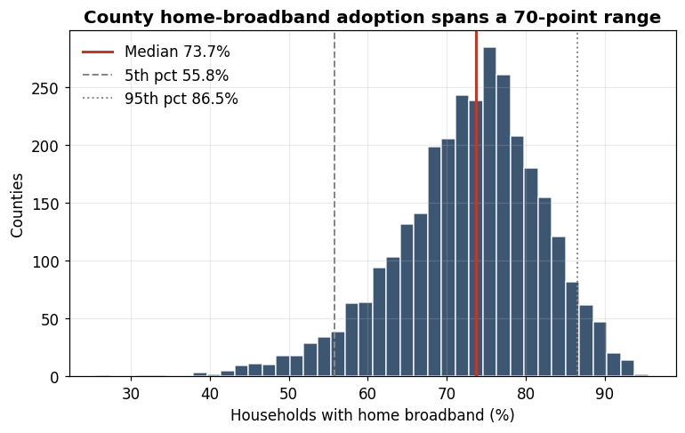
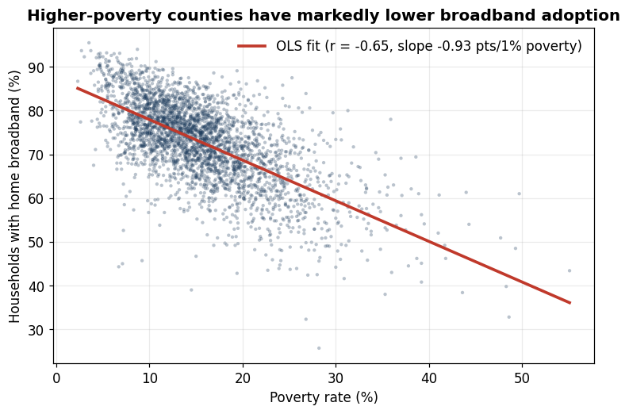
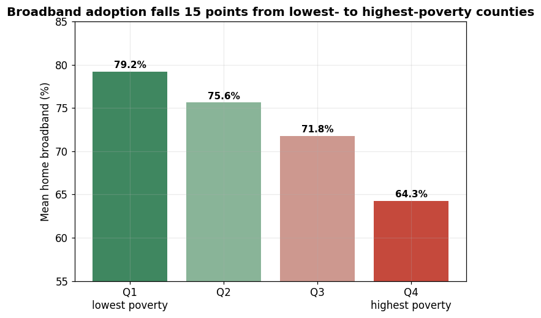
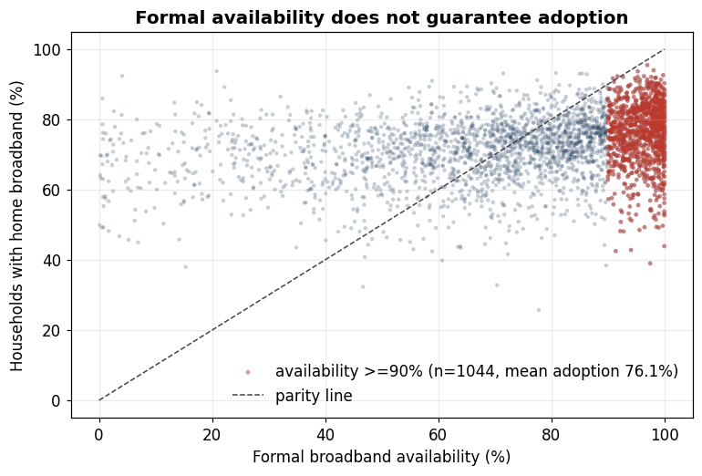
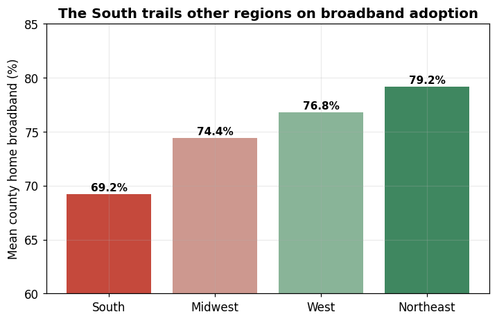
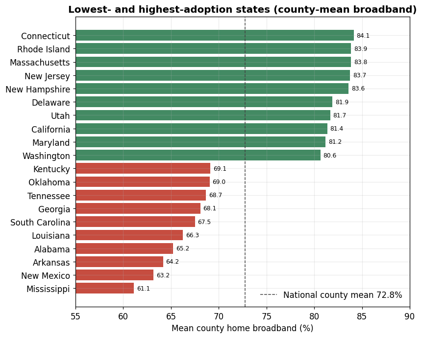

# County-Level Broadband Access in the United States — Full Report

## Abstract

This report analyzes home-broadband adoption across 3,102 U.S. counties using a
public extract that blends the Institute of Museum and Library Services (IMLS)
Indicators Workbook with the BroadbandNow Open Data Challenge dataset. The aim is
to characterize how broadband adoption varies below the level of national and
state averages, and to test whether adoption is predicted more by broadband
infrastructure (formal availability, provider counts) or by county economic
conditions (poverty, SNAP receipt). The analysis is descriptive and
correlational. Three results hold across the dataset: county adoption ranges
nearly 70 percentage points (25.7% to 95.5%, median 73.7%); poverty correlates
with adoption far more strongly (r = -0.65) than formal availability does
(r = +0.30); and formal availability substantially overstates real adoption,
with 1,044 counties at or above 90% availability still averaging only 76.1%
household adoption. The gap concentrates in high-poverty counties and in the
South. These patterns argue for affordability- and adoption-focused intervention
in economically disadvantaged counties rather than coverage buildout alone.

---

## 1. Background and research questions

Broadband access became a salient public issue during the COVID-19 era, when
remote work, schooling, and telehealth made home connectivity a precondition for
participation. But uneven connectivity long predates the pandemic, and it is
poorly described by aggregate statistics. A national adoption figure, or even a
state figure, averages together counties with very different realities. The unit
of analysis matters: a question about *who is left behind* requires the county
level, where the variation actually lives.

This report addresses two questions:

1. **How much does home-broadband adoption vary across U.S. counties, and where
   is it lowest?**
2. **Is adoption predicted more by broadband infrastructure (availability,
   provider presence) or by county economic conditions (poverty, program
   receipt)?**

A note on scope. The original Tableau version of this project layered a
county racial-composition overlay, joined separately, to examine racial equity in
broadband outcomes. That overlay is not part of the public extract analyzed here.
This report therefore analyzes the **socioeconomic** equity dimension that the
published data support directly — adoption as a function of poverty and program
receipt — and does not make claims about racial composition, which cannot be
traced to the data in this repository.

---

## 2. Data

### 2.1 Sources

The analysis file is a public county-level extract combining two sources:

**IMLS Indicators Workbook (primary).** The Institute of Museum and Library
Services compiled county-level broadband and socioeconomic indicators from the
American Community Survey 5-year estimates (2014–2018), a commercial
FCC-linked broadband aggregator (BroadbandNow), and Bureau of Labor Statistics
local-area unemployment statistics.

**BroadbandNow Open Data Challenge (supplementary).** A publicly released
county-level broadband dataset used to supply additional infrastructure metrics
(wired access, 25 Mbps coverage, average download speed).

A Simple Maps U.S. counties file supplied latitude/longitude for the Tableau
mapping layer; it is not required for the statistics in this report.

### 2.2 Variables

| Domain | Variables (cleaned names) |
|---|---|
| Geography | `full_name`, `county`, `state`, `state_abr` |
| Economic | `poverty_rate%`, `SNAP_recieved%`, `unemp_19%`, `nohealth_ins%` |
| Demographic | `population_19` |
| Technology access (outcome) | `home_havebroad%`, `no_homeinternet%`, `no_homecomp%` |
| Infrastructure | `broadProviders_num`, `broad_avail`, `broad_cost` |
| Supplementary infrastructure | `wired_bbn`, `all25_bbn`, `downave_bbn`, `access_bbn`, `slowfrac_bbn` |

The primary outcome is `home_havebroad%`, the share of households in a county
with a home broadband subscription. The two main predictors of interest are
`poverty_rate%` (an economic-need signal) and `broad_avail` (a formal
infrastructure-coverage signal).

### 2.3 Cleaning

Cleaning mirrors the original RapidMiner workflow and is reproduced in
`04_Source_Code.py`. The raw file has 3,142 rows; cleaning yields 3,102 counties
with no remaining missing values. The steps and the judgment behind them:

- **Duplicate price measure.** A BroadbandNow lowest-price column and the IMLS
  cost column measured the same quantity with near-identical summary statistics.
  The IMLS field (`broad_cost`) was kept as the more authoritative source and the
  BroadbandNow price column dropped.
- **Cost missingness.** The 40 rows (1.3%) missing `broad_cost` were dropped —
  a negligible share that does not warrant imputation.
- **Minor imputation.** Five near-complete continuous infrastructure fields
  (`wired_bbn`, `all25_bbn`, `downave_bbn`, `access_bbn`, `slowfrac_bbn`), each
  with under 0.5% missing, were mean-imputed. Mean imputation is appropriate here
  precisely because the missing share is tiny: the imputed values cannot
  materially move the distribution, so a more elaborate model-based imputation
  would add complexity without changing conclusions.
- **Single-county gaps.** Two single missing values were filled from public
  reference values (Kalawao County, HI unemployment = 21%; Rio Arriba County, NM
  poverty = 24%).
- **Implausible provider count.** The BroadbandNow provider count averaged about
  12 providers per county — roughly triple the FCC national average near 4. This
  is implausible and would distort any infrastructure comparison, so the IMLS
  provider count (`broadProviders_num`) was kept and the BroadbandNow version
  dropped, along with the redundant BroadbandNow population field.

### 2.4 Analytic approach and alternatives considered

The questions here are descriptive and relational, not predictive, so the design
is exploratory data analysis plus bivariate correlation rather than a fitted
predictive model. The reasoning: the goal is to *characterize* where adoption is
low and *compare the strength of association* of competing explanatory factors,
which Pearson correlations and grouped summaries answer directly and
transparently. A multivariate regression was considered and set aside for this
write-up: the economic predictors are strongly collinear (poverty, SNAP receipt,
uninsured rate, and unemployment all move together), so regression coefficients
would be unstable and harder to interpret than the simple, robust message that
economic conditions dominate infrastructure metrics. A predictive/classification
framing was also rejected because there is no decision target to predict — the
deliverable is interpretation, not a model to deploy. Exploratory analysis with
clearly defined summary statistics is the honest tool for this question (Tukey,
1977).

---

## 3. Methods and metric definitions

Because this report relies on a small number of summary measures rather than a
model-fit apparatus, the metrics used are defined here before they appear in the
results.

**Pearson correlation coefficient (r).** A measure of the strength and direction
of the *linear* association between two continuous variables. It ranges from -1
to +1: values near 0 indicate little linear relationship, values near ±1 a strong
one, and the sign indicates direction (negative means one rises as the other
falls). As a rough field convention, |r| around 0.1 is small, 0.3 moderate, and
0.5 or above large (Cohen, 1988). Pearson r captures only linear association and
is sensitive to outliers, which is why each key correlation below is paired with
a scatter or grouped summary rather than reported alone (Field, 2018).

**Median and percentiles.** The median is the 50th percentile — the value
separating the lower and upper halves of counties. It is reported in preference
to the mean for the adoption outcome because county distributions are skewed and
the median is robust to extreme values. Percentiles (5th, 25th, 75th, 95th)
describe the spread: the 5th percentile is the value below which the lowest 5% of
counties fall.

**Quartiles.** Counties were sorted by poverty and split into four equal-sized
groups (quartiles) of roughly 776 counties each. Comparing mean adoption across
poverty quartiles converts a continuous correlation into an interpretable
group-to-group gap.

**Ordinary least squares (OLS) slope.** Where a single trend line is drawn over a
scatter, it is the OLS best-fit line, whose slope estimates the average change in
the outcome per one-unit change in the predictor. It is used here descriptively
to summarize the poverty–adoption gradient, not as an inferential model.

---

## 4. Results

### 4.1 County adoption varies far more than averages suggest

The home-broadband adoption rate has a median of 73.7% but ranges from 25.7% to
95.5% — a span of nearly 70 percentage points. The 5th-to-95th-percentile range
is 55.8% to 86.5%, so even setting aside the extremes, the middle 90% of counties
differ by more than 30 points.

*What to inspect:* the histogram's width and the marked percentile lines. The
distribution is left-skewed with a long lower tail: a cluster of counties sits
well below the median (red line, 73.7%), and the 5th-percentile line (55.8%)
shows the bottom 5% of counties are barely above half of households connected.
This spread is what a single national or state figure conceals, and it is the
reason the rest of the analysis works at the county level.

### 4.2 Economic conditions predict adoption more than infrastructure does

Comparing the correlation of each candidate factor with home-broadband adoption
isolates the central question. Poverty is the strongest single correlate
(r = -0.65), with SNAP receipt close behind (r = -0.57). The infrastructure
metrics are weaker: formal availability r = +0.30, provider count r = +0.22, and
monthly cost essentially flat at r = +0.04. Average download speed (r = +0.46) is
the strongest infrastructure-side signal but still trails poverty.

*What to inspect:* the length of the bars and their color (red = negative
association, green = positive). The poverty bar (|r| = 0.65) is more than double
the formal-availability bar (|r| = 0.30). The implication is direct: if the goal
is to find where households are offline, county economic conditions carry more
signal than whether broadband is nominally available there. (The mechanical
near-perfect inverse between `home_havebroad%` and `no_homeinternet%` is excluded
from this comparison because the two are essentially the same measurement.)

### 4.3 The poverty–adoption gradient is continuous and population-wide

The poverty relationship is not driven by a handful of outliers. Plotting all
3,102 counties, the OLS fit has a slope of about -0.9 broadband points per
additional point of poverty (r = -0.65).

*What to inspect:* the downward slope and the density of the point cloud around
it. The relationship is visible across the entire poverty range, not just at the
tails — the cloud shifts steadily downward and to the right. Each additional
point of county poverty is associated with roughly a 0.9-point reduction in home
broadband, so a county 20 points higher in poverty is expected to be about 18
points lower in adoption.

### 4.4 Socioeconomic equity: a 15-point quartile gap

Binning counties by poverty quartile makes the gradient concrete. Mean adoption
falls monotonically from 79.2% in the lowest-poverty quartile (Q1) to 64.3% in
the highest (Q4), a 15-point gap.

*What to inspect:* the monotone step-down across the four bars. There is no
plateau — each quartile is meaningfully below the one before it (79.2 → 75.6 →
71.8 → 64.3), and the largest single drop is between Q3 and Q4. The digital divide
in this data maps cleanly onto economic disadvantage: the poorest quarter of
counties is, on average, 15 points less connected than the richest quarter.

### 4.5 Formal availability overstates real adoption

If broadband availability fully captured access, counties with near-universal
availability would have near-universal adoption. They do not. Among the 1,044
counties with formal availability at or above 90%, mean household adoption is only
76.1%, and the lowest is 39%.

*What to inspect:* the vertical scatter of the red points (availability ≥ 90%) and
their distance below the dashed parity line. If availability equaled adoption,
those points would sit on the parity line; instead they fan downward, many 15–50
points below it. Counting where providers exist substantially overstates where
households are actually connected — which is exactly why an availability-only
policy lens misses the adoption gap that economic conditions reveal.

### 4.6 Geographic concentration in the South

Aggregating to Census region, the South averages 69.2% county adoption (n = 1,390)
versus 79.2% in the Northeast, 76.8% in the West, and 74.4% in the Midwest — an
~10-point South-to-Northeast gap.

*What to inspect:* the ordering of the four bars, with the South lowest. The
state-level detail reinforces the regional story: the lowest-adoption states are
Mississippi (61.1%), New Mexico (63.2%), Arkansas (64.2%), Alabama (65.2%), and
Louisiana (66.3%), clustering in the Deep South and the rural Southwest — the
same places that carry the highest poverty in the dataset.

*What to inspect:* the gap between the two colored blocks relative to the dashed
national county mean (72.8%). Every one of the ten lowest-adoption states (red)
sits in the South or rural Southwest, while the ten highest (green) — led by
Connecticut (84.1%), Rhode Island (83.9%), and Massachusetts (83.8%) —
concentrate in the Northeast. The 23-point spread between the worst and best
state means is itself wider than the gap most national commentary acknowledges.

---

## 5. Synthesis

The three results reinforce one conclusion. County adoption varies far more than
aggregate statistics imply (§4.1); the variation is predicted by economic
conditions more than by infrastructure (§4.2–4.4); and infrastructure metrics
that policy often relies on overstate real access (§4.5). The gap is not evenly
distributed — it concentrates in high-poverty, Southern, and rural counties
(§4.4, §4.6). Taken together, the data describe a divide that is as much about
affordability and adoption as about whether wires reach a place.

---

## 6. Recommendations

Each recommendation is tied to a specific result above.

1. **Target affordability and adoption support, not only buildout.** Because
   poverty (r = -0.65) predicts adoption far better than availability (r = +0.30)
   (§4.2), and 1,044 fully-covered counties still average only 76% adoption
   (§4.5), funding aimed solely at infrastructure in nominally underserved areas
   will miss the larger problem. Subsidies, device access, and digital-literacy
   programs aimed at low-income households address the binding constraint the data
   point to.

2. **Prioritize the highest-poverty quartile and the South.** Adoption is 15
   points lower in the highest-poverty quartile (§4.4) and ~10 points lower in the
   South (§4.6). These are concrete targeting criteria for where limited program
   dollars close the most gap per dollar.

3. **Measure success by adoption, not availability.** Because availability
   overstates adoption by a wide and variable margin (§4.5), programs should track
   household subscription rates as the outcome of record. An availability-based
   scorecard would declare many still-disconnected counties "solved."

---

## 7. Limitations

**Data vintage.** Much of the source data reflects the 2014–2018 period. Adoption
has risen since, so the levels are not current-condition estimates; the *relative*
patterns (who is behind, and why) are the durable contribution.

**Observational and correlational.** All associations are descriptive. Poverty
and adoption are correlated, but causation runs through unmeasured channels
(income, education, housing, rurality) that this extract does not isolate. The
findings support targeting and prioritization, not causal attribution.

**Collinear predictors.** The economic indicators move together, which is why a
single multivariate model was not used to apportion unique effects (§2.4); the
report makes the weaker but well-supported claim that economic conditions as a
group dominate infrastructure metrics.

**Measurement of availability.** "Formal availability" is itself an imperfect,
provider-reported construct; part of the availability–adoption gap (§4.5) may
reflect measurement optimism in coverage data rather than pure non-adoption.

**Demographic scope.** The racial-equity overlay used in the original Tableau
story is not in this public extract, so this report is limited to socioeconomic
equity (§1).

---

## References

Cohen, J. (1988). *Statistical power analysis for the behavioral sciences* (2nd
ed.). Lawrence Erlbaum Associates.

Federal Communications Commission. (2021). *Fixed broadband deployment data*.
https://www.fcc.gov/general/broadband-deployment-data

Field, A. (2018). *Discovering statistics using IBM SPSS statistics* (5th ed.).
Sage.

Institute of Museum and Library Services. (2020). *IMLS indicators workbook:
Economic status and broadband availability and adoption*. https://www.imls.gov

U.S. Census Bureau. (2019). *American Community Survey 5-year estimates,
2014–2018*. https://www.census.gov/programs-surveys/acs

Tukey, J. W. (1977). *Exploratory data analysis*. Addison-Wesley.
