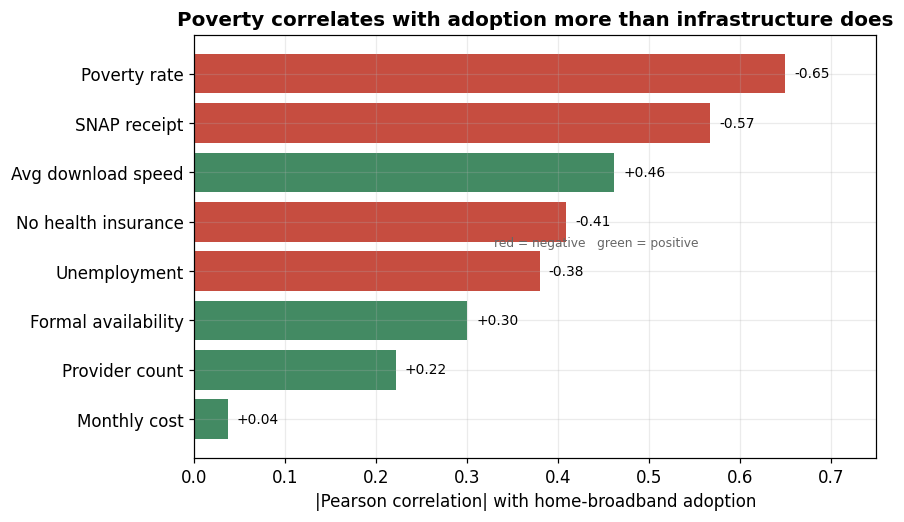

# County-Level Broadband Access in the United States

National and state averages suggest most of the country is online. County-level
data tell a different story — and show that whether a county's households are
actually connected tracks economic conditions far more closely than it tracks
broadband infrastructure. This analysis works across **3,102 U.S. counties**
from a public IMLS / BroadbandNow extract to map where the gap is and what
predicts it.

**Takeaway:** Across all 3,102 counties, poverty is the strongest correlate of
home-broadband adoption (r = -0.65), more than double the correlation of formal
broadband availability (r = +0.30). The digital divide in this data is mostly an
affordability and adoption problem, not only a coverage problem.

## Key findings

- **County adoption spans a 70-point range** (25.7% to 95.5%; median 73.7%) that
  national and state averages hide.
- **Economics beats infrastructure as a predictor.** Poverty (r = -0.65) and
  SNAP receipt (r = -0.57) correlate with adoption far more strongly than formal
  availability (r = +0.30) or provider count (r = +0.22).
- **Availability is not adoption.** Of the 1,044 counties with formal
  availability at or above 90%, mean household adoption is still only 76.1%, and
  the lowest is 39%.
- **The gap concentrates in the South and in high-poverty counties.** Mean
  county adoption is 69.2% in the South vs. 79.2% in the Northeast; it falls 15
  points from the lowest-poverty to the highest-poverty quartile.

## Where to start

- **[01_Project_Summary.md](01_Project_Summary.md)** — a short, plain-language
  overview of the problem, findings, and what they imply (about a 3-minute read).
- **[02_Project_Report.md](02_Project_Report.md)** — the full write-up: data,
  methods, metric definitions, figure-by-figure evidence, limitations, and
  references.
- **[03_Analysis_Notebook.ipynb](03_Analysis_Notebook.ipynb)** — the executed
  analysis workflow with inline figures.
- **[04_Source_Code.py](04_Source_Code.py)** — the annotated script that
  reproduces every statistic and figure.

## Interactive dashboard

An interactive Tableau version of the geographic story is available on Tableau
Public: [America's Broadband Problem](https://public.tableau.com/app/profile/mintay/viz/DVProject1-Tableau-AmericasBroadbandProblem/AmericasBroadbandProblem).

## Data

County-level public extract blending the IMLS Indicators Workbook (ACS 5-year
2014–2018 estimates, with BroadbandNow and BLS inputs) and the BroadbandNow Open
Data Challenge dataset. See [data/README.md](data/README.md) for provenance,
variables, and cautions. Findings are descriptive patterns from observational
data, not causal estimates or current-condition claims.
