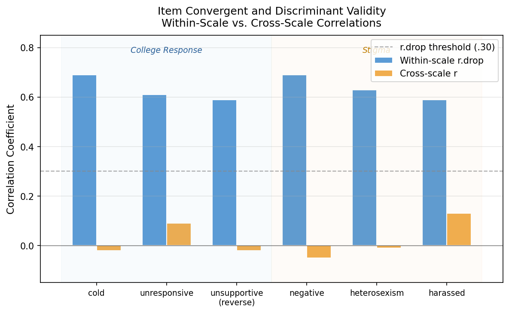

# Psychometric Scale Validation — Project Summary

**Instrument:** Perceptions of the LGBTQ College Campus Climate Scale (Szymanski & Bissonette, 2020)  
**Dataset:** N = 646 observations (simulated from published parameters)  
**Tools:** R (psych, tidyverse, MASS), Python (figure generation)

---

## The Measurement Problem

The LGBTQ Campus Climate Scale is a six-item Likert instrument designed to assess two dimensions of campus environment: how responsive the institution is to LGBTQ students (College Response) and how visible negative attitudes are on campus (Stigma). A key practical question is whether to use a single total score or to report the two subscales separately. The answer matters for research design, survey reporting, and data interpretation — collapsing distinct constructs into one score can obscure relationships with outcomes and reduce precision.

This project applied a full validation workflow to that question, using data simulated from the published factor loadings, item means, and sample size reported in the original article.

---

## What Was Found

**The instrument is better interpreted as two subscales than as a single total score.** The evidence from reliability, item analysis, and factor analysis converged on this conclusion from three independent angles.

**Reliability is substantially higher at the subscale level.** The six-item total scale produced a Cronbach's alpha of .64, below the commonly used .70 threshold. Both three-item subscales — College Response and Stigma — produced alphas of .79, a jump of 15 percentage points. This pattern is diagnostic of a two-dimensional instrument: pooling items from two distinct constructs inflates total variance without a proportional gain in covariance, suppressing alpha.

*The bar chart above shows the reliability gap directly: the total scale falls below the conventional threshold (dashed line at α = .70) while both subscales exceed it. The College Response and Stigma subscales each reach α = .79, compared to α = .64 for the six-item total.*

**Items clearly belong to their subscale, not to the other.** Within-scale corrected item-total correlations ranged from .59 to .69 — all well above the .30 threshold for acceptable item functioning. Cross-scale correlations (each item correlated with the *other* subscale) ranged from −.05 to .13. The difference is stark: items relate to their own subscale at roughly five times the strength they relate to the other.

*Each pair of bars represents one item. Blue bars show the within-scale corrected item-total correlation (.59–.69); orange bars show the cross-scale correlation (−.05–.13). In all six cases, the within-scale relationship dominates. The dashed line at r = .30 marks the conventional minimum for item-total correlations; all six items clear it comfortably on their own subscale and fall well below it for the cross-scale comparison.*

**Factor analysis confirmed the two-factor structure.** Both Principal Components Analysis (PCA) and Principal Axis Factoring (PAF) produced the same two-factor solution under orthogonal and oblique rotations. Factor loadings on the target factor ranged from .71 to .88; cross-loadings were negligible (≤ .16). Parallel analysis, which compares observed eigenvalues against eigenvalues from simulated random data, supported retention of exactly two factors. The between-factor correlation was near zero, confirming that College Response and Stigma are empirically orthogonal dimensions.

---

## Recommendations

**Report subscale scores rather than a total score.** The College Response and Stigma subscales are reliable (α = .79 each), structurally distinct, and near-orthogonal. Using a total score conflates two independent dimensions, reducing the precision of any associations found with external outcomes.

**Both subscales meet conventional thresholds for research use.** Subscale alphas of .79 and item-total correlations consistently above .59 support confidence in the measurement properties.

**Confirmatory factor analysis is the natural next step.** This project used exploratory methods, which are appropriate for establishing and visualizing structure. A CFA would provide formal fit indices (CFI, RMSEA, SRMR) needed before deploying the scale in high-stakes applied contexts.

---

## Data Note

Item-level data were simulated from the factor loadings, item means, standard deviations, and sample size (N = 646) reported in Szymanski and Bissonette (2020). The simulation used `MASS::mvrnorm()` with `empirical = TRUE` and a fixed seed (210827) for reproducibility. Because data are simulated rather than collected, this workflow demonstrates the validation process transparently but is not a new empirical validation study. The simulated data structure directly reflects the published psychometric properties of the scale.
