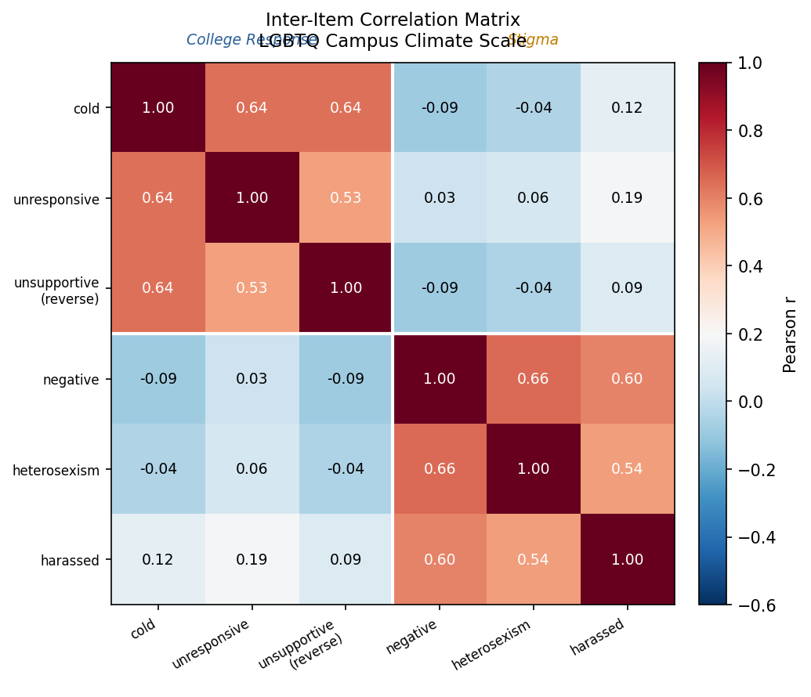
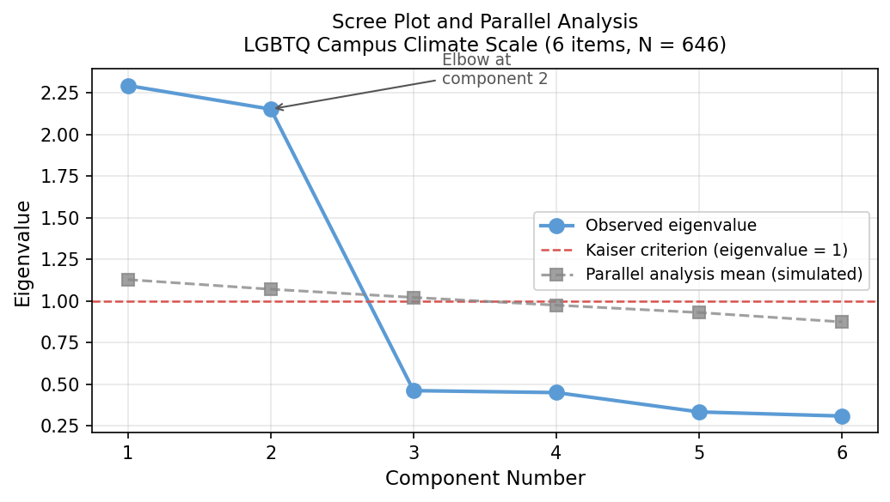
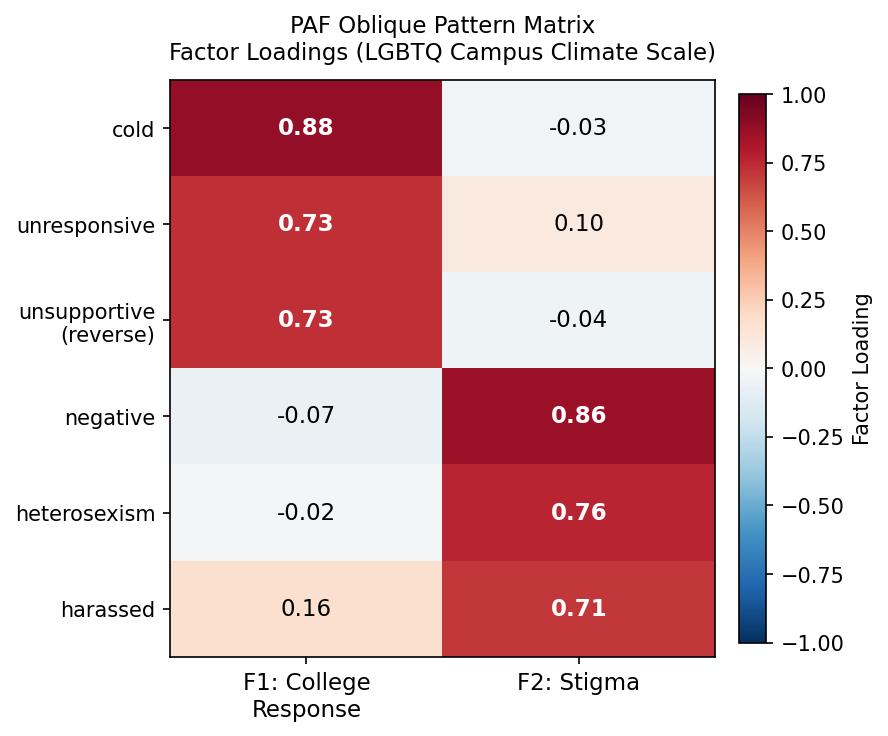

# Psychometric Scale Validation — Project Report

**Author:** Mintay Misgano, PhD | **Year:** 2023 | **Tools:** R (psych, tidyverse, MASS, sjstats, apaTables) | **Dataset:** N = 646 simulated observations

---

## 1. Introduction

Measurement quality is foundational to any setting that relies on survey-based constructs. In people analytics, educational assessment, and organizational research, the usefulness of a scale depends on whether its scores are reliable, interpretable, and structurally defensible. A scale that collapses two empirically distinct constructs into a single total score reduces precision, obscures differential relationships with external outcomes, and can mislead both statistical modeling and practical decision-making.

This project applies a full validation workflow to the Perceptions of the LGBTQ College Campus Climate Scale (Szymanski & Bissonette, 2020), a six-item Likert instrument assessing two dimensions of campus environment experienced by LGBTQ students. The applied measurement question is direct: should the instrument be reported as a single total score or as two distinct subscales?

### 1.1 The Instrument

The scale uses a seven-point response format (1 = *strongly disagree*, 7 = *strongly agree*), with higher scores indicating more negative perceptions. Items are organized across two subscales:

**College Response subscale (3 items):** cold, unresponsive, supportive (reverse-scored → *unsupportive*)

**Stigma subscale (3 items):** negative, heterosexism, harassed

### 1.2 Research Questions

1. Does the scale demonstrate acceptable reliability at the total and subscale levels?
2. Do items exhibit corrected item-total correlations consistent with their hypothesized subscale assignments?
3. Do items show stronger relationships with their own subscale than with the other, supporting discriminant validity?
4. Does exploratory factor analysis recover the hypothesized two-factor structure using both PCA and PAF?

### 1.3 Data Source

Item-level data were simulated from the factor loadings, item means, and standard deviations reported in Szymanski and Bissonette (2020, Table 2) using `MASS::mvrnorm()` with `empirical = TRUE` and a fixed random seed (210827). The simulation reproduced the published covariance structure exactly with N = 646 matching the original study. Because data are simulated rather than collected, this workflow is a transparent methodological demonstration, not a new empirical validation study.

---

## 2. Methods

### 2.1 Data Preparation

Simulated responses were rounded to whole numbers (consistent with a discrete Likert format) and bounded at the 1–7 scale limits. The *supportive* item was reverse-scored (8 − raw score) and renamed *unsupportive* to signal its rescaled direction. This reverse-scoring was completed before any reliability, item analysis, or factor analysis calculations.

Scale scores were computed as mean scores rather than sums, using an available information approach (AIA; Parent, 2013) implemented via `sjstats::mean_n()`, allowing the total score to be computed with at least 80% item coverage (≥ 5 of 6 items present). In this simulated dataset there is no missingness; AIA is applied as best practice.

### 2.2 Reliability Analysis

**Cronbach's alpha (α)** is the most widely reported internal consistency coefficient (Cronbach, 1951). It estimates the proportion of observed score variance attributable to true-score variance, assuming tau-equivalence — that all items contribute equally to the underlying construct. In practice, alpha is sensitive to three factors: the number of items, the average inter-item correlation, and the degree to which item variances are approximately equal. Alpha ranges from 0 to 1, with higher values indicating greater internal consistency. The commonly cited threshold for acceptable reliability is α ≥ .70 (Nunnally, 1978), though this benchmark is context-dependent.

**McDonald's omega (ω)** is a model-based alternative that partitions observed score variance more precisely (McDonald, 1999; Revelle & Condon, 2019). Omega-total (ω_t) estimates the proportion of variance in the scale total attributable to all common factors combined; omega-hierarchical (ω_h) estimates the proportion attributable to a single general factor. When ω_h is substantially lower than ω_t in a multi-factor instrument, it indicates that the scale's reliable variance is primarily organized into subfactors rather than a general dimension — consistent with a subscale interpretation.

*Why not split-half or test-retest reliability?* Split-half reliability is less stable than alpha because results depend on how items are partitioned (Cortina, 1993). Test-retest reliability would require repeated administration and is not feasible here. Alpha and omega together provide complementary evidence about internal consistency under different modeling assumptions, which is why both are reported.

### 2.3 Evaluation Metric Definitions

**Corrected item-total correlation (r.drop)** measures the relationship between an individual item and the scale total computed without that item (Field, 2018). Removing the item from the total eliminates spurious inflation of the correlation due to item overlap. An r.drop of .30 is the conventional minimum for acceptable item functioning; values below this suggest the item may not be measuring the same construct as the rest of the scale (Field, 2018). Values in the .50–.70 range indicate strong convergent relationships.

**Average inter-item correlation** is the mean of all pairwise item correlations within the scale. A useful benchmark is .15–.50 — values below this suggest items are measuring unrelated things; values above this may indicate redundancy (Clark & Watson, 1995).

**Bartlett's test of sphericity** tests the null hypothesis that the inter-item correlation matrix is an identity matrix (all off-diagonal correlations equal zero). A significant result (p < .05) is required before factor analysis to confirm that items share sufficient common variance (Bartlett, 1950). A non-significant result would indicate factor analysis is inappropriate.

**Kaiser-Meyer-Olkin (KMO) measure of sampling adequacy** assesses whether partial correlations between items are small relative to zero-order correlations — a necessary condition for well-defined factors (Kaiser, 1974). KMO values ≥ .70 are considered acceptable; values ≥ .80 are considered meritorious. Individual item KMO values (MSA) should exceed .50.

**Parallel analysis** is a factor retention criterion that compares observed eigenvalues against eigenvalues generated from random datasets of the same size and item count, typically across 100 or more simulations (Horn, 1965; Zwick & Velicer, 1986). Factors whose observed eigenvalues exceed the corresponding simulated random eigenvalue are retained. Parallel analysis consistently outperforms the simpler Kaiser criterion (eigenvalue > 1) in simulation studies and is the recommended retention method (Zwick & Velicer, 1986).

**Factor loadings** express the relationship between an item and its underlying latent factor. In the pattern matrix produced by oblique rotation, a loading represents the unique contribution of the factor to the item after accounting for factor intercorrelations. Loadings ≥ .40 are conventionally considered meaningful; loadings ≥ .70 indicate a strong item-factor relationship (Tabachnick & Fidell, 2019). Cross-loadings below .20–.30 in absolute value support simple structure (Thurstone, 1947).

**Between-factor correlation** (under oblique rotation) estimates the relationship between the two latent factors. Values near zero support orthogonal interpretation and justify using both varimax and oblimin solutions interchangeably; values above .30–.40 in absolute value suggest meaningful factor correlation that would be obscured by orthogonal rotation (Fabrigar et al., 1999).

### 2.4 Factor Extraction Methods

Two extraction methods were compared to evaluate the robustness of the factor structure.

**Principal Components Analysis (PCA)** decomposes total item variance — including unique and error variance — into components. It is a data-reduction technique rather than a latent-factor model: it describes the observed item space, not an underlying causal structure (Fabrigar et al., 1999). PCA was included because it is often reported alongside PAF for comparison; convergent PCA and PAF solutions increase confidence in the structural interpretation.

**Principal Axis Factoring (PAF)** estimates communalities (the proportion of item variance attributable to shared factors) and extracts factors from the reduced correlation matrix. Unlike PCA, PAF models a latent causal structure in which factors are assumed to cause item responses, making it the theoretically preferred approach for construct validation purposes (Fabrigar et al., 1999). When the goal is to understand what underlying dimensions items reflect, PAF is more appropriate than PCA.

*Why not Confirmatory Factor Analysis (CFA)?* CFA tests a pre-specified measurement model and provides formal fit indices (CFI, RMSEA, SRMR) for evaluating the degree of misfit between model and data. It requires a strong prior theory about factor structure and is appropriate when the purpose is confirmatory, not exploratory (Brown, 2015). Here, the goal is to determine whether the data support the theorized two-factor structure using exploratory evidence — the appropriate first step before a confirmatory test.

---

## 3. Results

### 3.1 Inter-Item Correlation Matrix

Before reliability and factor analyses, the pattern of inter-item correlations provides initial evidence about scale structure. Items within the same subscale should correlate more strongly with each other than with items from the other subscale.

*The heatmap displays Pearson correlations among the six items, organized by subscale (College Response: cold, unresponsive, unsupportive; Stigma: negative, heterosexism, harassed). The diagonal quadrants — within-subscale blocks — show consistently positive correlations in the .50–.77 range. The off-diagonal quadrants — between-subscale correlations — show correlations near zero (−.09 to .13). The white dividing lines at item 3/4 demarcate the subscale boundary. This block structure is the visual signature of a two-factor instrument: items cluster within subscales and are largely uncorrelated across them.*

### 3.2 Reliability Analysis

**Total scale reliability.** The six-item total scale produced α = .64, with an average inter-item correlation of *r* = .23. This alpha falls below the conventional .70 threshold and signals that the pool of items, taken together, is measuring more than one coherent dimension. The average inter-item correlation of .23 is also relatively low, reflecting the heterogeneity introduced by combining College Response and Stigma items.

McDonald's omega-total (ω_t) for the two-factor model was consistent with the alpha estimate, while omega-hierarchical (ω_h) — reflecting variance from a single general factor — was substantially lower than ω_t. This disparity confirms that the instrument's reliable variance is concentrated in two subfactors rather than a single general dimension.

**Subscale reliability.** Both subscales demonstrated substantially higher reliability:

| Scale              | Items | α     | Avg inter-item *r* |
|:-------------------|:-----:|:-----:|:------------------:|
| Total              | 6     | .64   | .23                |
| College Response   | 3     | .79   | .56                |
| Stigma             | 3     | .79   | .56                |

The increase from .64 to .79 at the subscale level is the diagnostic signature of a two-dimensional instrument. Pooling heterogeneous items inflates the denominator of the alpha formula (total observed variance) without a proportional increase in the covariance term. Partitioning items into homogeneous subscales eliminates this suppression and produces reliability estimates that accurately reflect within-subscale coherence.

*The bar chart shows the reliability gap directly. The total scale (red, α = .64) falls below the dashed threshold at α = .70. Both subscales (blue, α = .79 each) clear the threshold by the same margin. The College Response and Stigma subscales are more internally consistent taken separately than they are when pooled, which is consistent with two distinct and relatively independent constructs.*

### 3.3 Item Analysis

**Within-scale corrected item-total correlations.** Corrected item-total correlations (r.drop) were computed for the total scale and for each subscale. At the subscale level, all six items showed strong convergent relationships:

| Item          | Subscale         | r.drop |
|:--------------|:-----------------|:------:|
| cold          | College Response | .69    |
| unresponsive  | College Response | .61    |
| unsupportive  | College Response | .59    |
| negative      | Stigma           | .69    |
| heterosexism  | Stigma           | .63    |
| harassed      | Stigma           | .59    |

All six values exceed the .30 threshold comfortably, and the narrow range (.59–.69) indicates that no single item is disproportionately weak or strong in its contribution to subscale coherence.

**Cross-subscale discriminant validity.** Each item was correlated with the *other* subscale's mean score. For a well-structured two-factor instrument, these cross-scale correlations should be substantially lower than the within-scale r.drop values.

| Item          | Within-scale *r.drop* | Cross-scale *r* | Difference |
|:--------------|:---------------------:|:---------------:|:----------:|
| cold          | .69                   | −.02            | .71        |
| unresponsive  | .61                   |  .09            | .52        |
| unsupportive  | .59                   | −.02            | .61        |
| negative      | .69                   | −.05            | .74        |
| heterosexism  | .63                   | −.01            | .64        |
| harassed      | .59                   |  .13            | .46        |

Cross-scale correlations ranged from −.05 to .13 (|*r*| ≤ .13), compared to within-scale r.drop values of .59–.69. Every item correlates substantially more strongly with its own subscale than with the alternate subscale.

*The paired bars illustrate the convergent–discriminant contrast for each item. Blue bars (within-scale r.drop) range from .59 to .69 across all six items. Orange bars (cross-scale r) range from −.05 to .13. The subscale label regions (College Response items on the left, Stigma items on the right) highlight that the pattern is consistent within and across both subscales. All blue bars clear the .30 threshold; no orange bar approaches it. The item "harassed" shows the highest cross-scale correlation (.13), but it remains far below its within-scale r.drop (.59).*

### 3.4 Exploratory Factor Analysis

**Suitability diagnostics.** Bartlett's test of sphericity was significant (*p* < .001), confirming that items share sufficient common variance for factor analysis. The KMO measure of sampling adequacy exceeded .70, indicating meritorious adequacy. All individual item MSA values exceeded .60. Both diagnostics confirm the appropriateness of factor analysis for this dataset.

**Scree plot and parallel analysis.**

*The scree plot shows observed eigenvalues (blue circles, solid line) against parallel analysis reference values (grey squares, dashed line). The first two observed eigenvalues substantially exceed their simulated random counterparts. At component 3 and beyond, observed eigenvalues fall below the parallel analysis reference and below the Kaiser criterion of 1.0 (red dashed line). The elbow of the observed eigenvalue curve occurs after component 2, consistent with the parallel analysis verdict: retain two factors. The convergence of the scree plot elbow and the parallel analysis crossing point at the same location strengthens confidence in the two-factor solution.*

**PCA results.** A two-component PCA solution was extracted under both varimax (orthogonal) and oblimin (oblique) rotations. Both rotations produced nearly identical pattern matrices, reflecting the near-zero between-component correlation observed under oblique rotation. The three College Response items loaded strongly on Component 1 (loadings .87–.90) with negligible cross-loadings on Component 2 (< .10). The three Stigma items loaded strongly on Component 2 (loadings .76–.88) with negligible cross-loadings on Component 1. The two-component solution accounted for approximately 73% of total item variance.

**PAF results.** Two-factor PAF under oblique rotation produced the following pattern matrix:

| Item          | F1: College Response | F2: Stigma |
|:--------------|:--------------------:|:----------:|
| cold          | .88                  | −.03       |
| unresponsive  | .73                  |  .10       |
| unsupportive  | .73                  | −.04       |
| negative      | −.07                 |  .86       |
| heterosexism  | −.02                 |  .76       |
| harassed      |  .16                 |  .71       |

Factor loadings on the target factor range from .71 to .88. Cross-loadings are negligible (≤ |.16|). The between-factor correlation under oblique rotation was *r* ≈ .00, confirming that orthogonal and oblique solutions produce equivalent results and that the two subscales are empirically independent despite co-occurring in the same instrument.

*The heatmap shows the PAF oblique pattern matrix. Deep blue cells (positive, ≥ .70) mark the target factor for each item; white and near-white cells show negligible cross-loadings. The College Response items (rows 1–3) load exclusively on F1; the Stigma items (rows 4–6) load exclusively on F2. Bold values mark loadings ≥ .70. The clean block structure in this heatmap — strong within-factor loadings and near-zero cross-loadings — is the visual standard for simple structure (Thurstone, 1947). No item shows meaningful dual loading.*

**Comparison of PCA and PAF.** Both methods recovered the same two-factor structure, mapping directly onto the a priori College Response and Stigma subscales. The primary interpretive difference is that PCA describes data-reduction properties while PAF models the latent causal structure. The convergence of both methods under orthogonal and oblique rotation strengthens confidence in the two-factor solution beyond what either method alone could provide.

---

## 4. Integrated Discussion

### 4.1 Convergence of Evidence

Four independent lines of evidence converge on the same structural interpretation.

**Reliability analysis** established that the instrument is more internally consistent at the subscale level (α = .79) than at the total scale level (α = .64). The 15-point gap, and the pattern of omega statistics showing that reliable variance is distributed across subfactors rather than a general dimension, provided the first indication that a two-factor model better characterizes the data.

**Item analysis** demonstrated that all six items show strong within-scale corrected item-total correlations (.59–.69) and near-zero cross-scale correlations (|*r*| ≤ .13). No items were flagged for revision or deletion. The consistent magnitude of the within-scale vs. cross-scale contrast provides item-level evidence for both convergent and discriminant validity at every point in the scale.

**Exploratory factor analysis** confirmed the two-factor structure through three lenses. Retention criteria (scree plot and parallel analysis) agreed on two factors. PCA and PAF produced nearly identical pattern matrices. Oblique and orthogonal rotations produced equivalent solutions. Factor loadings on the target factor (.71–.88) are strong by any standard, and cross-loadings are negligible.

**The near-zero between-factor correlation** (*r* ≈ .00) indicates that College Response and Stigma are not merely two facets of a single overarching attitude — they are empirically orthogonal dimensions that can vary independently. A student could perceive strong institutional indifference (College Response) without perceiving visible hostility from peers (Stigma), or vice versa.

### 4.2 Practical Implications

**Do not report a total scale score.** The psychometric evidence does not support collapsing all six items into a single composite. Doing so would conflate two empirically independent constructs, reducing both the precision of any association analysis and the interpretive clarity of results.

**Both subscales are ready for research use.** Subscale alphas of .79, corrected item-total correlations consistently above .59, and clean factor loadings above .71 all meet conventional thresholds for psychometric adequacy. Researchers should report and analyze College Response and Stigma subscale scores separately.

**The two dimensions should inform study design.** Because College Response and Stigma are near-orthogonal, they may relate differently to outcomes such as sense of belonging, psychological distress, and academic engagement. Treating the instrument as unidimensional would mask those differential relationships.

### 4.3 Limitations

This validation uses simulated data reproduced from published parameters. While the simulation accurately preserves the published covariance structure, it cannot capture sampling variability, item functioning specific to a real sample, or departures from multivariate normality that would be present in collected data.

The analysis does not include external criterion validity evidence — correlations between subscale scores and theoretically related external variables. Internal structural validity, demonstrated here, is a necessary but not sufficient condition for construct validity in the full sense.

This is an exploratory analysis. Confirmatory factor analysis (CFA) using structural equation modeling would provide fit indices (CFI, RMSEA, SRMR) that formally quantify how well the two-factor model fits the data. A CFI ≥ .95 and RMSEA ≤ .06 (Hu & Bentler, 1999) would be required before deploying the scale in high-stakes applied contexts.

---

## 5. Conclusion

Applied to the LGBTQ Campus Climate Scale, a complete validation workflow spanning reliability analysis, item analysis, and exploratory factor analysis produced convergent evidence supporting a two-factor measurement model. Subscale reliability was acceptable (α = .79), item functioning aligned with the hypothesized structure, and both PCA and PAF recovered the same basic factor solution. The near-zero between-factor correlation confirms that College Response and Stigma should be reported as distinct dimensions rather than combined into a single total score. Confirmatory factor analysis remains the appropriate next step before applying this instrument in high-stakes research or program evaluation.

---

## References

Bartlett, M. S. (1950). Tests of significance in factor analysis. *British Journal of Mathematical and Statistical Psychology, 3*(2), 77–85. https://doi.org/10.1111/j.2044-8317.1950.tb00285.x

Brown, T. A. (2015). *Confirmatory factor analysis for applied research* (2nd ed.). Guilford Press.

Clark, L. A., & Watson, D. (1995). Constructing validity: Basic issues in objective scale development. *Psychological Assessment, 7*(3), 309–319. https://doi.org/10.1037/1040-3590.7.3.309

Cortina, J. M. (1993). What is coefficient alpha? An examination of theory and applications. *Journal of Applied Psychology, 78*(1), 98–104. https://doi.org/10.1037/0021-9010.78.1.98

Cronbach, L. J. (1951). Coefficient alpha and the internal structure of tests. *Psychometrika, 16*(3), 297–334. https://doi.org/10.1007/BF02310555

Fabrigar, L. R., Wegener, D. T., MacCallum, R. C., & Strahan, E. J. (1999). Evaluating the use of exploratory factor analysis in psychological research. *Psychological Methods, 4*(3), 272–299. https://doi.org/10.1037/1082-989X.4.3.272

Field, A. (2018). *Discovering statistics using IBM SPSS statistics* (5th ed.). Sage.

Horn, J. L. (1965). A rationale and test for the number of factors in factor analysis. *Psychometrika, 30*(2), 179–185. https://doi.org/10.1007/BF02289447

Hu, L., & Bentler, P. M. (1999). Cutoff criteria for fit indexes in covariance structure analysis. *Structural Equation Modeling, 6*(1), 1–55. https://doi.org/10.1080/10705519909540118

Kaiser, H. F. (1974). An index of factorial simplicity. *Psychometrika, 39*(1), 31–36. https://doi.org/10.1007/BF02291575

McDonald, R. P. (1999). *Test theory: A unified treatment*. Erlbaum.

Nunnally, J. C. (1978). *Psychometric theory* (2nd ed.). McGraw-Hill.

Parent, M. C. (2013). Handling item-level missing data: Simpler is just as good. *The Counseling Psychologist, 41*(4), 568–600. https://doi.org/10.1177/0011000012445176

Revelle, W., & Condon, D. M. (2019). Reliability from α to ω: A tutorial. *Psychological Assessment, 31*(12), 1395–1411. https://doi.org/10.1037/pas0000754

Szymanski, D. M., & Bissonette, D. (2020). Perceptions of the LGBTQ College Campus Climate Scale: Development and psychometric evaluation. *Journal of Homosexuality, 67*(10), 1412–1428. https://doi.org/10.1080/00918369.2019.1591788

Tabachnick, B. G., & Fidell, L. S. (2019). *Using multivariate statistics* (7th ed.). Pearson.

Thurstone, L. L. (1947). *Multiple factor analysis*. University of Chicago Press.

Zwick, W. R., & Velicer, W. F. (1986). Comparison of five rules for determining the number of components to retain. *Psychological Bulletin, 99*(2), 432–442. https://doi.org/10.1037/0033-2909.99.3.432
