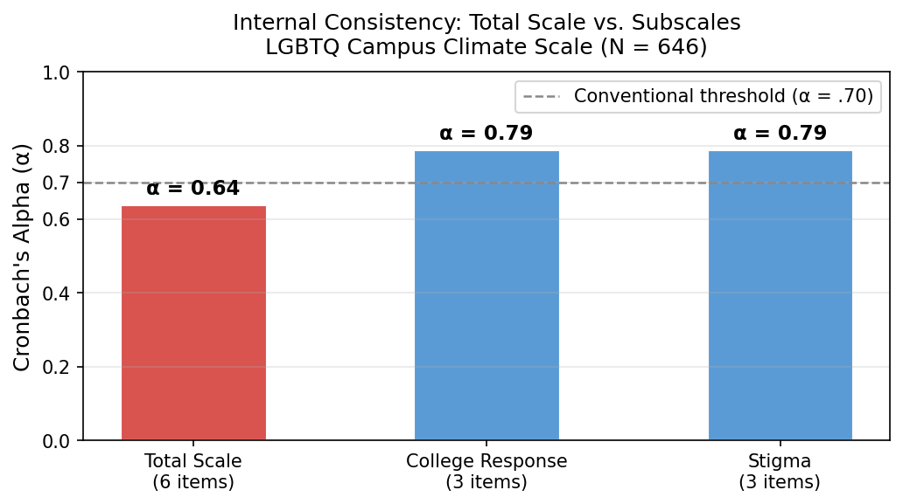

# Psychometric Scale Validation

**Instrument:** Perceptions of the LGBTQ College Campus Climate Scale (Szymanski & Bissonette, 2020)  
**Tools:** R (psych, tidyverse, MASS) · Python (figure generation)  
**Dataset:** N = 646 observations simulated from published parameters

---

## The Question

The LGBTQ Campus Climate Scale is a six-item instrument designed to measure two dimensions of campus environment: institutional responsiveness to LGBTQ students (College Response) and visibility of negative attitudes and harassment on campus (Stigma). The applied measurement question is whether to report a single total score or two subscale scores. The two interpretations differ in specificity and statistical behavior — reporting a total conflates two constructs and may obscure differential associations with outcomes.

This project applied a full scale-validation workflow (reliability analysis, item analysis, and exploratory factor analysis) to determine which interpretation the data support.

---

## Key Finding

**The instrument should be reported as two subscales, not as a single total score.** Three independent lines of evidence converge on this conclusion:

- Subscale alphas (.79 each) exceed the total scale alpha (.64) by 15 percentage points — a diagnostic pattern for a two-dimensional instrument
- Within-scale item correlations (.59–.69) are five times larger than cross-scale correlations (−.05–.13) at every item
- PCA and PAF both recover the same clean two-factor structure, with loadings of .71–.88 and near-zero between-factor correlation

*The total scale alpha (α = .64, red) falls below the conventional threshold of .70 (dashed line). Both three-item subscales reach α = .79 (blue). This 15-point reliability gap — and the accompanying omega analysis showing reliable variance concentrated in two subfactors — is the defining signature of a two-dimensional instrument measured by a pooled total score.*

---

## Project Files

| File | Purpose |
|---|---|
| [`01_Project_Summary.md`](01_Project_Summary.md) | Concise findings-first overview: measurement problem, key evidence, and recommendations |
| [`02_Project_Report.md`](02_Project_Report.md) | Full PhD-level write-up: metric definitions, method definitions and alternatives, figure walkthroughs, APA 7 citations |
| [`03_Analysis_Workflow.md`](03_Analysis_Workflow.md) | Rendered R Markdown workflow with step-by-step code, outputs, and embedded results |
| [`04_Source_Analysis.Rmd`](04_Source_Analysis.Rmd) | R Markdown source for the rendered workflow |

---

## Data Note

Item-level data are simulated from the factor loadings, item means, standard deviations, and sample size (N = 646) reported in Szymanski and Bissonette (2020, Table 2). Simulation used `MASS::mvrnorm()` with `empirical = TRUE` and a fixed seed (210827) for reproducibility. This is a methodological demonstration, not a new empirical validation study.
