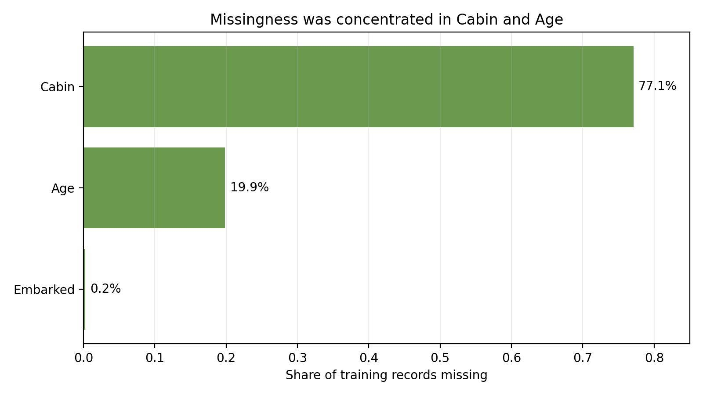
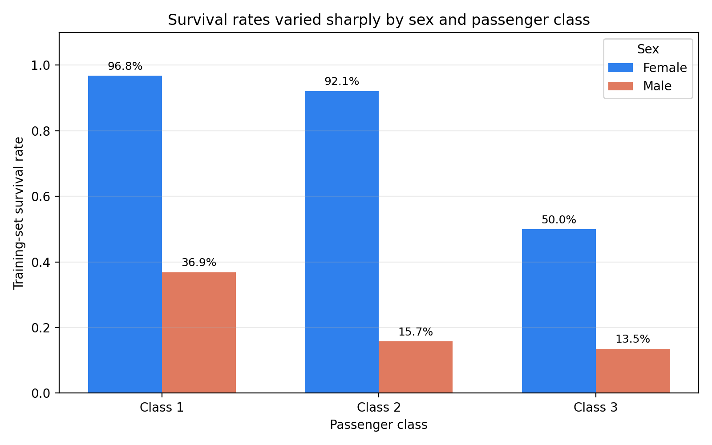
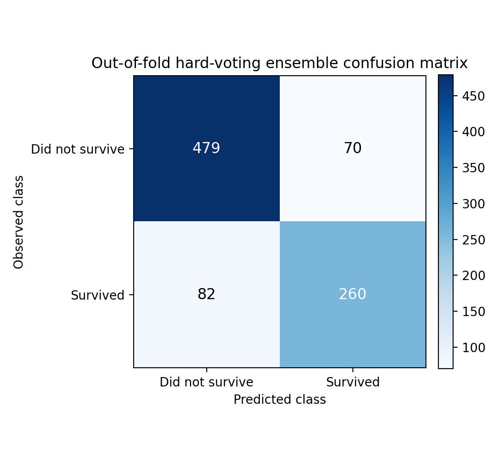
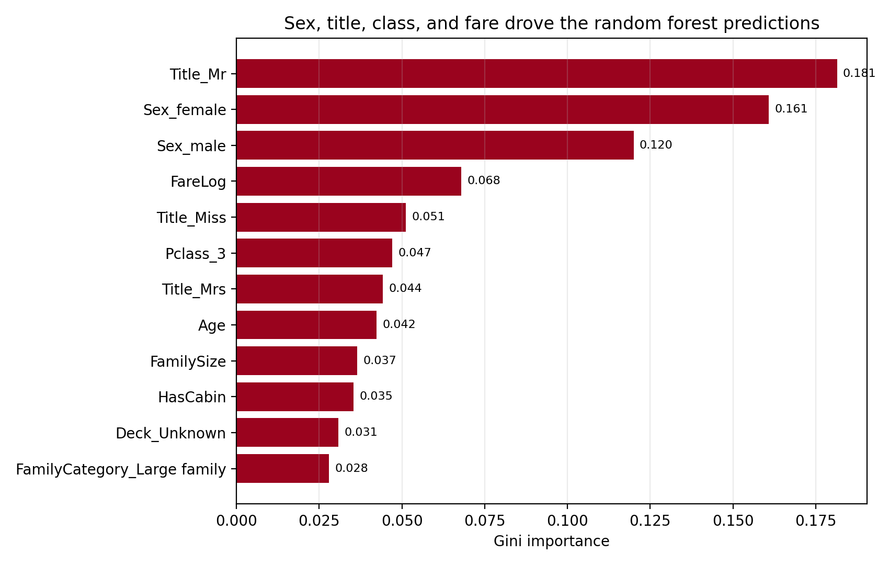
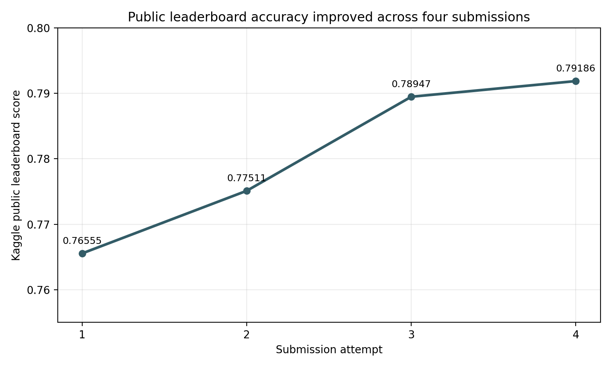

# Titanic Passenger Survival Classification - Project Report

**Author:** Mintay Misgano, PhD
**Dataset:** Kaggle Titanic: Machine Learning from Disaster
**Tools:** Python, pandas, scikit-learn, matplotlib
**Best recorded public leaderboard score:** 0.79186

## Abstract

This project analyzes the public Kaggle Titanic competition dataset as a binary classification problem: predict passenger survival from demographic, ticket, family, cabin, fare, and embarkation records. The final workflow uses training-set-only imputation, feature engineering for passenger title, family structure, fare skew, cabin availability, deck, and age bands, then compares logistic regression, Gaussian naive Bayes, decision tree, random forest, gradient boosting, and a hard-voting ensemble under five-fold stratified cross-validation. In the rebuilt analysis, gradient boosting produced the highest cross-validated accuracy (0.838), followed by random forest (0.832) and the hard-voting ensemble (0.829). The original public Kaggle submission history improved from 0.76555 for a single decision-tree baseline to 0.79186 for the tuned five-model voting submission.

## 1. Problem And Dataset

The Kaggle Titanic competition asks analysts to predict whether passengers survived the sinking of the RMS Titanic using structured passenger records (Kaggle, 2012). The task is useful as a compact applied machine-learning benchmark because it combines a clear binary outcome with realistic data issues: missing values, skewed continuous variables, categorical encodings, and predictors that are socially and historically entangled.

The training file contains 891 labeled passenger records. The outcome variable, `Survived`, is coded as 1 for survival and 0 for non-survival. In the labeled data, 342 passengers survived (38.4%) and 549 did not survive (61.6%). This is a moderate class imbalance: the minority class is large enough for ordinary supervised learning, but naive accuracy can still overstate model quality if a model mostly predicts the majority class. The test file contains 418 passenger records without the outcome label.

The raw feature set includes passenger class (`Pclass`), sex, age, siblings/spouses aboard (`SibSp`), parents/children aboard (`Parch`), ticket number, fare, cabin, and embarkation port. Missingness is concentrated in `Cabin` and `Age`: cabin is missing for 687 of 891 training records (77.1%), age is missing for 177 records (19.9%), and embarkation port is missing for 2 records (0.2%). Those missingness patterns were handled differently because they imply different kinds of information loss.

## 2. Feature Engineering

Feature engineering means transforming raw variables into model-ready predictors that better represent the structure of the problem (Kuhn & Johnson, 2013). In this project, the strongest predictors are visible in the historical evacuation logic. The modeling task is therefore less about extracting signal from a huge dataset and more about encoding a small dataset carefully enough that the model can learn the relevant interactions.

Passenger title was extracted from the `Name` field and collapsed into `Mr`, `Mrs`, `Miss`, `Master`, and `Rare`. Title is useful because it combines social role, approximate age, and gendered evacuation priority. A child titled `Master` and an adult titled `Mr` should not receive the same age or survival expectation just because both records are male.

Age imputation used the median age within each title-by-class group learned from the training set. If a specific title-class group had no available age median, the workflow fell back first to the title median and then to the global training median. This is more specific than global median imputation while avoiding target leakage. The test set receives imputation values learned from the training set; it is not allowed to teach the workflow its own medians.

Family structure was represented with `FamilySize`, defined as `SibSp + Parch + 1`, and `IsAlone`, a binary indicator for passengers traveling with no recorded family members. The feature also feeds `FamilyCategory`, which separates solo travelers, small family groups, and large family groups. This captures a practical evacuation issue: traveling alone and traveling with a large group are both different from traveling with one or two close relatives.

Fare was transformed with `log1p(Fare)` because the raw fare distribution is right-skewed. Log transformation compresses extreme high fares while preserving rank order, reducing the influence of a few unusually expensive first-class tickets on models that are sensitive to scale (Kuhn & Johnson, 2013).

Cabin was missing too often for direct cabin-number imputation to be credible. Instead, the workflow uses `HasCabin` to preserve whether a cabin was recorded and extracts `Deck` from the first cabin letter when available. Cabin availability is partly a proxy for class and ticket documentation, while deck is a rough location signal.

The strongest descriptive pattern appears in survival rates by sex and passenger class. First-class women survived at 96.8%, second-class women at 92.1%, and third-class women at 50.0%. Men survived at much lower rates: 36.9% in first class, 15.7% in second class, and 13.5% in third class. These rates justify keeping sex and class as central predictors and also motivate interaction-sensitive models.

## 3. Models And Methodological Rationale

Logistic regression models the log-odds of a binary outcome as a linear combination of predictors. It is a strong baseline because it is interpretable and stable on small datasets, but it assumes that the predictors combine additively on the log-odds scale unless interactions are explicitly included (Hosmer et al., 2013). Here, logistic regression provides a useful benchmark for how far a comparatively simple linear classifier can go after feature engineering.

Gaussian naive Bayes is a probabilistic classifier that applies Bayes' theorem while assuming conditional independence among predictors and Gaussian distributions for continuous features (Hastie et al., 2009). Those assumptions are not literally true for Titanic data: sex, title, class, fare, and cabin availability are correlated. The model remains valuable as a low-variance comparator because it often performs reasonably well on small datasets despite misspecified independence assumptions.

A decision tree recursively partitions the feature space into groups that are more homogeneous on the outcome (Breiman et al., 1984). It can represent nonlinear splits and interactions without manually specifying them. The cost is high variance: a single tree can overfit the training data, especially when sample size is modest. This workflow restricts tree depth and leaf size to reduce that risk.

Random forest addresses decision-tree variance by fitting many trees on bootstrapped samples and random subsets of predictors, then averaging their predictions (Breiman, 2001). This usually improves generalization relative to a single tree and produces useful feature-importance diagnostics, though the resulting model is less directly interpretable than a small tree.

Gradient boosting builds trees sequentially, where each new tree focuses on errors left by the previous ensemble (Friedman, 2001). Boosting often performs well on structured tabular data because it can model nonlinear relationships and interactions in a controlled sequence. Its tradeoff is sensitivity to tuning choices such as learning rate, tree depth, and number of boosting stages.

Hard voting combines several classifiers by taking the class that receives the majority vote. Compared with soft voting, which averages predicted probabilities, hard voting does not require all component models to produce calibrated probabilities. Compared with stacking, which trains a second-level model on base-model predictions, hard voting is simpler and less likely to overfit a small dataset. The ensemble in this project combines logistic regression, Gaussian naive Bayes, decision tree, random forest, and gradient boosting so that the vote spans linear, probabilistic, single-tree, bagged-tree, and boosted-tree assumptions.

## 4. Evaluation Metrics

Accuracy is the share of records whose predicted class matches the observed class. Its range is 0 to 1, with higher values indicating more correct classifications. In the Kaggle Titanic competition, leaderboard score is based on classification accuracy on held-out test records (Kaggle, 2012). Accuracy is therefore the primary metric, but it must be read alongside class balance because a model can look acceptable by favoring the majority class.

Balanced accuracy averages sensitivity across the outcome classes. In binary classification, it gives equal weight to correct classification of survivors and non-survivors, making it useful when class sizes differ (Brodersen et al., 2010). A balanced accuracy near 0.50 would be no better than chance under balanced classes, while values closer to 1.00 indicate stronger performance across both groups. Here it helps check whether high accuracy is coming from both survivor and non-survivor predictions rather than mostly from the larger non-survivor class.

Cross-validation estimates model performance by repeatedly training on part of the labeled data and validating on the held-out part. Five-fold stratified cross-validation divides the data into five folds while preserving the survival/non-survival ratio in each fold (Kohavi, 1995). The mean score estimates expected performance across folds, while the standard deviation shows fold-to-fold stability. A higher mean with a low standard deviation is preferable because it suggests both accuracy and stability.

Precision for the survived class is the share of predicted survivors who were observed survivors. Recall for the survived class is the share of observed survivors that the model correctly identified (Powers, 2011). Precision and recall clarify the error pattern behind the confusion matrix. In this project, recall matters because under-identifying survivors would mean the model is missing a substantial portion of the positive class.

The public Kaggle leaderboard score is an external benchmark computed on a portion of the unlabeled competition test set. It is useful for comparison but is not a substitute for internal validation because repeated public submissions can indirectly tune decisions to the public split. The project therefore separates the original leaderboard history from cross-validated training-set evaluation.

## 5. Results

### 5.1 Cross-Validated Model Comparison

All six model configurations were evaluated with the same five stratified folds. Gradient boosting produced the strongest mean accuracy at 0.838 with a standard deviation of 0.026. Random forest followed closely at 0.832 with a much smaller standard deviation of 0.004, suggesting highly stable fold-to-fold behavior. The hard-voting ensemble reached 0.829 accuracy and 0.816 balanced accuracy, nearly matching the best individual models while combining distinct model assumptions.

| Model | Accuracy mean | Accuracy SD | Balanced accuracy mean |
|:--|--:|--:|--:|
| Gradient Boosting | 0.838 | 0.026 | 0.818 |
| Random Forest | 0.832 | 0.004 | 0.813 |
| Hard-Voting Ensemble | 0.829 | 0.015 | 0.816 |
| Logistic Regression | 0.828 | 0.014 | 0.815 |
| Gaussian Naive Bayes | 0.807 | 0.011 | 0.811 |
| Decision Tree | 0.800 | 0.018 | 0.775 |

The ordering is analytically useful. The single decision tree lagged the ensemble methods, which is consistent with the expected variance of one constrained tree. Logistic regression was competitive after feature engineering, reaching 0.828 accuracy, which indicates that much of the signal was captured by well-structured predictors rather than by complex algorithms alone. Gradient boosting led the comparison, but the random forest's low standard deviation makes it the most stable individual model in this run.

### 5.2 Hard-Voting Ensemble Diagnostics

The out-of-fold confusion matrix for the hard-voting ensemble was `[[479, 70], [82, 260]]`, where rows are observed classes and columns are predicted classes. The model correctly identified 479 non-survivors and 260 survivors. It mislabeled 70 non-survivors as survivors and 82 survivors as non-survivors.

For the survived class, precision was 0.788 and recall was 0.760. Balanced accuracy was 0.816. The confusion matrix shows a reasonable survivor identification rate while still reflecting the difficulty of the minority class: 82 of 342 observed survivors were missed in out-of-fold predictions. This is why the report emphasizes both accuracy and balanced accuracy instead of treating leaderboard-style accuracy as the only quality signal.

### 5.3 Feature Importance

Random forest feature importance ranked title, sex, fare, passenger class, age, and family structure as the most influential predictors. The top features were `Title_Mr` (0.181), `Sex_female` (0.161), `Sex_male` (0.120), `FareLog` (0.068), `Title_Miss` (0.051), `Pclass_3` (0.047), `Title_Mrs` (0.044), `Age` (0.042), `FamilySize` (0.037), and `HasCabin` (0.035).

The importance profile supports the feature-engineering strategy. `Title_Mr`, `Sex_female`, and `Sex_male` capture the historically dominant sex and social-role pattern. `FareLog`, `Pclass_3`, and `HasCabin` capture class and booking-status gradients. `Age` and `FamilySize` add signals that are not reducible to sex or class alone.

### 5.4 Submission History

The original public Kaggle submissions improved across four attempts:

| Attempt | Method | Public score |
|--:|:--|--:|
| 1 | Single decision tree baseline | 0.76555 |
| 2 | Three-model voting ensemble | 0.77511 |
| 3 | Five-model voting ensemble, first tuning pass | 0.78947 |
| 4 | Tuned five-model voting ensemble | 0.79186 |

The largest gain came from leaving the single-tree baseline and moving into ensemble modeling. Later gains were smaller but meaningful, coming from a broader set of component models and refinements to the feature set. The rebuilt internal validation now shows gradient boosting and random forest as the best current performers, while the historical public score records the strongest submitted version.

## 6. Limitations

The Titanic competition is a historical benchmark, not a general theory of emergency survival. The strongest predictors reflect a specific event, ship layout, evacuation protocol, and social context. They should not be generalized beyond the dataset without historical and operational evidence.

The public leaderboard score is informative but limited. Kaggle public scores are computed on a public subset of the test data, and repeated submissions can encourage overfitting to that subset. A production workflow would need a protected holdout set, stricter model-selection governance, and a clear threshold for when model tuning must stop.

Feature importance in a random forest is not causal evidence. Gini importance can favor variables with more split opportunities and can distribute credit across correlated predictors (Breiman, 2001). Here, feature importance is used as a model interpretation aid, not as proof that any variable caused survival.

The dataset is small. Five-fold cross-validation helps estimate generalization performance, but the fold-to-fold uncertainty for gradient boosting (standard deviation 0.026) shows that small changes in validation split can affect the estimated score. The random forest's lower standard deviation is a point in its favor when stability matters.

## 7. Conclusion

The rebuilt workflow treats the Titanic competition as a disciplined tabular classification exercise: encode the historical structure, fit preprocessing choices from the training data, compare model families under the same validation scheme, and separate internal validation from public leaderboard history. Gradient boosting led the current cross-validation results at 0.838 accuracy, while random forest offered the most stable high-performing individual model. The five-model hard-voting ensemble produced 0.829 accuracy, 0.816 balanced accuracy, and a final test-file predicted survival rate of 40.4%.

The original Kaggle progression from 0.76555 to 0.79186 is best understood as evidence of iterative modeling judgment. The meaningful gains came from moving beyond a single decision tree, representing passenger role and family context more precisely, and using validation evidence to compare models before final submission.

## References

Breiman, L. (2001). Random forests. *Machine Learning, 45*(1), 5-32. https://doi.org/10.1023/A:1010933404324

Breiman, L., Friedman, J. H., Olshen, R. A., & Stone, C. J. (1984). *Classification and regression trees*. Wadsworth.

Brodersen, K. H., Ong, C. S., Stephan, K. E., & Buhmann, J. M. (2010). The balanced accuracy and its posterior distribution. *2010 20th International Conference on Pattern Recognition*, 3121-3124. https://doi.org/10.1109/ICPR.2010.764

Friedman, J. H. (2001). Greedy function approximation: A gradient boosting machine. *Annals of Statistics, 29*(5), 1189-1232. https://doi.org/10.1214/aos/1013203451

Hastie, T., Tibshirani, R., & Friedman, J. (2009). *The elements of statistical learning: Data mining, inference, and prediction* (2nd ed.). Springer.

Hosmer, D. W., Lemeshow, S., & Sturdivant, R. X. (2013). *Applied logistic regression* (3rd ed.). Wiley.

Kaggle. (2012). *Titanic: Machine learning from disaster*. https://www.kaggle.com/c/titanic

Kohavi, R. (1995). A study of cross-validation and bootstrap for accuracy estimation and model selection. *Proceedings of the 14th International Joint Conference on Artificial Intelligence*, 1137-1143.

Kuhn, M., & Johnson, K. (2013). *Applied predictive modeling*. Springer.

Pedregosa, F., Varoquaux, G., Gramfort, A., Michel, V., Thirion, B., Grisel, O., Blondel, M., Prettenhofer, P., Weiss, R., Dubourg, V., Vanderplas, J., Passos, A., Cournapeau, D., Brucher, M., Perrot, M., & Duchesnay, E. (2011). Scikit-learn: Machine learning in Python. *Journal of Machine Learning Research, 12*, 2825-2830.

Powers, D. M. W. (2011). Evaluation: From precision, recall and F-measure to ROC, informedness, markedness and correlation. *Journal of Machine Learning Technologies, 2*(1), 37-63.
