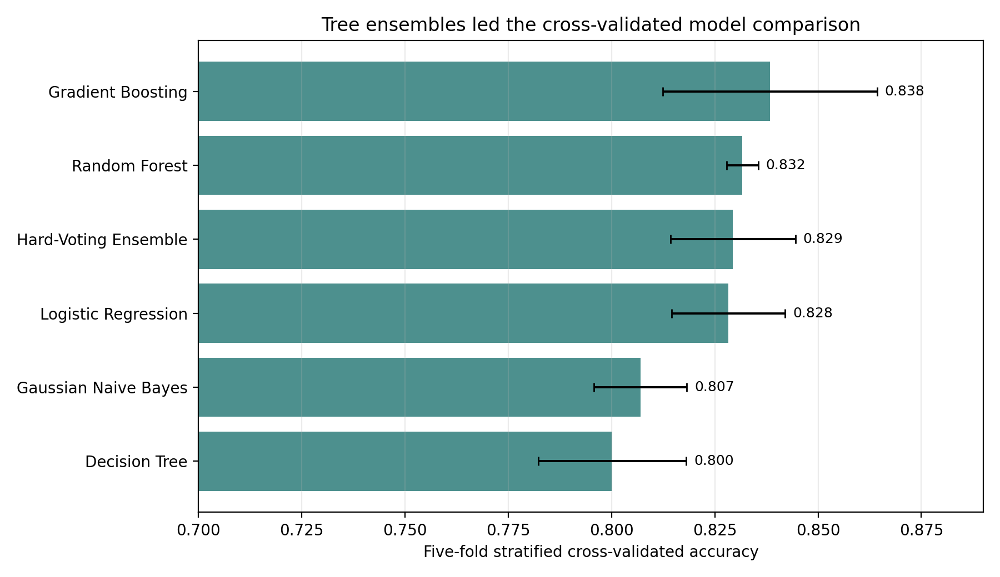

# Titanic Passenger Survival Classification

**Author:** Mintay Misgano, PhD
**Dataset:** Kaggle Titanic: Machine Learning from Disaster
**Best recorded public leaderboard score:** 0.79186

The Titanic benchmark asks a simple classification question with a messy tabular dataset: which passengers were most likely to survive, given demographic, ticket, family, cabin, and embarkation records? The final workflow uses training-set-only imputation, engineered social-role and travel-party features, six model comparisons, and a competition-style submission file.

Gradient boosting produced the strongest five-fold cross-validated accuracy in the rebuilt workflow at 0.838, followed by random forest at 0.832 and a hard-voting ensemble at 0.829. The original competition submission history still matters: four Kaggle public submissions improved from 0.76555 to 0.79186 as the workflow moved from a single decision tree to broader feature engineering and ensemble modeling.

## Key Findings

- Survival in the training data was 38.4% overall, with 342 survivors and 549 non-survivors across 891 labeled passengers.
- Sex and class were the clearest descriptive split: first-class women survived at 96.8%, while third-class men survived at 13.5%.
- Missingness was concentrated in `Cabin` (77.1%) and `Age` (19.9%), so cabin was treated as an availability signal and age was imputed from passenger title and class.
- Random forest feature importance ranked `Title_Mr`, `Sex_female`, `Sex_male`, `FareLog`, and `Title_Miss` as the strongest predictors.
- The hard-voting ensemble produced 0.816 out-of-fold balanced accuracy, with 479 true non-survivor predictions and 260 true survivor predictions in cross-validation.

## Project Files

- [01_Project_Summary.md](01_Project_Summary.md): concise findings and implications.
- [02_Project_Report.md](02_Project_Report.md): full methods, metric definitions, results, limitations, and references.
- [03_Analysis_Notebook.ipynb](03_Analysis_Notebook.ipynb): rendered notebook view of the workflow.
- [04_Source_Code.py](04_Source_Code.py): reproducible Python source.
- [docs/Results_Snapshot.md](docs/Results_Snapshot.md): model metrics, confusion matrix, feature importance, and figure inventory.

## Project Files

| File or folder | Purpose |
|:--|:--|
| `data/` | Public Kaggle `train.csv` and `test.csv` files with a source note. |
| `docs/figures/` | Six rendered figures used by the README, report, and workflow. |
| `outputs/titanic_submission.csv` | Final prediction file written by the source workflow. |
| `Titanic_Project_Summary.md`, `Titanic_Project_Report.md`, `Titanic_ML_Classification.py`, `Titanic_ML_Classification.ipynb` | Compatibility pointers for the earlier file names. |
