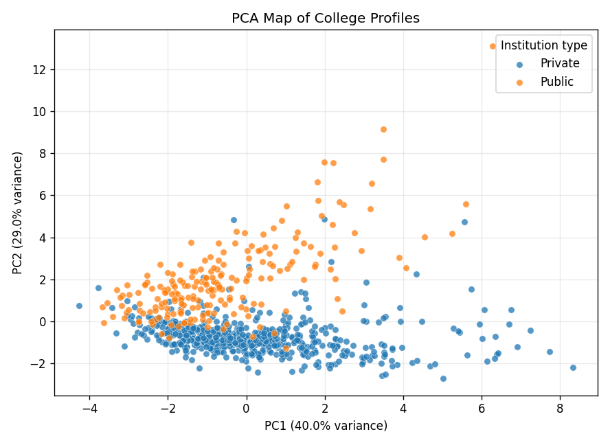

# College Institutional Profile Modeling - Summary

## The problem

The same college dataset can support several different modeling questions: predicting graduation rate, classifying private versus public institutions, discovering natural clusters, and reducing many institutional features into a smaller set of dimensions. This project puts those questions side by side to show where the methods agree, where they diverge, and what that means for interpreting institutional data.

The analysis uses the public ISLR College dataset (`N = 777`). The dataset is educational rather than operational, so the goal is not to recommend decisions about real colleges. The value is in the modeling judgment: choosing metrics that match each question, comparing predictive and exploratory methods fairly, and explaining why a high-performing classifier does not mean the same thing as a meaningful unsupervised cluster.

## What I did

I used one project-local Python workflow to run four linked analyses. First, I fit a linear regression to predict graduation rate from institutional features. Second, I compared four private/public classifiers with the same 5-fold stratified cross-validation design. Third, I used k-means and Gaussian mixture modeling to test whether the numeric profiles naturally separated into groups without using the private/public label. Fourth, I used principal components analysis to see how many dimensions were needed to preserve most of the feature variation.

## What I found

**Private/public classification was highly learnable.** SVM with an RBF kernel produced the strongest cross-validated accuracy (`0.937`), with logistic regression essentially tied (`0.936`). Random forest was slightly lower (`0.929`), and the decision tree trailed at `0.901`. The small gap between SVM and logistic regression matters: a simpler, more interpretable linear classifier was nearly as strong as the nonlinear model.

**The strongest classification signal came from institutional scale and cost variables.** Random forest ranked out-of-state tuition highest (`importance = 0.279`), followed by enrollment (`0.193`) and acceptances (`0.110`). That pattern suggests the model is mostly separating institutional profile types rather than discovering a narrow admissions-only rule.

**Unsupervised structure did not simply reproduce the private/public label.** k-means had a near-zero adjusted Rand index against private/public status (`ARI = -0.023`), while Gaussian mixture modeling was better but still moderate (`ARI = 0.289`). The PCA map shows overlap between private and public schools rather than two perfectly separated clouds.

## What it means

The main lesson is methodological judgment. A classifier can perform well when the target label is supplied, but unsupervised methods answer a different question: whether the features form natural groups before labels are imposed. Here, the private/public label is predictable, but it is not the only structure in the data. For applied analytics work, that distinction matters because it prevents a modeler from treating a successful prediction task as proof that the underlying population has simple, clean segments.

## Recommendation

Use this project as evidence of disciplined model comparison rather than as a deployment case. The workflow shows how to align each method with its actual question: regression for continuous outcomes, classification for known labels, clustering for unlabeled structure, and PCA for dimensionality reduction. In a real people analytics or institutional research setting, the same discipline would be the starting point before adding fairness review, calibration, stakeholder validation, and current operational data.
