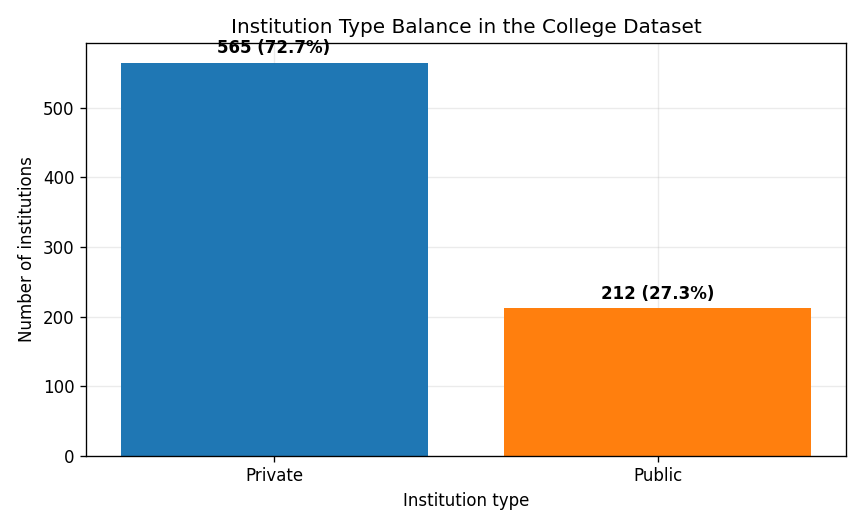
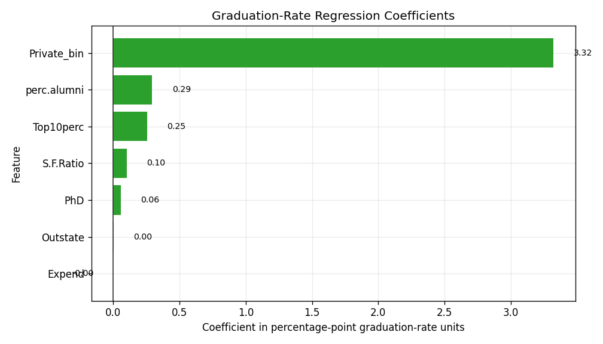
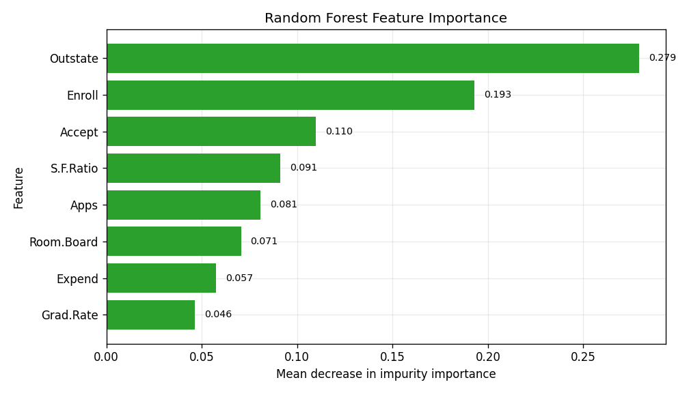
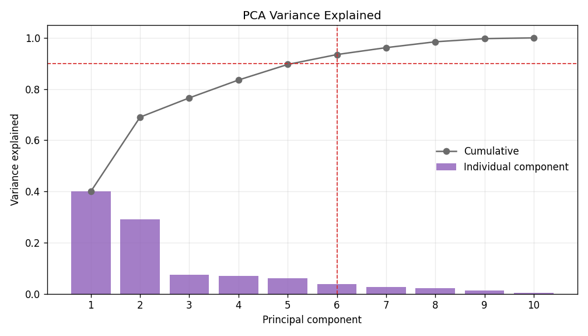

# College Institutional Profile Modeling - Project Report

**Author:** Mintay Misgano, PhD
**Tools:** Python, pandas, scikit-learn, matplotlib
**Dataset:** ISLR College dataset (`N = 777` U.S. colleges and universities)

---

## Abstract

This project uses the public ISLR College dataset to compare several machine-learning methods on the same institutional profile records. The workflow asks four related questions: which features help explain graduation-rate differences, how accurately models can classify private versus public institutions, whether unsupervised methods recover meaningful structure without the label, and how much feature variation can be compressed through principal components analysis. SVM and logistic regression produced the strongest private/public classification accuracy (`0.937` and `0.936`, respectively), while k-means clustering did not recover the private/public label (`ARI = -0.023`). The result is a useful modeling lesson: a supplied label can be highly predictable while the unlabeled feature space still contains more complicated structure.

---

## 1. Project Context

The project originated in graduate machine-learning coursework and was rebuilt as a public, reproducible modeling comparison. The public version is not framed as a college admissions or policy recommendation. Instead, it uses a familiar teaching dataset to show how model choice depends on the question being asked.

The same institutional records support at least four different analytic tasks:

1. Predicting a continuous outcome: graduation rate.
2. Classifying a known label: private versus public institution.
3. Discovering unlabeled structure: whether institutions form natural clusters.
4. Reducing dimensionality: whether many profile variables can be summarized by fewer latent dimensions.

That distinction matters because these methods are often discussed as interchangeable "machine learning." In practice, they produce different kinds of evidence.

---

## 2. Data

The ISLR College dataset contains `777` U.S. colleges and universities. The project-local dataset includes institutional variables such as applications, acceptances, enrollment, out-of-state tuition, room and board, faculty credentials, student-faculty ratio, alumni giving, instructional expenditure, and graduation rate. The binary target `Private` identifies whether an institution is private (`565`, or `72.7%`) or public (`212`, or `27.3%`).

**Figure 1 interpretation.** The class balance is visibly uneven: private institutions make up nearly three quarters of the dataset. This is why classification accuracy should be interpreted with context. A model can look strong if it mostly predicts the majority class, so the workflow uses stratified cross-validation to preserve the private/public ratio within each fold.

---

## 3. Methods

### 3.1 Linear Regression

Linear regression models a continuous outcome as a weighted sum of predictors plus an error term. In this project, the outcome is graduation rate, measured in percentage points. The model estimates how much graduation rate changes when a predictor changes while other predictors are held constant. The method is appropriate here because graduation rate is continuous and the goal is an interpretable baseline, not a black-box prediction model (James et al., 2021).

**Alternative considered.** A random forest regressor or gradient boosting regressor could capture nonlinear relationships, but those models would make the first result less interpretable. Linear regression is retained because the question is: which institutional features are directionally associated with graduation-rate differences?

### 3.2 Logistic Regression

Logistic regression models the probability of a binary outcome using the log-odds scale. For private/public classification, the model estimates how institutional features shift the odds that a college is private. Logistic regression is useful because it is comparatively transparent: coefficients can be inspected and the model is less opaque than ensemble methods (Hosmer et al., 2013).

**Alternative considered.** A nonlinear classifier can improve performance if the decision boundary is curved or interaction-heavy. Logistic regression is included as the interpretable baseline against which more flexible models are compared.

### 3.3 Decision Tree, SVM, and Random Forest

A decision tree recursively splits the feature space into rules that maximize class separation. It is easy to explain, but a single tree can be unstable. A support vector machine (SVM) finds a separating boundary between classes; with a radial basis function kernel, the boundary can be nonlinear. A random forest averages many decision trees, reducing the instability of one tree and often improving predictive performance (Breiman, 2001; Cortes & Vapnik, 1995).

**Alternative considered.** Gradient boosting could be included as another ensemble method, but this pass keeps the classifier comparison focused on four common model families: interpretable linear model, simple tree, kernel model, and bagged ensemble.

### 3.4 k-Means, Gaussian Mixture Modeling, and PCA

k-means clustering partitions observations into `k` groups by minimizing within-cluster distances. Gaussian mixture modeling (GMM) also clusters observations, but treats each cluster as a probabilistic distribution rather than a hard centroid. Principal components analysis (PCA) transforms correlated features into orthogonal components that capture descending amounts of variance (Jolliffe & Cadima, 2016; MacQueen, 1967).

**Alternative considered.** Hierarchical clustering could show nested structure, but the two-cluster k-means and GMM comparison is better aligned with the private/public label question: do the numeric profiles naturally split into two groups?

### 3.5 Evaluation Metrics

**Cross-validated accuracy.** Accuracy is the proportion of correct classifications. Five-fold stratified cross-validation repeats the estimate across five train/test splits while preserving the class ratio in each fold. This produces a more stable estimate than one split and is appropriate when comparing models on the same dataset (Kohavi, 1995).

**R-squared.** R-squared is the proportion of variance in a continuous outcome explained by the regression model. It ranges from `0` to `1` in ordinary settings, with higher values indicating more explained variance. Here it tells how much of graduation-rate variation is explained by the selected institutional features.

**RMSE.** Root mean squared error is the typical prediction error in the outcome's units. Because graduation rate is measured in percentage points, RMSE is interpreted as percentage-point error.

**Adjusted Rand index (ARI).** ARI compares a clustering solution to a known label while correcting for chance agreement. A value near `1` means close agreement; `0` means roughly chance-level agreement; negative values indicate worse-than-chance alignment. It is used here to test whether unsupervised clusters recover the private/public label.

**PCA variance explained.** PCA variance explained is the share of total feature variation captured by each component. Cumulative variance answers how many components are needed before most of the feature information is retained.

---

## 4. Results

### 4.1 Graduation-Rate Regression

The graduation-rate regression explained nearly half of the holdout variance (`R-squared = 0.487`) with an RMSE of `10.98` graduation-rate percentage points. The largest coefficient by absolute value was the private-institution indicator (`+3.322`), followed by alumni giving percentage (`+0.294`), top-10-percent entering class share (`+0.254`), and student-faculty ratio (`+0.102`).

**Figure 2 interpretation.** The private-institution coefficient is the largest visible effect, but the continuous predictors are more important for analytic interpretation because they show how institutional resources and selectivity enter the graduation-rate model. Alumni giving and top-10-percent share are both positive, consistent with the idea that student preparation and institutional support are linked to graduation outcomes. The model is useful as an interpretable baseline, but the RMSE of `10.98` points means it is not precise enough for high-stakes institutional ranking.

### 4.2 Private/Public Classification

The four classifiers were compared under the same 5-fold stratified cross-validation design. SVM with an RBF kernel produced the highest average accuracy (`0.937`, SD `0.014`), but logistic regression was essentially tied (`0.936`, SD `0.012`). Random forest followed at `0.929`, and the decision tree trailed at `0.901`.

**Figure 3 interpretation.** The key pattern is not only that SVM leads. The more useful evidence is the small gap between SVM and logistic regression: only `0.001` accuracy points separate them. That makes logistic regression a strong practical candidate if interpretability is valuable. Random forest is also strong, but its `0.929` accuracy does not justify extra complexity by accuracy alone in this dataset.

### 4.3 Random Forest Feature Importance

Random forest ranked out-of-state tuition as the strongest predictor (`importance = 0.279`), followed by enrollment (`0.193`), acceptances (`0.110`), student-faculty ratio (`0.091`), and applications (`0.081`).

**Figure 4 interpretation.** The top predictors are mostly institutional scale, cost, and selectivity indicators. Out-of-state tuition leads the model, which makes sense because private institutions often have different tuition structures than public institutions. Enrollment and acceptances also matter, suggesting that the classifier is separating institutional profile types rather than relying on one admissions field alone.

### 4.4 Unsupervised Structure

k-means clustering with `k = 2` did not align with private/public status (`ARI = -0.023`). Its two clusters mixed both labels: cluster `0` contained `50` public and `206` private schools, while cluster `1` contained `162` public and `359` private schools. Gaussian mixture modeling aligned better but remained moderate (`ARI = 0.289`; AIC `11544.8`; BIC `12154.7`).

**Figure 5 interpretation.** The PCA map shows overlap between private and public institutions rather than two cleanly separated clouds. This visual pattern explains the clustering result. Private/public is predictable when the label is supplied, but the unlabeled feature space does not reduce to a simple two-group segmentation. In applied work, this distinction prevents a modeler from saying "the data naturally form private and public clusters" when the clustering evidence does not support that claim.

### 4.5 Dimensionality Reduction

The first two principal components captured `69.0%` of the feature variance. Six components were needed to reach at least `90%` cumulative variance.

**Figure 6 interpretation.** The first two components carry a large share of the structure, but not enough to preserve the dataset on their own. Reaching the `90%` threshold requires six components, which means the institutional profile is not reducible to one or two simple dimensions without information loss. PCA is still useful for visualization and compression, but the result argues against over-interpreting a two-dimensional plot.

---

## 5. Synthesis

Three findings matter most. First, private/public status is highly predictable from institutional profile variables; SVM and logistic regression both exceed `0.93` cross-validated accuracy. Second, interpretability remains competitive: logistic regression nearly matches SVM, so the simpler model may be preferable when the goal is explanation rather than a marginal accuracy gain. Third, unsupervised structure is not the same as supervised predictability. k-means does not recover the private/public label, and PCA needs six components to preserve `90%` of the variation.

The overall conclusion is that method choice changes the claim the analyst can make. Classification answers, "Can I predict a supplied label?" Clustering answers, "Do the profiles form natural groups without that label?" PCA answers, "How much structure can I compress?" Treating those questions as interchangeable would overstate what the data show.

---

## 6. Recommendations

**Use simple models when the performance gain is negligible.** Logistic regression reached `0.936` accuracy, only `0.001` below SVM. If a stakeholder needs a private/public classifier that can be explained, the linear model is more defensible than the nonlinear SVM.

**Do not treat unsupervised clusters as proof of the known label.** k-means produced `ARI = -0.023` against private/public status, so the clustering evidence does not support a claim that the feature space naturally splits into private and public institutions.

**Use PCA as a diagnostic and visualization aid, not a full replacement for the feature set.** PC1 and PC2 captured `69.0%` of variance, but six components were needed for at least `90%`. A two-dimensional PCA plot is useful for orientation, but it omits meaningful information.

---

## 7. Limitations

The dataset is public and educational, not current operational data. The results should not be used to make claims about today's higher-education market without updated data and validation.

The classification target is institutional type, which is a broad label. A production workflow would need fairness review, calibration, external validation, and a stakeholder-specific objective before being used in decision-making.

The model comparison is intentionally compact. It uses stable default or lightly constrained model settings rather than exhaustive hyperparameter tuning. That is appropriate for a workflow focused on method comparison, but it is not a benchmark leaderboard exercise.

---

## References

Breiman, L. (2001). Random forests. *Machine Learning, 45*, 5-32.

Cortes, C., & Vapnik, V. (1995). Support-vector networks. *Machine Learning, 20*, 273-297.

Hosmer, D. W., Lemeshow, S., & Sturdivant, R. X. (2013). *Applied logistic regression* (3rd ed.). Wiley.

James, G., Witten, D., Hastie, T., & Tibshirani, R. (2021). *An introduction to statistical learning: With applications in R* (2nd ed.). Springer.

Jolliffe, I. T., & Cadima, J. (2016). Principal component analysis: A review and recent developments. *Philosophical Transactions of the Royal Society A, 374*(2065), 20150202.

Kohavi, R. (1995). A study of cross-validation and bootstrap for accuracy estimation and model selection. In *Proceedings of the 14th International Joint Conference on Artificial Intelligence* (pp. 1137-1143).

MacQueen, J. (1967). Some methods for classification and analysis of multivariate observations. In *Proceedings of the Fifth Berkeley Symposium on Mathematical Statistics and Probability* (pp. 281-297).
