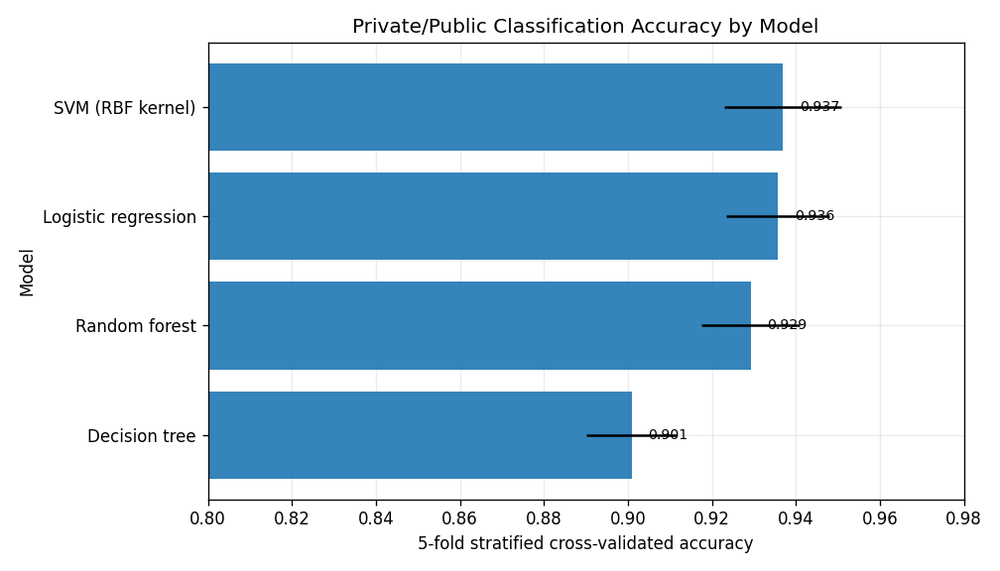

# College Institutional Profile Modeling

**Author:** Mintay Misgano, PhD

The ISLR College dataset contains 777 U.S. colleges and universities with enrollment, tuition, admissions, faculty, spending, and graduation-rate fields. This project uses that public dataset to answer a practical modeling question: when the same institutional records are viewed through supervised prediction, unsupervised clustering, and dimensionality reduction, which patterns are stable enough to guide interpretation?

The main result is that private/public classification is highly learnable from institutional profile variables, but unsupervised clusters do not simply recover the same label. SVM and logistic regression produced the strongest cross-validated private/public accuracy (`0.937` and `0.936`), while k-means clustering had a near-zero adjusted Rand index against the private/public label (`ARI = -0.023`). In plain terms, prediction works well when the target is supplied; structure discovery answers a different question.

## Where to go next

- **[01_Project_Summary.md](01_Project_Summary.md)** — a 3-minute, recruiter-friendly summary of the modeling story and key findings.
- **[02_Project_Report.md](02_Project_Report.md)** — the full technical write-up with method definitions, metric definitions, figure walkthroughs, limitations, and references.
- **[03_Analysis_Notebook.ipynb](03_Analysis_Notebook.ipynb)** — the GitHub-viewable notebook companion with the verified run output and figures.
- **[04_Source_Code.py](04_Source_Code.py)** — the reproducible Python source that reads `data/College_Data.csv` and regenerates every figure.
- **[docs/Results_Snapshot.md](docs/Results_Snapshot.md)** — a quick metric snapshot for fast review.

## Repository guide

| Path | Purpose |
|---|---|
| `data/College_Data.csv` | Public ISLR College dataset used for the analysis |
| `docs/figures/` | Six generated figures referenced in the README, summary, and report |
| `01_Project_Summary.md` | Short, findings-first overview |
| `02_Project_Report.md` | Full methods and results report |
| `03_Analysis_Notebook.ipynb` | Notebook companion with saved run output |
| `04_Source_Code.py` | Reproducible source workflow |

## Data and interpretation note

This project originated in graduate machine-learning coursework, but the public version is framed as an applied modeling comparison rather than a course lab. The dataset is public and educational, so the results should be read as evidence of modeling judgment and interpretation rather than as deployment guidance for a current college admissions or workforce process.
