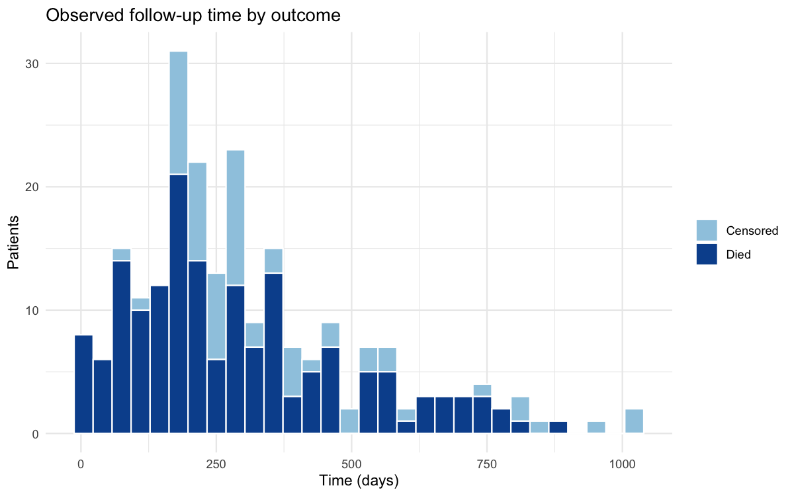
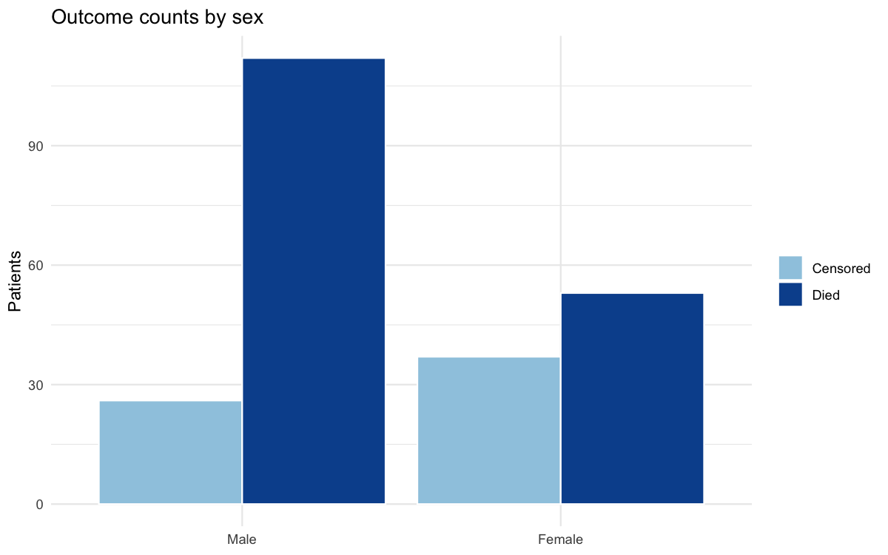
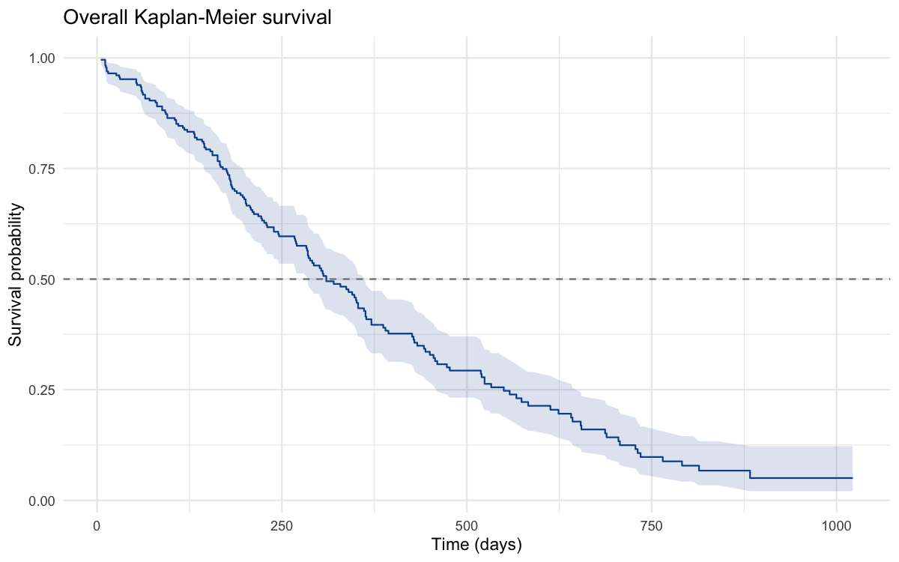
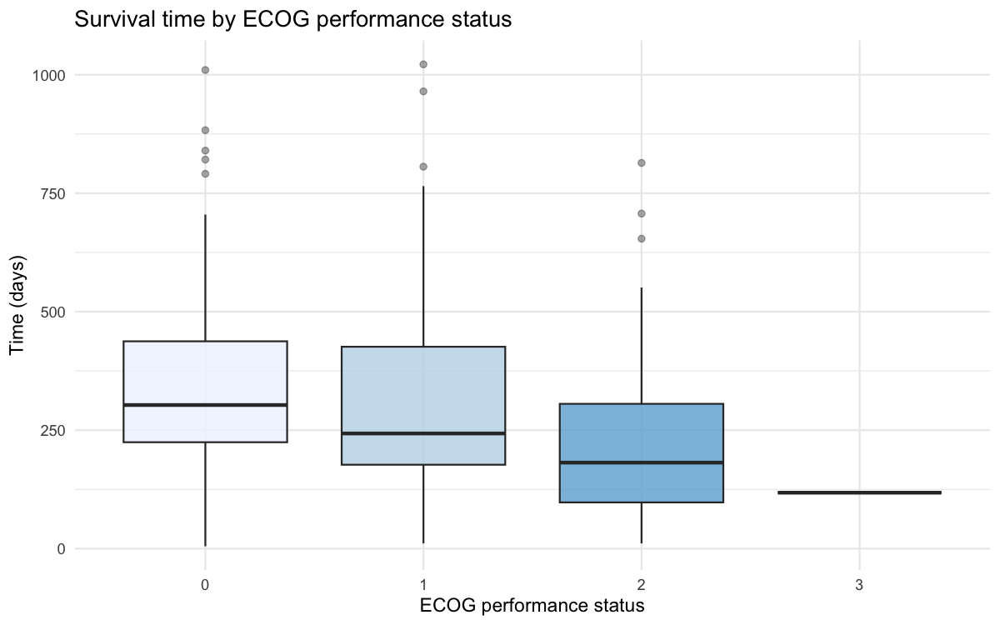
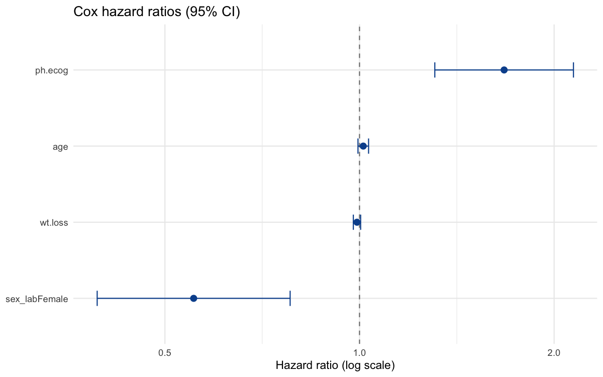
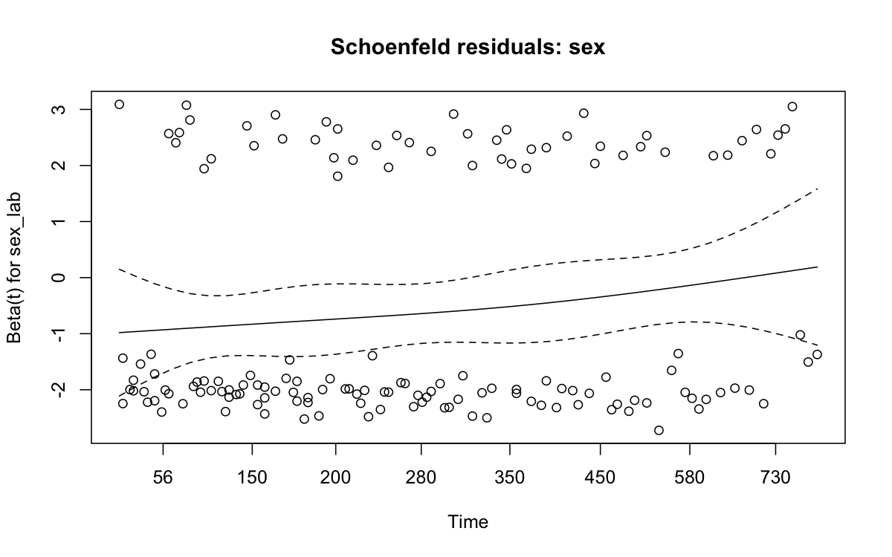

# Who Survives Longer After an Advanced Lung Cancer Diagnosis — and Why?

**Author:** Mintay Misgano, PhD
**Tools:** R (`survival`, `dplyr`, `ggplot2`, `broom`)
**Dataset:** NCCTG advanced lung cancer cohort, N = 228 (Loprinzi et al., 1994)

> **Data note.** This is a public, de-identified instructional dataset distributed with R's `survival` package. It is analyzed here as a methods demonstration; the clinical conclusions belong to the original oncology study, not to a new medical claim.

---

## 1. The problem and why the method choice matters

Among 228 patients with advanced lung cancer, we want to know who lives longer and which clinical factors drive that difference. The complication is **censoring**: at the end of follow-up, 63 of the 228 patients (28%) were still alive, so their true survival time is unknown — only that it exceeds their last contact. Averaging observed "time" would systematically understate survival because it treats those incomplete records as if the patient had died. The methods below are sequenced to respect that structure: exploratory description, a group comparison (ANOVA), and survival-specific tools (Kaplan-Meier and Cox regression) that use censored records correctly rather than discarding them.

The cohort is 138 men and 90 women, mean age 62.4 years (*SD* = 9.1, range 39-82), with 165 deaths observed during follow-up.

---

## 2. Metric definitions

Defined here so the results tables below can be read without external reference.

- **Median survival time** — the time at which the estimated survival probability first falls to 0.50, i.e., the point by which half the cohort has died. Preferred over the mean because it is well-defined even when some patients are still alive (the mean would require every patient to have an observed death).
- **Censoring** — an observation for which the event (death) has not occurred by the end of observation. It contributes information up to the censoring time and is then removed from the at-risk set.
- **Log-rank test** — a nonparametric test comparing the entire survival curves of two or more groups across all event times; its χ² statistic is large when curves diverge consistently. A small *p* indicates the groups' survival experiences differ (Harrington & Fleming, 1982).
- **Hazard ratio (HR)** — from the Cox model, the multiplicative change in instantaneous risk of death per one-unit increase in a predictor. HR = 1 is no effect, HR > 1 is elevated risk, HR < 1 is protection. A 95% confidence interval (CI) that excludes 1 indicates statistical significance.
- **Concordance (C-index)** — the probability that, for a random pair of patients, the model assigns higher risk to the one who dies first. 0.5 is chance; 0.7+ is generally considered useful discrimination (Harrell et al., 1996).
- **F-statistic (ANOVA)** — the ratio of between-group to within-group variance in survival time; large values indicate group means differ more than would be expected by chance (Fisher, 1925).

---

## 3. Exploratory description

*What to inspect:* the right tail and the color split. The distribution is right-skewed — most events occur in the first ~500 days — and the lighter censored bars cluster at longer follow-up times, the visual signature of patients still alive at last contact. This is the concrete reason the analysis cannot treat "time" as a complete outcome.

*What to inspect:* the censored-to-died ratio within each sex. Women show a higher proportion of censored (surviving) records than men, previewing the formal survival difference established next.

---

## 4. Survival by sex (Kaplan-Meier + log-rank)

Overall median survival is **310 days (95% CI 284-361)** — the point where the curve crosses the dashed 0.5 line.

*Evidence walkthrough.* The female curve sits above the male curve across essentially the entire follow-up window. Median survival is **426 days for women (n = 90, 53 deaths)** versus **270 days for men (n = 138, 112 deaths)** — a difference of roughly five months. The log-rank test confirms the separation is unlikely to be chance: **χ²(1) = 10.3, p = 0.0013**. Sex is therefore a real prognostic signal, not visual noise, which is what justifies carrying it into the multivariable model.

---

## 5. Performance status and survival time (ANOVA)

ECOG performance status grades functional ability from 0 (fully active) to 3 (largely bedbound). A one-way ANOVA of survival time across ECOG groups is significant: **F(3, 223) = 3.37, p = 0.019**. The group medians fall monotonically — **303, 243, 182, and 118 days for ECOG 0, 1, 2, and 3** — so each step down in functional status corresponds to a shorter typical survival. (ANOVA here is descriptive of the time variable and ignores censoring; the Cox model in Section 6 is the censoring-aware test of the same idea.)

---

## 6. Multivariable Cox proportional-hazards model

The Cox model estimates each predictor's effect on the hazard of death while adjusting for the others, using time-to-event with censoring intact.

| Predictor | Hazard ratio | 95% CI | p |
|---|---:|---|---:|
| ECOG performance status (per level) | **1.67** | 1.31-2.14 | **< 0.001** |
| Sex (female vs. male) | **0.55** | 0.39-0.78 | **0.001** |
| Age (per year) | 1.01 | 0.99-1.03 | 0.165 |
| Weight loss (per unit) | 0.99 | 0.98-1.00 | 0.176 |

*Evidence walkthrough.* Reading the forest plot left-to-right against the dashed "no effect" line at 1: **ECOG performance status is the strongest driver** — each one-level decline in functional status multiplies the hazard by 1.67 (95% CI 1.31-2.14), and its whiskers sit entirely right of 1. **Female sex is protective** — a 45% lower hazard than men (HR 0.55, 95% CI 0.39-0.78), the adjusted counterpart of the Kaplan-Meier gap in Section 4. Age and weight loss, by contrast, have confidence intervals straddling 1 and are not statistically distinguishable from no effect once the stronger predictors are included. The model's **concordance index is 0.65**, modest-but-useful discrimination consistent with a small clinical predictor set.

*Assumption check.* The Cox model assumes hazard ratios are roughly constant over time (proportional hazards). The global test is non-significant (**p = 0.10**), and the Schoenfeld residuals for sex show no systematic trend against time, so the proportionality assumption is reasonable and the hazard ratios above can be interpreted as stable over follow-up (Grambsch & Therneau, 1994).

---

## 7. Recommendations and interpretation

- **Stratify prognosis primarily on ECOG performance status.** It is the strongest adjusted predictor (HR 1.67 per level, p < 0.001) and the monotonic ANOVA medians (303 → 118 days) reinforce it; it should anchor risk discussion ahead of age, which was not significant here.
- **Treat sex as an independent prognostic factor, not a confound.** The female advantage persists after adjustment (HR 0.55), so it reflects more than differences in age or performance status within this cohort.
- **Do not lean on age or weight loss as standalone predictors in this sample.** Both had intervals crossing 1; any apparent univariate signal is absorbed by performance status and sex.
- **Report time-to-event, not event rates, for outcomes like this.** With 28% censoring, summarizing on deaths-only would bias survival downward; the Kaplan-Meier and Cox framework is the appropriate reporting standard.

---

## 8. Limitations

The cohort is a single instructional dataset of 228 patients, so estimates carry wide intervals and should not be generalized as new clinical guidance. ECOG and Karnofsky scores are collinear measures of the same construct, so only ECOG was modeled to avoid redundancy. The analysis prioritizes methodological range and correct handling of censoring over exhaustive model selection.

---

## References

Cox, D. R. (1972). Regression models and life-tables. *Journal of the Royal Statistical Society: Series B, 34*(2), 187-202.

Fisher, R. A. (1925). *Statistical methods for research workers.* Oliver and Boyd.

Grambsch, P. M., & Therneau, T. M. (1994). Proportional hazards tests and diagnostics based on weighted residuals. *Biometrika, 81*(3), 515-526.

Harrell, F. E., Lee, K. L., & Mark, D. B. (1996). Multivariable prognostic models: Issues in developing models, evaluating assumptions and adequacy, and measuring and reducing errors. *Statistics in Medicine, 15*(4), 361-387.

Harrington, D. P., & Fleming, T. R. (1982). A class of rank test procedures for censored survival data. *Biometrika, 69*(3), 553-566.

Kaplan, E. L., & Meier, P. (1958). Nonparametric estimation from incomplete observations. *Journal of the American Statistical Association, 53*(282), 457-481.

Loprinzi, C. L., Laurie, J. A., Wieand, H. S., Krook, J. E., Novotny, P. J., Kugler, J. W., ... Klatt, N. E. (1994). Prospective evaluation of prognostic variables from patient-completed questionnaires. *Journal of Clinical Oncology, 12*(3), 601-607.
