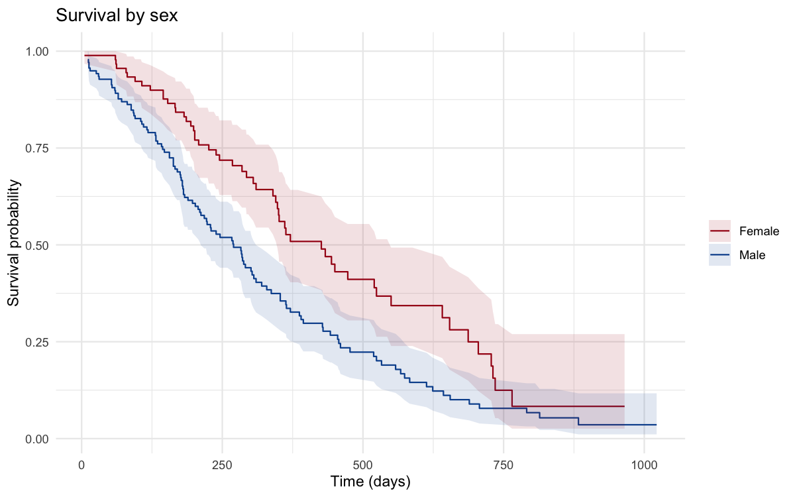

# Survival Analysis of Advanced Lung Cancer Outcomes

**Author:** Mintay Misgano, PhD · **Language:** R (`survival`, `ggplot2`)

Among 228 patients with advanced lung cancer, who survives longer — and which clinical factors actually drive that difference? This project answers that question while handling the central difficulty of survival data: 28% of patients were still alive at the end of follow-up, so their survival time is only partially known (censored), and ordinary averages would mislead.

**Key findings:** Women survived markedly longer than men (median 426 vs. 270 days; log-rank *p* = 0.001). A patient's ECOG performance status was the strongest predictor of mortality (hazard ratio 1.67 per level, *p* < 0.001), while age and weight loss showed no independent effect once it and sex were accounted for. The Cox model reached a concordance of 0.65, and its proportional-hazards assumption held (*p* = 0.10).

**Methods:** Kaplan-Meier estimation and the log-rank test for group survival, one-way ANOVA for performance-status differences, and a multivariable Cox proportional-hazards model with hazard-ratio interpretation and a Schoenfeld-residual assumption check.

## Read this project

- **[01_Project_Summary.md](./01_Project_Summary.md)** — a 3-minute, plain-language overview of the findings and what they mean.
- **[02_Project_Report.md](./02_Project_Report.md)** — the full write-up: metric definitions, figure-by-figure interpretation, the Cox results table, assumption checks, and references.
- **[03_Analysis_Workflow.md](./03_Analysis_Workflow.md)** — the rendered R Markdown workflow with code, tables, and inline figures.
- **[04_Source_Report.Rmd](./04_Source_Report.Rmd)** — the reproducible R source; the rendered workflow and figures are produced from it on publish.

## Data

NCCTG advanced lung cancer cohort (N = 228), a public, de-identified instructional dataset distributed with R's `survival` package (Loprinzi et al., 1994). It is analyzed here as a methods demonstration, not as a new clinical claim.
