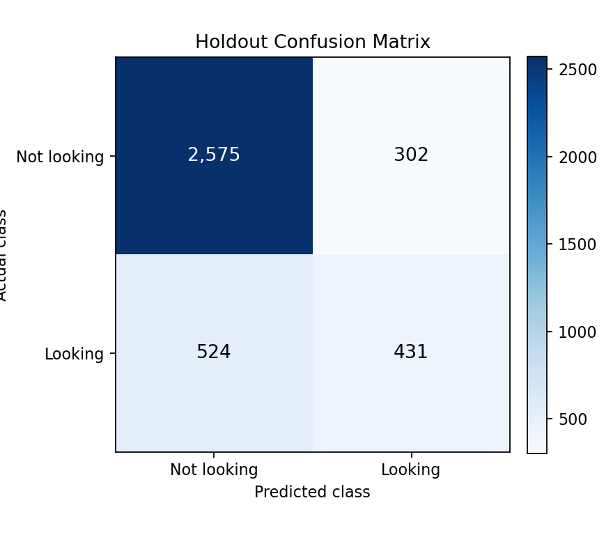

# Job Change Prediction with CRISP-DM

This project uses a public Kaggle dataset to model which data science trainees are likely to look for a new job. The practical question is not just "which model wins," but whether the model can help a training provider prioritize follow-up without treating a prediction as an automatic decision.

I organized the analysis with CRISP-DM, a data-mining workflow that moves from business understanding to data preparation, modeling, evaluation, and deployment planning. The training data includes 19,158 records, with 4,777 trainees (24.9%) labeled as looking for a job change, so I evaluated models with ROC-AUC in addition to accuracy. ROC-AUC is useful here because it measures how well a model ranks likely job-change cases ahead of non-job-change cases when the outcome is imbalanced.

Gradient boosting performed best in this setup, with cross-validated ROC-AUC = 0.784 and holdout ROC-AUC = 0.802. Random forest was close behind at cross-validated ROC-AUC = 0.781, which suggests the ensemble models were picking up nonlinear structure that a simpler baseline missed.

The model-comparison figure shows that the ensemble models lead the comparison, but the strongest practical story is not just "gradient boosting won." The gradient boosting and random forest AUCs are nearly tied, so the stronger takeaway is that nonlinear ensemble models were more useful than the linear baseline.

The confusion matrix is the main caution. At the default 0.50 threshold, the model correctly identified 431 of 955 job-change cases but missed 524. That means the model is useful as a ranked screening layer, but it would need threshold tuning, calibration, and current operational data before being used for live intervention decisions.

This visual makes the threshold tradeoff concrete: the large true-negative cell supports the overall accuracy, while the 524 false negatives show why recall needs attention before any live use.

The strongest model signal was city development index (feature importance = 0.604), followed by company size (0.132) and log training hours (0.060). I interpret those predictors as labor-market and employer-context signals rather than individual-level causal claims.
