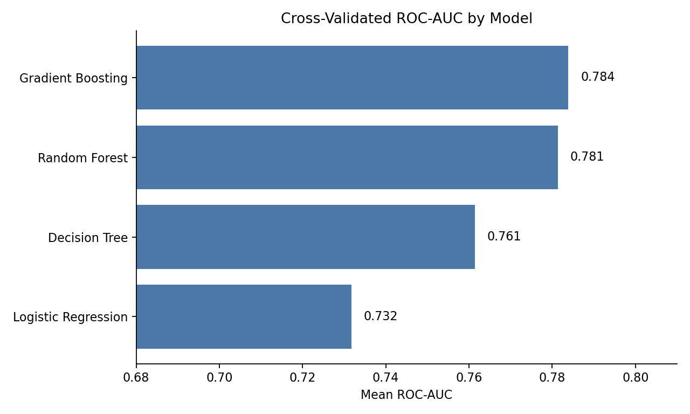

# Project 09 - Job Change Prediction with CRISP-DM

Author: Mintay Misgano, PhD

This project uses a public HR analytics dataset to estimate which data science trainees are most likely to look for a new job after training. I organized the work with CRISP-DM, a structured data-mining process that moves from business framing to data understanding, preparation, modeling, evaluation, and deployment planning.

The dataset is included locally in `data/` under its CC0/Public Domain license, so the workflow can be rerun without local source-folder or cloud-drive dependencies.

## Project Focus

- Frame job-change prediction as a talent-pipeline prioritization problem.
- Examine class balance and missingness before modeling.
- Prepare categorical, ordinal, and skewed variables for model comparison.
- Compare logistic regression, decision tree, random forest, and gradient boosting under the same stratified cross-validation setup.
- Interpret ROC-AUC, precision, recall, and the confusion matrix together because the positive class is only 24.9% of the training sample.

## Main Results

Gradient boosting and random forest separate from the simpler baselines on ROC-AUC, but the gap between the two ensemble models is small: 0.784 for gradient boosting versus 0.781 for random forest.

- The training data contains 19,158 records; 4,777 trainees (24.9%) are labeled as looking for a job change.
- Gradient boosting produced the strongest cross-validated ROC-AUC (0.784), narrowly ahead of random forest (0.781).
- On the holdout set, gradient boosting reached ROC-AUC = 0.802 and accuracy = 0.784.
- At the default 0.50 threshold, the model identified 431 of 955 job-change cases and missed 524, so it is better framed as a ranked screening tool than as an automated decision rule.
- City development index was the dominant feature in the fitted gradient boosting model (importance = 0.604), followed by company size (0.132) and log training hours (0.060).

## Project Files

- `Job_Change_Prediction_Project_Summary.md` provides the short overview.
- Use `Job_Change_Prediction_Project_Report.md` for the fuller CRISP-DM write-up.
- Open `Job_Change_Prediction_Data_Mining.ipynb` for a rendered notebook version of the workflow.
- Use `Job_Change_Prediction_Data_Mining.py` if you prefer the script version.

## Project Files

| File | Role |
|------|------|
| `Job_Change_Prediction_Project_Summary.md` | Short interpretive overview of the project |
| `Job_Change_Prediction_Project_Report.md` | Full CRISP-DM write-up |
| `Job_Change_Prediction_Data_Mining.ipynb` | Rendered notebook companion for the workflow |
| `Job_Change_Prediction_Data_Mining.py` | Script version of the workflow |
| `data/` | Public Kaggle CSVs and source/license note |
| `docs/figures/` | Generated figures embedded in the writeups |
| `outputs/` | Local run outputs; generated CSVs are intentionally ignored |

## Data Note

The project uses Kaggle's **HR Analytics: Job Change of Data Scientists** dataset. It is best read as a benchmark-style applied data-mining analysis: the workflow documents how I would structure prediction, threshold interpretation, and deployment cautions, but it is not a live organizational deployment claim.
