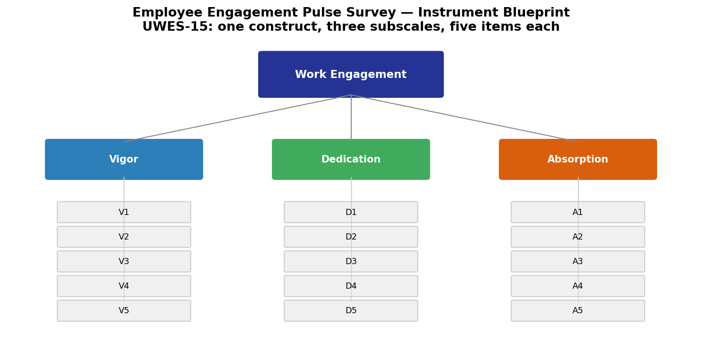
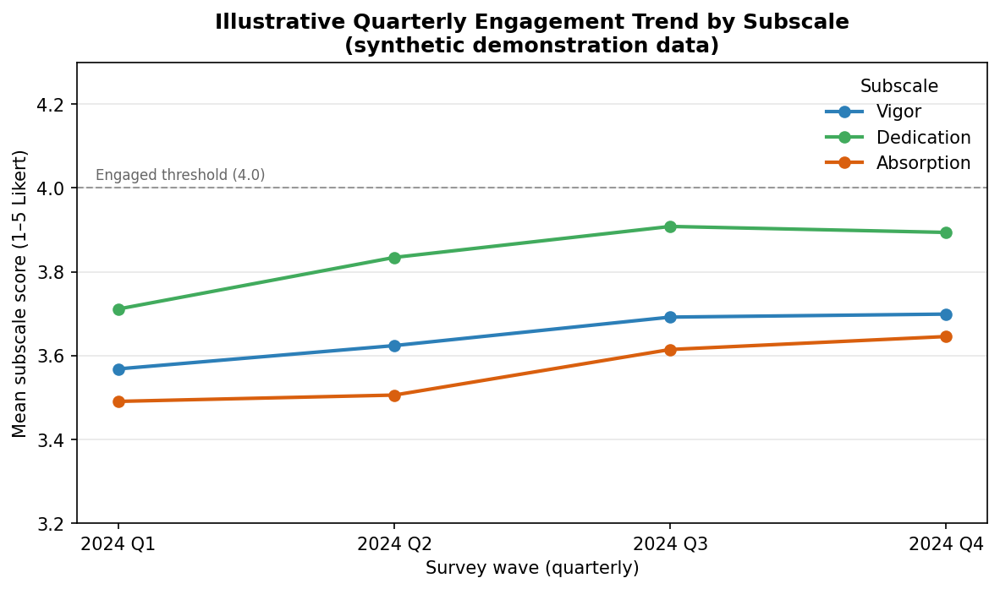
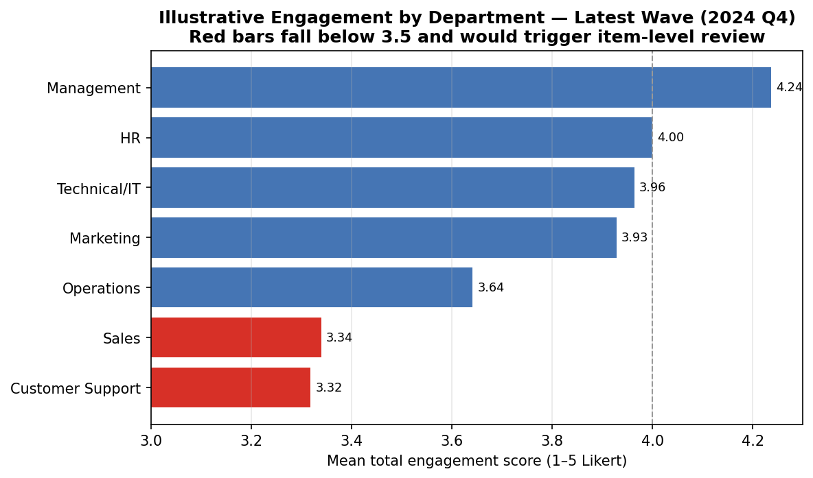
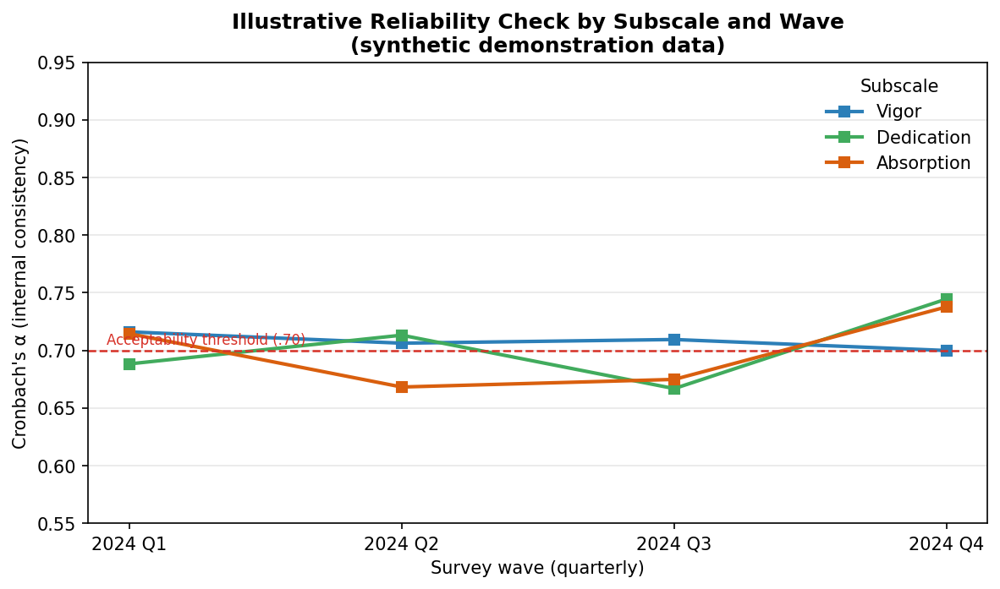
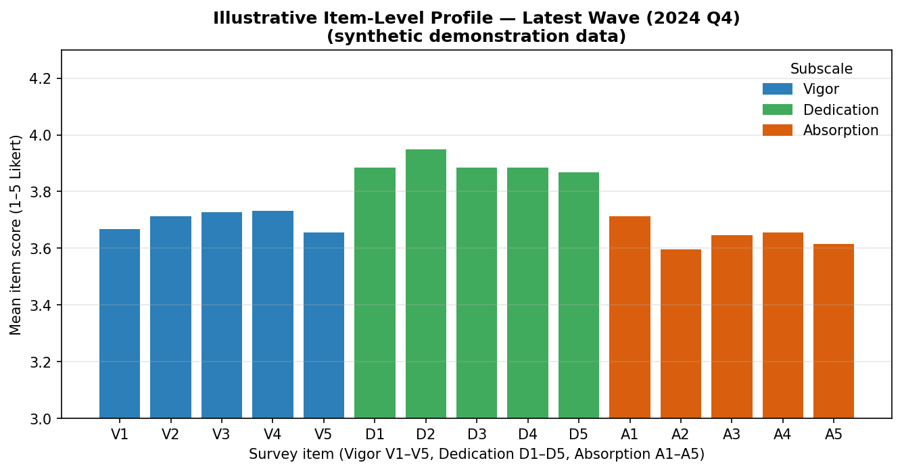

# Employee Engagement Pulse Survey: Design Specification

**Author:** Mintay Misgano, PhD
**Context:** Graduate coursework in survey design and development (2023)

---

## 1. Project Rationale

### 1.1 Why Measure Engagement

Employee engagement — defined as a sustained mental state in which employees devote their physical, emotional, and cognitive resources to their work (Christian et al., 2011) — is one of the most consequential constructs in organizational psychology. Its relevance to people analytics is well-established:

- Gallup's (2023) State of the Global Workplace report estimated that low engagement costs the global economy **$8.8 trillion annually**. North America has experienced a 2-percentage-point decline in engagement from 2021–2022, with simultaneous increases in disengaged and actively disengaged employees.
- Gallup's (2020) meta-analysis of 456 research studies across industries found that teams with high engagement show **23% higher profitability, 18% higher productivity**, and substantial reductions in absenteeism, safety incidents, and voluntary turnover.
- Saks and Gruman (2014) connect engagement to shareholder returns, and Byrne et al. (2016) associate it with performance and organizational commitment.

The case for measurement is straightforward: a survey can only support decision-making if the construct is defined clearly and the instrument is designed carefully. This project approaches engagement measurement as a research-design problem rather than simply a communications exercise.

### 1.2 Survey Purpose

This document specifies a **quarterly Employee Engagement Pulse Survey** designed to:

1. Monitor engagement levels across the organization on a recurring basis
2. Identify engagement trends by demographic subgroup (department, tenure, role)
3. Provide actionable, time-sensitive data to HR and leadership before engagement decline becomes visible in attrition
4. Establish a quantitative baseline for comparing intervention effectiveness over time

---

## 2. Theoretical Framework

The survey is grounded in the **Utrecht Work Engagement Scale (UWES)** (Schaufeli et al., 2002), the most widely validated multi-dimensional engagement measure in organizational psychology. The UWES conceptualizes engagement as a three-factor construct:

| Dimension | Definition | Example Item Stem |
|:----------|:-----------|:------------------|
| **Vigor** | High levels of energy and mental resilience at work; willingness to invest effort | "At my work, I feel bursting with energy." |
| **Dedication** | Strong involvement in work; experiencing significance, enthusiasm, and challenge | "I find the work I do full of meaning and purpose." |
| **Absorption** | Deep concentration and engrossment in work; difficulty detaching from work | "When I am working, I forget everything else around me." |

This three-factor structure has been validated across countries, industries, and organizational types. Using it as the theoretical foundation ensures that the survey measures engagement as a multidimensional construct rather than reducing it to a single attitudinal question.

---

## 3. Research Design

### 3.1 Survey Type

**Pulse survey** — a brief, high-frequency instrument designed for trend monitoring rather than comprehensive assessment. Key design choices:

- **20 items total** — short enough to complete in 10–15 minutes; long enough to reliably measure three distinct dimensions
- **Quarterly administration** — provides four annual data points; enough granularity to detect seasonal trends, post-intervention effects, and early warning signals
- **5-point Likert scale** — response options range from 1 (*Strongly Disagree*) to 5 (*Strongly Agree*); sufficient anchoring for inter-rater reliability without cognitive overload

### 3.2 Sampling Strategy

**Stratified random sampling** — participants are selected randomly within pre-defined strata (departments) to ensure proportional representation of the organization's demographic structure.

Strata for stratification:
- Department (HR, Sales, Marketing, Technical/IT, Customer Support, Operations, Management)
- Employment status (Full-time, Part-time, Contract)
- Location/business unit (if multi-site)

Minimum recommended sample per stratum: n ≥ 30 for reliable subgroup estimates. A 70% response rate target is recommended; if achieved, 20–40 responses per department are typically sufficient for quarterly tracking.

**Non-probability alternative (small organizations):** If total headcount < 150, a census approach (surveying all employees) is preferred over sampling to maximize statistical power for subgroup analyses.

### 3.3 Administration

- **Platform:** Qualtrics (anonymous link; Qualtrics Authenticator or unique survey links for response tracking without de-anonymization)
- **Distribution:** Email invitation from HR; executive sponsorship message attached
- **Reminder cadence:** Initial invitation → 7-day reminder → 3-day final reminder → close
- **Confidentiality:** All responses are anonymous; only aggregate and subgroup results (n ≥ 5 per group) are shared with leadership

---

## 4. Survey Instrument

### 4.1 Instructions and Informed Consent

> *Thank you for participating in our Employee Engagement Survey. Your feedback is essential for understanding and improving our workplace environment.*
>
> *For each statement, indicate your level of agreement on the 5-point scale below:*
> *1 = Strongly Disagree | 2 = Disagree | 3 = Neutral | 4 = Agree | 5 = Strongly Agree*
>
> *Your responses are completely confidential and will be used only to improve working conditions. No individual responses will be shared with managers or leadership. Results are reported only in aggregate or for groups of 5 or more participants. Participation is voluntary.*
>
> *This survey contains 20 items and should take approximately 10–15 minutes to complete.*

### 4.2 Demographic Questions (5 items)

Demographic items are placed **at the end** of the survey (reducing survey fatigue on engagement items) and are used only for subgroup analysis.

| # | Item | Response Options |
|:--|:-----|:-----------------|
| D1 | Gender | Male / Female / Non-binary / Prefer not to say / Other |
| D2 | Age group | Under 20 / 20–29 / 30–39 / 40–49 / 50–59 / 60+ |
| D3 | Employment status | Full-time / Part-time / Contract / Prefer not to say |
| D4 | Years with the company | <1 / 1–3 / 4–6 / 7–9 / 10+ |
| D5 | Department | [Organization-specific list] |

### 4.3 Engagement Items (15 items — 5 per dimension)

Items are ordered by dimension (Vigor → Dedication → Absorption), following Sudman et al. (1996) guidance on smooth concept transitions and reduced cognitive load from interspersed items. Vigor is presented first as the most neutral and generic dimension; Absorption is presented last as the most cognitively complex.

**Vigor Subscale (V1–V5):**

| # | Item | Direction |
|:--|:-----|:----------|
| V1 | At my work, I feel full of energy. | + |
| V2 | At my job, I feel strong and vigorous. | + |
| V3 | When I wake up in the morning, I look forward to going to work. | + |
| V4 | I can continue working for very long periods of time. | + |
| V5 | At my work, I always persevere, even when things do not go well. | + |

**Dedication Subscale (D1–D5):**

| # | Item | Direction |
|:--|:-----|:----------|
| D1 | I find the work that I do full of meaning and purpose. | + |
| D2 | I am enthusiastic about my job. | + |
| D3 | My job inspires me. | + |
| D4 | I am proud of the work I do. | + |
| D5 | To me, my job is challenging. | + |

**Absorption Subscale (A1–A5):**

| # | Item | Direction |
|:--|:-----|:----------|
| A1 | Time flies when I am working. | + |
| A2 | When I am working, I forget everything else around me. | + |
| A3 | I feel happy when I am working intensely. | + |
| A4 | I am immersed in my work. | + |
| A5 | I get carried away when I am working. | + |

*Note: All items are positively worded. In a full validation study, reverse-scored items would be included to detect acquiescence bias. For a pulse survey context prioritizing brevity, the all-positive format is an acceptable tradeoff, with the limitation noted in the design documentation.*

---

## 5. Scoring and Reporting

### 5.1 Subscale Scores

Each subscale score is the mean of its five items:

- **Vigor Score** = mean(V1–V5); range 1–5
- **Dedication Score** = mean(D1–D5); range 1–5
- **Absorption Score** = mean(A1–A5); range 1–5
- **Total Engagement Score** = mean(V1–V5, D1–D5, A1–A5); range 1–5

A score of 4.0 or above is generally considered "engaged" (consistent with UWES benchmarks). The UWES-15 benchmark database provides population norms for comparison.

### 5.2 Reporting Framework

Engagement results are reported at three levels:

**Organizational level:** Overall engagement score and subscale scores for the full employee population, trended quarter-over-quarter. Reported to HR leadership and executive team.

**Subgroup level:** Scores by department, tenure band, and employment type (for groups of n ≥ 5). Used to identify pockets of high or low engagement and prioritize targeted interventions.

**Item level:** For subgroups showing low scores, item-level analysis identifies which specific dimension(s) and items are driving the deficit, informing more precise intervention design.

---

## 6. Methodological Considerations

### 6.0 Evaluation Metrics Defined

Because the validation plan (Sections 6.2 and 7) and the reporting demonstration (Section 9) rely on specific psychometric and fit statistics, each is defined here before it appears in any result so the reader can interpret the values directly.

**Cronbach's alpha (α).** Alpha estimates *internal-consistency reliability* — the degree to which the items intended to measure one subscale actually move together. It is computed as α = (k/(k−1)) × (1 − Σσ²ᵢ/σ²ₜ), where k is the number of items, σ²ᵢ is each item's variance, and σ²ₜ is the variance of the summed scale (Cronbach, 1951; Field, 2018). It ranges from 0 to 1; values of .70–.95 are conventionally acceptable, with .80+ considered good. Below .70, the items are not measuring a coherent construct and item-level diagnostics are warranted. This design adopts α ≥ .70 as the per-administration acceptability gate.

**Corrected item-total correlation (r.drop).** This is the correlation between a single item and the sum of the *other* items in its subscale (the item itself excluded to avoid spurious inflation). It indicates how well an individual item discriminates; values below .30 flag an item that contributes little and is a revision candidate (Field, 2018).

**Comparative Fit Index (CFI).** A confirmatory-factor-analysis fit index comparing the hypothesized three-factor model to a baseline null model in which all items are uncorrelated. It ranges 0–1; values ≥ .95 indicate good fit (Hu & Bentler, 1999). CFI is used at the confirmatory validation stage (Section 7) to test whether the Vigor/Dedication/Absorption structure holds before full rollout.

**Root Mean Square Error of Approximation (RMSEA).** A CFA badness-of-fit index estimating model misfit per degree of freedom in the population, so it rewards parsimony. Lower is better: ≤ .06 indicates good fit and ≥ .10 indicates poor fit (Hu & Bentler, 1999). Reported alongside CFI because the two indices are sensitive to different kinds of misspecification.

### 6.1 Validity Considerations

**Content validity:** Items were selected directly from the validated UWES-15 (Schaufeli et al., 2002), ensuring construct coverage. The three-dimensional structure (Vigor, Dedication, Absorption) maps to the theoretical definition of engagement.

**Convergent validity:** In independent validation, UWES subscale scores should correlate positively with job satisfaction, organizational commitment, and performance ratings — relationships documented extensively in the UWES validation literature (Schaufeli et al., 2002; Bakker et al., 2008).

**Discriminant validity:** Engagement scores should be empirically distinguishable from burnout (Maslach Burnout Inventory subscales), which occupies the opposite pole on the same energy-identification continuum.

### 6.2 Reliability Considerations

Published UWES-15 internal consistency coefficients range from α = .75 to .92 across subscales and samples (Schaufeli & Bakker, 2003). A pulse survey should reproduce these reliability levels; if alpha falls below .70 in a given administration, item-level diagnostics are warranted.

### 6.3 Design Limitations

**Survey fatigue:** Quarterly administration introduces the risk of response rate decline and rushed responses over time. A brief executive message reinforcing the connection between survey results and visible organizational changes mitigates this risk.

**Social desirability bias:** Self-reported engagement items may be inflated if employees perceive that responses could be traced to them. Anonymization and clear confidentiality communication are essential.

**Non-response bias:** If actively disengaged employees are less likely to respond, the resulting data will overestimate engagement. Tracking response rates by department enables the HR team to flag low-response subgroups and interpret their data cautiously.

**Causal inference:** Pulse surveys are observational, not experimental. A low engagement score in a department identifies a problem but does not establish its cause. Qualitative follow-up (focus groups, manager conversations) is required to design effective interventions.

---

## 7. Connection to Psychometric Validation

This survey design connects directly to the psychometric validation workflow demonstrated in [Project 05 — Psychometric Scale Validation (R)](../05_Psychometrics_Scale_Validation_R/). Before an organization deploys a new engagement survey instrument in production, the following validation steps are recommended:

1. **Pilot test** with a small sample (n ≥ 100) to establish internal consistency reliability (Cronbach's α ≥ .70 per subscale)
2. **Item analysis:** Corrected item-total correlations (r.drop) should exceed .30; items below this threshold are candidates for revision
3. **Exploratory factor analysis:** Confirm three-factor structure via PAF with oblique rotation; verify that items load on their intended subscale (loading ≥ .50) without significant cross-loadings (< .30)
4. **Confirmatory factor analysis:** Formally test the three-factor model fit (CFI ≥ .95, RMSEA ≤ .06) before full organizational rollout

The psychometrics work in Project 05 demonstrates this validation workflow on a related instrument, and the same logic applies here before any full deployment.

---

## 8. Recommended Analysis Plan

Once engagement data are collected, the following analysis sequence is recommended:

```r
# Step 1: Reliability check (each administration)
alpha(engagement_df[vigor_items])
alpha(engagement_df[dedication_items])
alpha(engagement_df[absorption_items])

# Step 2: Descriptive statistics and trend comparison
engagement_df %>%
  group_by(quarter, department) %>%
  summarise(across(c(vigor, dedication, absorption, total), mean, na.rm=TRUE))

# Step 3: Group differences (ANOVA if 3+ groups; t-test if 2 groups)
aov(total_engagement ~ department, data = engagement_df)

# Step 4: Predictors of engagement (multiple regression)
lm(total_engagement ~ tenure + department + employment_status, data = engagement_df)

# Step 5: Engagement → attrition linkage (if attrition data available)
glm(voluntary_left ~ total_engagement + vigor + dedication,
    family=binomial, data=linked_df)
```

---

## 9. Reporting Demonstration on Illustrative Data

A survey design is only as credible as the output it produces. Because no employees were surveyed for this coursework artifact, the scoring and reporting pipeline specified above is demonstrated on an **illustrative synthetic dataset** generated to match the instrument's exact structure: three subscales of five items each, 5-point Likert responses, four quarterly waves, and seven department strata of roughly 30 respondents each (the n ≥ 30 sampling target from Section 3.2). The full pipeline is implemented in `03_Reporting_Demonstration.ipynb` (source: `04_Reporting_Demonstration_Source.py`). The values below are simulated for demonstration and are not findings about any organization; their purpose is to make the abstract reporting framework inspectable.

### 9.1 Instrument Blueprint



This figure renders the measurement model before any data is involved. *What to inspect:* the single top-level construct (Work Engagement) feeding three subscale boxes, each with five labeled items (V1–V5, D1–D5, A1–A5). *Why it matters:* it visually commits the design to a multidimensional structure — the same three-factor structure that the confirmatory validation stage (Section 7, CFI ≥ .95, RMSEA ≤ .06) is later meant to test. A reviewer can confirm at a glance that the instrument measures engagement as three distinct constructs rather than a single attitudinal index.

### 9.2 Organizational-Level Trend



This is the headline monitoring view (reporting level 1 from Section 5.2). *What to inspect:* the three subscale lines across the four quarterly waves relative to the dashed 4.0 "engaged" threshold. *What pattern is visible:* all three dimensions sit in the 3.5–4.0 band and drift gently upward across 2024, with Dedication consistently highest and Absorption lowest — the expected ordering, since absorption is the most cognitively demanding dimension. *Why it matters:* the value of the design is not the level but the *slope and separation* — a single subscale turning down while the others hold would be visible here a full quarter or more before it surfaced in attrition, which is precisely the early-warning function the survey exists to provide.

### 9.3 Subgroup-Level Comparison



This is reporting level 2 — the stratified breakdown that drives targeted action. *What to inspect:* the department bars for the latest wave, sorted ascending, with red marking any subgroup below 3.5. *Which groups support the conclusion:* Customer Support (3.32) and Sales (3.34) fall roughly 0.9 points below Management (4.24) and clearly below the next group, Operations (3.64). *Why it changes the interpretation:* the organizational trend in 9.2 looked healthy, but the subgroup view reveals that two departments are materially disengaged and would be automatically flagged for the item-level drill-down — demonstrating why the design mandates subgroup reporting rather than a single company-wide number.

### 9.4 Reliability Quality Gate



This figure operationalizes the reliability gate defined in Section 6.0. *What to inspect:* each subscale's alpha across waves against the dashed .70 threshold. *What pattern is visible:* alpha generally sits between .67 and .75, and in this simulation several points dip just below .70 (e.g., Dedication and Absorption in mid-year waves) before recovering to .74–.75 in 2024 Q4. *Why it matters:* the figure shows the gate doing its job — a sub-.70 administration is the design's signal to run corrected item-total diagnostics (r.drop < .30, Section 6.0) before trusting that wave's scores, rather than silently reporting unreliable numbers. In production these values would be expected to stabilize at the published UWES range of .75–.92 (Schaufeli & Bakker, 2003); the demonstration's smaller synthetic samples explain the softer values here.

### 9.5 Item-Level Drill-Down



This is reporting level 3 — the deepest layer, triggered when a subgroup scores low. *What to inspect:* the per-item means for the latest wave, grouped by subscale colour. *Why it matters:* when a department such as Customer Support is flagged in 9.3, this view localizes the deficit to specific items rather than a whole subscale, so an intervention can target the actual driver (for example, a low Vigor item about energy at work points to workload, whereas a low Dedication item about meaning points to role clarity). This is the mechanism by which the design converts a flagged score into an actionable hypothesis.

---

## References

Bakker, A. B., Schaufeli, W. B., Leiter, M. P., & Taris, T. W. (2008). Work engagement: An emerging concept in occupational health psychology. *Work & Stress, 22*(3), 187–200. https://doi.org/10.1080/02678370802393649

Byrne, Z. S., Peters, J. M., & Weston, J. W. (2016). The struggle with employee engagement: Measures and construct clarification using five samples. *Journal of Applied Psychology, 101*(9), 1201–1227. https://doi.org/10.1037/apl0000122

Christian, M. S., Garza, A. S., & Slaughter, J. E. (2011). Work engagement: A quantitative review and test of its relations with task and contextual performance. *Personnel Psychology, 64*(1), 89–136. https://doi.org/10.1111/j.1744-6570.2010.01203.x

Cronbach, L. J. (1951). Coefficient alpha and the internal structure of tests. *Psychometrika, 16*(3), 297–334. https://doi.org/10.1007/BF02310555

Field, A. (2018). *Discovering statistics using IBM SPSS statistics* (5th ed.). SAGE.

Gallup. (2020). *The relationship between engagement at work and organizational outcomes: 2020 Q12 meta-analysis.* Gallup, Inc.

Hu, L., & Bentler, P. M. (1999). Cutoff criteria for fit indexes in covariance structure analysis: Conventional criteria versus new alternatives. *Structural Equation Modeling, 6*(1), 1–55. https://doi.org/10.1080/10705519909540118

Gallup. (2023). *State of the global workplace: 2023 report.* Gallup, Inc.

Rich, B. L., Lepine, J. A., & Crawford, E. R. (2010). Job engagement: Antecedents and effects on job performance. *Academy of Management Journal, 53*(3), 617–635. https://doi.org/10.5465/amj.2010.51468988

Saks, A. M., & Gruman, J. A. (2014). What do we really know about employee engagement? *Human Resource Development Quarterly, 25*(2), 155–182. https://doi.org/10.1002/hrdq.21187

Schaufeli, W. B., & Bakker, A. B. (2003). *Utrecht Work Engagement Scale: Preliminary manual.* Occupational Health Psychology Unit, Utrecht University.

Schaufeli, W. B., Salanova, M., González-Romá, V., & Bakker, A. B. (2002). The measurement of engagement and burnout: A two sample confirmatory factor analytic approach. *Journal of Happiness Studies, 3*(1), 71–92. https://doi.org/10.1023/A:1015630930326

Schwarz, N. (1999). Self-reports: How the questions shape the answers. *American Psychologist, 54*(2), 93–105.

Sudman, S., Bradburn, N. M., & Schwarz, N. (1996). *Thinking about answers: The application of cognitive processes to survey methodology.* Jossey-Bass.

Tourangeau, R., & Yan, T. (2007). Sensitive questions in surveys. *Psychological Bulletin, 133*(5), 859–883. https://doi.org/10.1037/0033-2909.133.5.859
