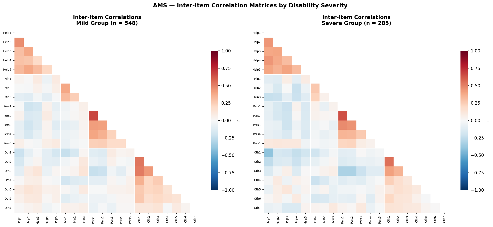
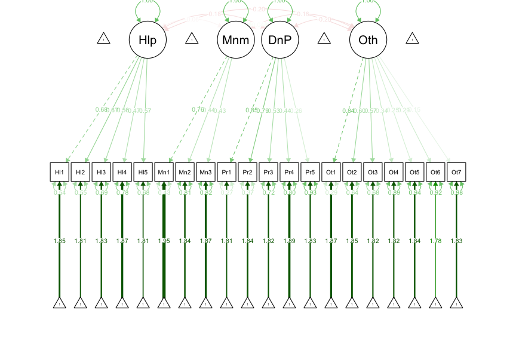
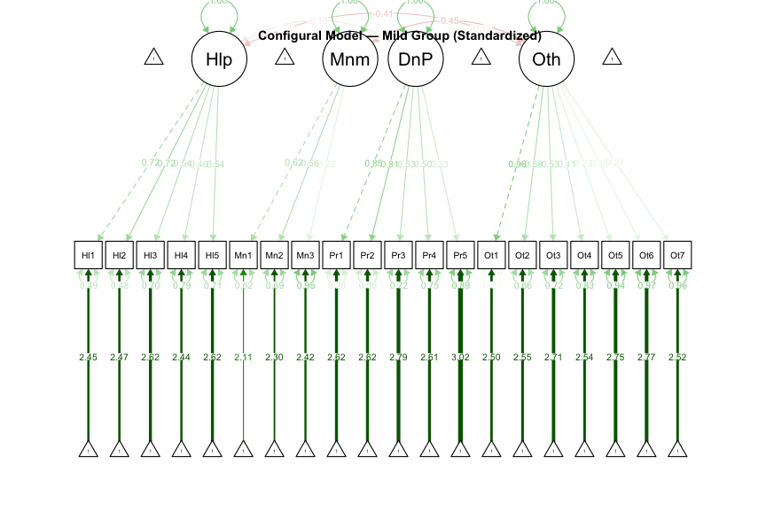
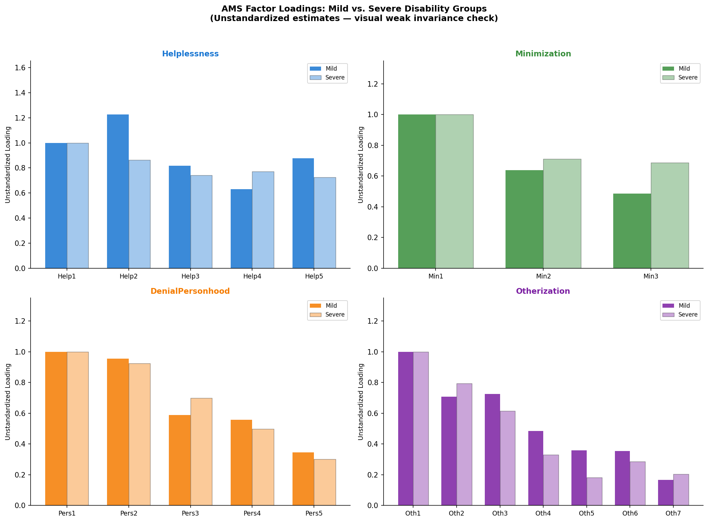

# Measurement Invariance Testing of the Ableist Microaggressions Scale Across Disability Severity Groups

**Mintay Misgano, PhD**
*Psychometrics and Measurement*

---

## Abstract

Cross-group survey comparisons are only defensible when the instrument measures the construct in comparable ways across the groups being compared. This analysis tests whether the Ableist Microaggressions Scale (AMS), a 20-item four-factor measure of disability-related microaggressions, functions equivalently across mild and severe disability-severity groups in a simulated public dataset derived from published scale parameters. Multi-group confirmatory factor analysis supports configural and weak invariance, but not strong invariance. The four-factor structure and item loadings are stable enough to compare construct structure across groups, but item intercepts are not stable enough to treat raw observed means as directly comparable.

---

## Introduction

Survey scores often look directly comparable because every respondent receives the same items and response scale. That assumption can fail when groups interpret, endorse, or respond to items differently. In that case, an observed group difference may reflect a measurement artifact rather than a true difference in the underlying construct.

Measurement invariance testing evaluates whether a measure keeps the same statistical meaning across groups. At a basic level, it asks whether the same factor structure appears in each group. At a stricter level, it asks whether the items relate to the latent construct with the same strength, and whether the item baselines are equivalent when respondents have the same latent score. Vandenberg and Lance (2000) describe this sequence as a prerequisite for meaningful organizational and psychological group comparisons.

The Ableist Microaggressions Scale (AMS; Conover et al., 2017) measures disability-related microaggressions across four domains: Helplessness, Minimization, Denial of Personhood, and Otherization. The present analysis asks whether AMS scores can be compared across disability-severity groups. The data are simulated from the published factor-loading structure rather than collected from a new empirical sample, so the value of the analysis is in the measurement decision logic: what evidence would support or block group comparisons?

---

## Method

### Data and Instrument

The analytic dataset contains 833 simulated respondents and 20 AMS items scored from 0 to 5. The item covariance structure was generated from the factor loading matrix reported by Conover et al. (2017, Table 2). The simulation used the factor-model equation Sigma = Lambda Phi Lambda' + Theta, with standardized factors and item-specific uniqueness terms. The final grouped dataset contains 548 Mild respondents (65.8%) and 285 Severe respondents (34.2%).

The AMS items map to four correlated factors:

| Factor | Items | Construct meaning |
|---|---:|---|
| Helplessness | Help1-Help5 | Unsolicited assistance, overprotection, and treatment as incapable |
| Minimization | Min1-Min3 | Dismissal or denial of disability-related experiences |
| Denial of Personhood | Pers1-Pers5 | Dehumanizing, objectifying, or infantilizing treatment |
| Otherization | Oth1-Oth7 | Exclusion, othering, and being made to feel different |

### Confirmatory Factor Analysis

Confirmatory factor analysis (CFA) tests whether observed survey items follow a pre-specified latent structure. Unlike exploratory factor analysis, which searches for a structure, CFA starts with a theoretically specified model and evaluates whether the observed covariance matrix is consistent with that model. In this analysis, CFA tests whether the 20 AMS items follow the expected four-factor structure within each disability-severity group.

Multi-group confirmatory factor analysis extends CFA by estimating the same measurement model across groups and then adding equality constraints. This makes it possible to test whether the same scale has comparable structure and item behavior in each group. The R analysis uses lavaan maximum likelihood estimation, which estimates model parameters by finding the parameter values that make the observed data most likely under the specified model (Rosseel, 2012).

### Invariance Sequence

The analysis follows the standard hierarchical sequence described by Vandenberg and Lance (2000) and Putnick and Bornstein (2016):

1. **Configural invariance:** the same factor structure is estimated in both groups, with parameters freely estimated. Support means the same broad construct map appears in each group.
2. **Weak or metric invariance:** factor loadings are constrained to equality across groups. Support means the items relate to their latent factors with similar strength, so the scale operates on a comparable metric.
3. **Strong or scalar invariance:** factor loadings and item intercepts are constrained to equality. Support means group mean comparisons are defensible because groups have equivalent item baselines at equal latent construct levels.
4. **Strict invariance:** factor loadings, intercepts, and residual variances are constrained to equality. Support means item-level error variance is also comparable. Because strong invariance fails here, strict invariance is computed only as a diagnostic model and is not interpreted as a valid next step for mean comparison.

### Fit and Decision Metrics

The chi-square fit statistic tests whether the model-implied covariance matrix differs from the observed covariance matrix. Smaller chi-square values indicate closer fit, but the test is sensitive to sample size; with N = 833, statistically significant chi-square values can occur even when practical fit is acceptable.

The Comparative Fit Index (CFI) compares the specified model against a baseline model in which variables are treated as unrelated. Values closer to 1 indicate stronger fit. The Tucker-Lewis Index (TLI) is similar but includes an additional penalty for model complexity. Conventional guidance often treats values near .90 as minimally acceptable and values near .95 as stronger evidence, though invariance decisions should not rely on a single absolute cutoff (Putnick & Bornstein, 2016).

Root Mean Square Error of Approximation (RMSEA) estimates the amount of model misfit per degree of freedom. Lower values indicate better fit, with values near .05 often interpreted as strong and values below .08 as generally acceptable in many applied settings. Standardized Root Mean Square Residual (SRMR) summarizes average standardized residual error; values below .08 are commonly treated as acceptable.

Sequential invariance decisions use fit change, not just absolute fit. Delta chi-square tests whether adding constraints significantly worsens fit. Delta CFI measures the practical change in fit between adjacent models; Cheung and Rensvold (2002) recommend treating an absolute Delta CFI of .010 or larger as meaningful degradation.

---

## Results

### Descriptive Pattern

The Mild group item means range from 1.693 (Pers3) to 1.943 (Min1). The Severe group item means range from 2.133 (Min1) to 2.607 (Pers3). The Severe group endorses every item at a higher average level, which makes the mean-comparison question visible before the invariance models are tested.

At the factor level, the largest average gaps are Denial of Personhood (+0.845), Otherization (+0.711), and Helplessness (+0.677). Minimization shows a smaller but still visible gap (+0.416). The largest item-level gaps are Pers3 (+0.914), Pers5 (+0.896), Pers4 (+0.823), Pers2 (+0.810), and Pers1 (+0.780), all within Denial of Personhood.

The item mean profile shows the practical problem that measurement invariance testing is meant to resolve. If the items function equivalently, the higher Severe-group means could be interpreted as higher reported exposure to the measured microaggression domains. If item intercepts differ by group, those mean differences partly reflect group-specific item baselines and should not be interpreted as direct construct differences.

### Correlational Structure

The correlation heatmaps show similar block structure across groups: items within Helplessness, Denial of Personhood, and Otherization tend to cluster more strongly with one another than with items from other domains. This visual pattern supports the configural question at a descriptive level. The structure is not identical across groups, but both matrices preserve the broad four-domain pattern expected by the AMS model.

### Configural Model

The configural model tests whether the same four-factor structure can be estimated in both groups. The model fits the simulated data with CFI = .894, TLI = .877, RMSEA = .048, 90% CI [.043, .054], and SRMR = .066. RMSEA and SRMR are in acceptable ranges, while CFI/TLI sit just below the usual .90 heuristic. In the context of a generated ordinal-style dataset and a 20-item multi-factor model, the configural model is adequate enough to proceed to loading-equivalence testing.

The path diagrams are useful structural checks: the four latent factors are represented separately, and the AMS items attach to their expected domains in both groups. This supports the substantive interpretation that the model is testing the intended construct map rather than an ad hoc item grouping.

### Weak Invariance

The weak invariance model constrains item loadings to equality across Mild and Severe groups. This constraint barely changes fit: chi-square increases by 18.809 with 16 additional degrees of freedom, p = .279, and Delta CFI = -.001. Because the change in CFI is far below the .010 degradation threshold, weak invariance is supported.

The loading comparison figure helps explain why the weak-invariance decision is defensible. There are item-level differences, but the broad loading pattern remains similar enough that the constrained model does not meaningfully degrade. This means the AMS items generally relate to their intended latent domains with comparable strength across the two groups.

### Strong Invariance

The strong invariance model adds item-intercept equality constraints. This step produces a large fit decline: chi-square increases by 291.336 with 16 additional degrees of freedom, p < .001, and Delta CFI = -.092. Because the Delta CFI decline is far larger than .010, strong invariance is not supported.

This is the key measurement decision. The scale appears to preserve the same structure and broad item-factor metric across groups, but the item baselines differ. At equal latent construct levels, Mild and Severe respondents are not expected to endorse all items at the same average level. Raw observed group means therefore cannot be treated as clean group differences in the underlying microaggression domains.

### Fit Index Summary

**Table 1. Fit indices for the AMS measurement invariance sequence**

| Model | chi-square | df | p | CFI | TLI | RMSEA | 90% CI | SRMR | Delta CFI | Decision |
|---|---:|---:|---:|---:|---:|---:|---|---:|---:|---|
| Configural | 645.786 | 328 | < .001 | .894 | .877 | .048 | [.043, .054] | .066 | -- | Supported |
| Weak | 664.594 | 344 | < .001 | .893 | .882 | .047 | [.042, .053] | .067 | -.001 | Supported |
| Strong | 955.930 | 360 | < .001 | .801 | .790 | .063 | [.058, .068] | .080 | -.092 | Not supported |
| Strict diagnostic | 965.333 | 380 | < .001 | .805 | .805 | .061 | [.056, .066] | .081 | .004 | Not interpreted after scalar failure |

**Table 2. Sequential model comparisons**

| Comparison | Delta chi-square | Delta df | p | Delta CFI | Decision |
|---|---:|---:|---:|---:|---|
| Weak vs. configural | 18.809 | 16 | .279 | -.001 | Supported |
| Strong vs. weak | 291.336 | 16 | < .001 | -.092 | Not supported |
| Strict vs. strong | 9.403 | 20 | .978 | .004 | Diagnostic only |

---

## Discussion

### Main Interpretation

The AMS passes the first two levels of the invariance sequence but fails at the level needed for direct mean comparison. Configural invariance indicates that the same four-factor construct map is plausible in both severity groups. Weak invariance indicates that the item loadings are stable enough to compare factor structure and item-construct relationships. Strong invariance failure indicates that the observed item baselines differ across groups.

The distinction matters because the descriptive means are visibly higher for the Severe group. Without invariance testing, those differences could be read as direct evidence that Severe respondents experience more of every microaggression domain. The strong-invariance result blocks that simple interpretation. The higher means may reflect real construct differences, but they are also entangled with group-specific item intercepts.

### Recommendations

1. Avoid raw observed mean comparisons across mild and severe disability-severity groups unless strong or partial strong invariance is established in the target sample.
2. Use weak-invariance results to support structure-level interpretations, such as whether items continue to represent the same latent domains across groups.
3. Test partial invariance before abandoning group comparison entirely. The largest descriptive gaps are concentrated in Denial of Personhood items, especially Pers3, Pers5, Pers4, Pers2, and Pers1; these items are natural candidates for intercept-focused follow-up.
4. Report item- or factor-level results separately by group when strong invariance is not supported, and describe them as observed endorsement patterns rather than direct latent mean differences.

### Limitations

The dataset is simulated from published factor-loading parameters rather than collected from respondents. That preserves the intended structure for a transparent measurement demonstration, but it does not capture sampling noise, real demographic variation, correlated residuals, response styles, or the full social context of disability-severity measurement.

Severity group assignment is based on ranked AMS mean scores in the generated dataset. That creates a useful contrast for demonstrating invariance testing, but it also means group differences are partly induced by the grouping rule itself. A live validation study should use independently measured disability-severity information rather than deriving severity from the focal AMS items.

The Python notebook provides useful replication visuals, but the full weak/strong/strict constraint sequence is implemented in R lavaan because semopy does not natively provide the same group-equality workflow. The R workflow is therefore the primary quantitative source for invariance decisions.

---

## Conclusion

The AMS measurement structure is broadly stable across the simulated mild and severe disability-severity groups, but its item intercepts are not equivalent. The defensible conclusion is narrow and practical: the scale can support structure-level and loading-level comparison, but direct raw mean comparison requires additional invariance work. The strongest next analytic step would be partial scalar invariance testing focused on the items with the largest baseline differences, especially the Denial of Personhood indicators.

---

## References

Cheung, G. W., & Rensvold, R. B. (2002). Evaluating goodness-of-fit indexes for testing measurement invariance. *Structural Equation Modeling: A Multidisciplinary Journal, 9*(2), 233-255. https://doi.org/10.1207/S15328007SEM0902_5

Conover, K. J., Riser, K., Hucks, D., McKelvey, S., Vansickle, M., & Carter, R. T. (2017). Development and initial validation of the Ableist Microaggressions Scale. *The Counseling Psychologist, 45*(4), 570-599. https://doi.org/10.1177/0011000017718426

Igolkina, A. A., & Meshcheryakov, G. (2020). semopy: A Python package for structural equation models. *Structural Equation Modeling: A Multidisciplinary Journal*. https://doi.org/10.1080/10705511.2021.1972574

Putnick, D. L., & Bornstein, M. H. (2016). Measurement invariance conventions and reporting: The state of the art and future directions for psychological research. *Developmental Review, 41*, 71-90. https://doi.org/10.1016/j.dr.2016.06.004

Rosseel, Y. (2012). lavaan: An R package for structural equation modeling. *Journal of Statistical Software, 48*(2), 1-36. https://doi.org/10.18637/jss.v048.i02

Vandenberg, R. J., & Lance, C. E. (2000). A review and synthesis of the measurement invariance literature: Suggestions, practices, and recommendations for organizational research. *Organizational Research Methods, 3*(1), 4-70. https://doi.org/10.1177/109442810031002
