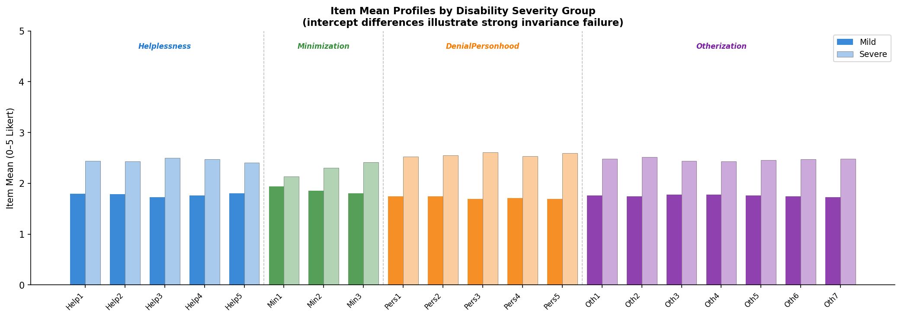

# Project 12 - Measurement Invariance Testing

Author: Mintay Misgano, PhD

This project tests whether the Ableist Microaggressions Scale functions equivalently across disability-severity groups. A multi-group confirmatory factor analysis evaluates whether the same four-factor structure, item loadings, and item intercepts hold for mild and severe disability-severity groups before any group-score comparisons are treated as defensible.

The item mean profile shows why the invariance question matters: the Severe group endorses every AMS item at a higher average level than the Mild group, with the largest factor-level gaps in Denial of Personhood (+0.845) and Otherization (+0.711). The analysis tests whether those visible mean differences reflect comparable measurement or whether item functioning differs by group.

## Main Finding

Weak invariance was supported, but strong invariance was not. Factor loadings were stable across groups (weak vs. configural Delta CFI = -.001), but adding item-intercept constraints produced a large fit decline (strong vs. weak Delta CFI = -.092). The scale preserves the same general construct metric across groups, but raw observed means should not be compared as if the items had equivalent baselines.

## Project Files

- [01_Project_Summary.md](./01_Project_Summary.md) gives the concise findings-first overview.
- [02_Project_Report.md](./02_Project_Report.md) gives the full technical report with method definitions, fit metrics, interpretation, limitations, and recommendations.
- [03_Analysis_Workflow.md](./03_Analysis_Workflow.md) is the primary rendered invariance workflow using lavaan.
- [04_Source_Analysis.Rmd](./04_Source_Analysis.Rmd) is the source for the rendered workflow.
- [05_Python_Supplement.ipynb](./05_Python_Supplement.ipynb) provides an executed Python replication and supplemental visuals.

## Data Note

The dataset is simulated from published AMS factor-loading parameters and is not a new empirical sample. The results therefore demonstrate the measurement-invariance workflow and interpretation logic rather than making a new substantive claim about disability microaggression prevalence.
