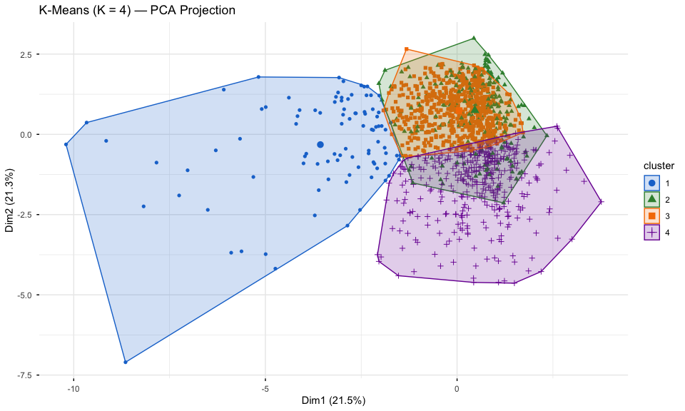
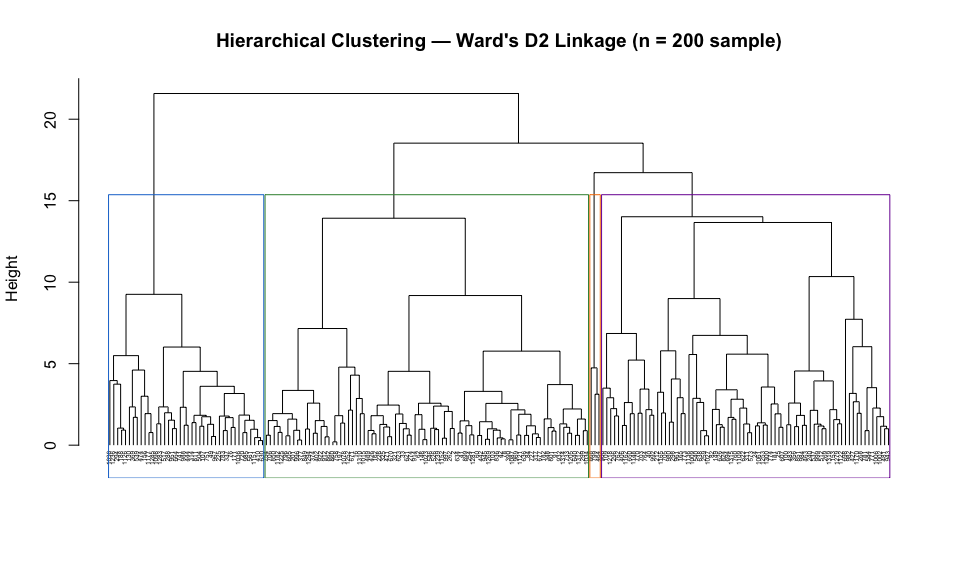

# Unsupervised Segmentation of Credit Card Applicants

## The Problem

Credit card applicants who look similar on individual metrics often differ substantially in their overall behavioral profiles. A single creditworthiness score compresses that heterogeneity. This project asks whether distinct applicant segments emerge from behavioral and financial data alone — without using approval status as a target — and whether different clustering methods agree on the structure they find.

## The Data

The analysis uses a public credit card applicant dataset (N = 1,319; CreditCard, from Greene, 2003) with nine behavioral and financial features: derogatory reports, age, income, spending share, monthly expenditure, dependents, account tenure, number of major cards held, and number of active accounts. Binary variables (approval status, home ownership, self-employment) were excluded from clustering to ensure the segments reflect behavioral patterns rather than approval outcomes. All features were standardized before analysis.

## Approach

Four clustering algorithms were applied to the same standardized feature set: K-Means, Hierarchical (Ward's D2 linkage), DBSCAN (density-based), and Mean Shift (mode-seeking). Using four methods with structurally different assumptions — centroid-based, linkage-based, density-based, and mode-seeking — allows the analysis to test whether a segment structure is robust or merely an artifact of one algorithm's assumptions. When multiple methods converge, confidence in the partition increases substantially.

## Main Findings

A four-segment structure emerges consistently across methods. The K-Means elbow plot shows a clear inflection at K = 4, accounting for approximately 36–40% of total variance. Hierarchical clustering converges on the same partition (Adjusted Rand Index > 0.60 with K-Means). Mean Shift stabilizes at four clusters across a range of bandwidths. DBSCAN identifies the same core population while flagging approximately 5% of applicants as noise — profiles that do not fit cleanly into any behavioral cluster.

**Figure 1.** K-Means four-cluster solution on the two largest principal component dimensions. Cluster 2 (high-spend established applicants) and Cluster 3 (delinquency-risk applicants) are the most behaviorally distinct; Clusters 1 and 4 occupy overlapping regions, consistent with their lower centroid separation on raw financial features.

The four segments map onto interpretable financial profiles: a **low-engagement group** with limited credit history and near-zero expenditure, a **high-value established segment** with elevated income and spending, a **delinquency-risk group** with above-average derogatory reports and overextended spending share, and a **young active-builder segment** with higher active account counts and moderate spending.

**Figure 2.** Hierarchical dendrogram (200-observation sample for readability). The dendrogram supports cutting at four clusters, matching the K-Means partition. Applied to the full dataset, the Ward's D2 four-cluster solution shows ARI > 0.60 agreement with K-Means, confirming the segment structure is not algorithm-specific.

## Practical Implications

Cross-method convergence is the project's central result — more persuasive than any single algorithm's output. It supports three concrete applications: flagging the high-risk delinquency segment for enhanced review without blanket restrictions; targeting the high-value established segment for premium products; and routing the ~5% DBSCAN noise applicants to manual underwriting rather than automated scoring.

The broader implication is methodological. When different clustering approaches recover the same structure, that structure warrants more confidence — a principle that applies across applied segmentation problems beyond credit card applications.
