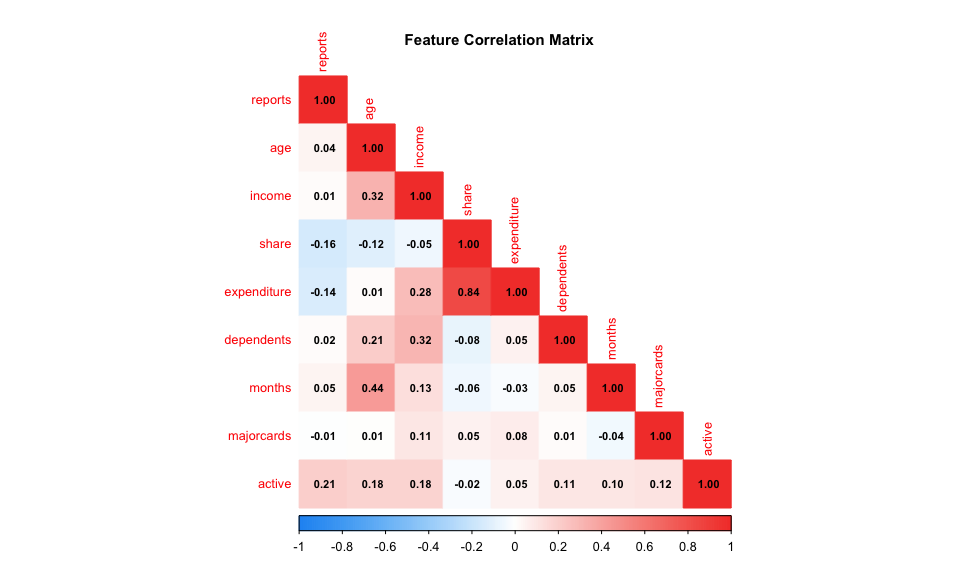
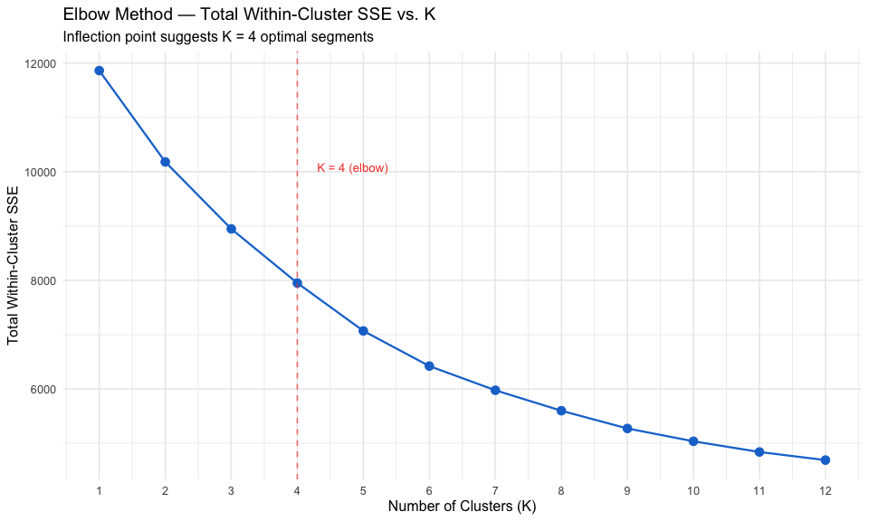
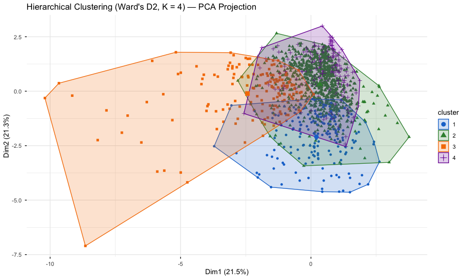
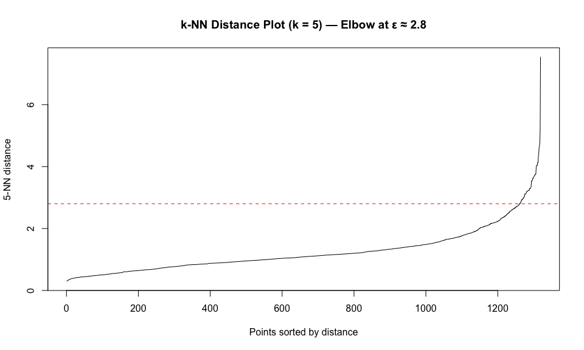
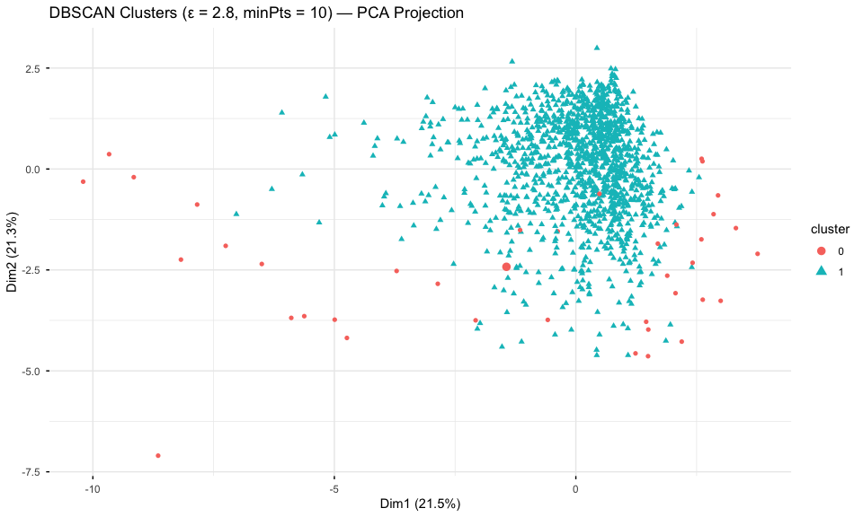
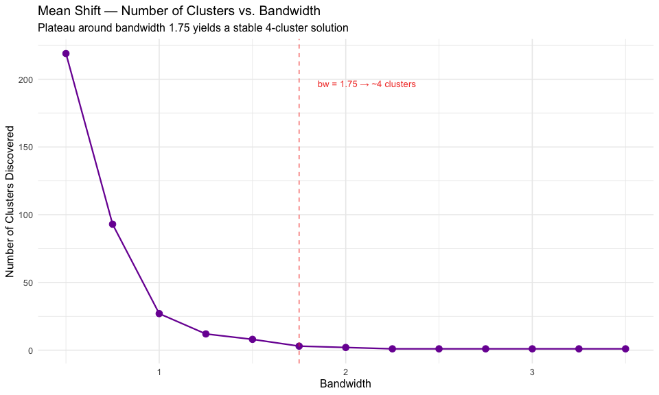

# Unsupervised Segmentation of Credit Card Applicants: A Multi-Method Clustering Analysis

**Mintay Misgano, PhD**

---

## Abstract

Clustering algorithms surface latent behavioral structure in unlabeled data. This project applies four unsupervised clustering methods — K-Means, Hierarchical (Ward's D2), DBSCAN, and Mean Shift — to a public credit card applicant dataset (N = 1,319) to identify behaviorally distinct profiles based on income, spending patterns, account tenure, and derogatory reports. The elbow criterion identified K = 4 as the optimal K-Means solution. Hierarchical clustering converged on the same four-segment structure (Adjusted Rand Index > 0.60). DBSCAN identified approximately 5% of applicants as noise points, and Mean Shift yielded a stable four-cluster solution under a bandwidth of 1.75. Convergence across four methodologically distinct algorithms is the primary analytical result, substantially increasing confidence that the four-segment structure reflects genuine behavioral heterogeneity rather than algorithmic artifact.

---

## 1. Introduction

Financial institutions routinely face the challenge of differentiating among applicants and customers who appear similar on surface-level metrics but exhibit fundamentally different behavioral profiles. Traditional scoring approaches reduce applicant profiles to a single creditworthiness metric, compressing behavioral heterogeneity that could otherwise inform segment-specific product design, risk limits, and communication strategies.

Clustering analysis offers an alternative: rather than classifying applicants against a fixed threshold, it identifies natural groupings in behavioral data without requiring labeled outcomes. When multiple methods with structurally different assumptions converge on the same segments, confidence in the partition increases substantially.

This analysis applies four clustering algorithms to the CreditCard dataset (originally from Greene, 2003) to answer a practical question: are there identifiable behavioral segments among credit card applicants, and if so, what characterizes them? Card approval status is used only for descriptive post-hoc validation — the clustering itself is performed on behavioral and financial features alone.

---

## 2. Method

### 2.1 Dataset

The dataset contains N = 1,319 credit card applicants with 12 features: `reports` (derogatory reports on credit file), `age`, `income` (annual income in thousands), `share` (ratio of monthly credit card expenditure to yearly income), `expenditure` (average monthly expenditure in dollars), `owner` (home ownership), `selfemp` (self-employed), `dependents`, `months` (months living at current address), `majorcards` (number of major credit cards held), `active` (number of active accounts), and `card` (whether the application was approved; used only for post-hoc validation).

Nine numeric features — `reports`, `age`, `income`, `share`, `expenditure`, `dependents`, `months`, `majorcards`, and `active` — were selected for clustering. Binary categorical variables (`card`, `owner`, `selfemp`) were excluded from the clustering features to ensure segments reflect behavioral patterns rather than approval outcomes or demographic categories. All features were standardized to zero mean and unit variance prior to analysis using `scale()`, as required for distance-based and density-based methods (James et al., 2021).

### 2.2 Clustering Methods

**K-Means.** K-Means partitions observations into K clusters by minimizing total within-cluster sum of squared deviations from cluster centroids (MacQueen, 1967). The algorithm iterates between assigning points to the nearest centroid and recomputing centroid positions until assignments stabilize. Key assumptions are that clusters are spherical and similarly sized, and that the appropriate K is specified in advance. The analysis used K = 4, nstart = 25 (multiple random restarts to reduce sensitivity to initialization), and iter.max = 100. Random seed was set to 100 for reproducibility.

*Alternative considered:* K-Medoids (Partitioning Around Medoids; PAM) is more robust to outliers because centroids are constrained to be actual data points. Given the credit card dataset's right-skewed derogatory-report distribution, K-Medoids was considered but not pursued as the primary method, because K-Means on standardized features already reduces outlier influence, and the rendered figures showed no indication of centroid contamination.

**Hierarchical Clustering.** Agglomerative hierarchical clustering successively merges the two closest clusters into a single cluster, building a dendrogram that records the complete merge history (Ward, 1963). Ward's D2 linkage was used, which minimizes total within-cluster variance at each merge step and tends to produce compact, similarly sized clusters well-suited to behavioral segmentation. The dendrogram was visualized on a 200-observation random sample for readability; cluster assignments for the full dataset were obtained by cutting the full dendrogram at K = 4.

*Alternative considered:* Complete linkage (maximum-distance) and average linkage tend to produce chained or irregularly shaped clusters in behavioral data. Ward's D2 was preferred for its tendency toward compact cluster geometries consistent with K-Means comparison.

**DBSCAN.** Density-Based Spatial Clustering of Applications with Noise identifies clusters as contiguous high-density regions separated by low-density gaps (Ester et al., 1996). An observation is a *core point* if it has at least minPts neighbors within radius ε; a *border point* if it falls within ε of a core point but has fewer than minPts neighbors itself; and a *noise point* (cluster 0) if it meets neither condition. Unlike K-Means and Hierarchical, DBSCAN does not force every observation into a cluster — noise points represent profiles that do not fit any coherent behavioral region.

*Alternative considered:* OPTICS (Ordering Points To Identify the Clustering Structure) extends DBSCAN to handle variable density and does not require a single ε threshold. It was considered as a robustness check but not pursued, as the k-NN distance plot showed a clear single elbow suggesting a stable single density threshold.

**Mean Shift.** Mean Shift is a non-parametric, mode-seeking algorithm that iteratively shifts each point toward the local density maximum within a kernel window of radius defined by the bandwidth parameter (Fukunaga & Hostetler, 1975). It does not require specifying K in advance; the number of clusters emerges from the data's density structure. Points that converge to the same mode are assigned to the same cluster. Bandwidth selection is critical: too small a bandwidth fragments the data into many clusters; too large a bandwidth merges everything into one.

*Alternative considered:* Gaussian Mixture Models (GMM) are a probabilistic alternative that can capture elliptical cluster shapes and provide soft cluster membership probabilities. GMM was not the primary choice because the analysis aimed to compare methods that vary in their structural assumptions; Mean Shift adds a mode-seeking perspective without requiring a distributional assumption, whereas GMM would add a second model-based method with assumptions overlapping those of K-Means.

### 2.3 Evaluation Metrics

The following metrics are used to evaluate clustering quality and select hyperparameters. Each is defined before its first appearance in results.

**Within-Cluster Sum of Squares (within-cluster SSE).** The within-cluster SSE is the sum of squared Euclidean distances from each observation to its assigned cluster centroid. Lower values indicate tighter, more homogeneous clusters, but SSE decreases monotonically as K increases (adding more clusters always reduces SSE). The elbow criterion selects K as the value at which additional clusters produce diminishing SSE reductions — the "elbow" in the scree-style plot. SSE is used only as a K-selection tool, not as an absolute quality measure.

**Proportion of Variance Explained (between-SS / total-SS).** The ratio of between-cluster sum of squares to total sum of squares measures how much of the total variance in the data is captured by the cluster partition, analogous to R² in regression. Range: 0 to 1; values closer to 1 indicate greater separation between clusters relative to within-cluster spread. For behavioral data with many continuous features, values of 0.30–0.50 for a four-cluster solution are typical; values above 0.60 are unusual and may indicate overfit (K too large).

**Adjusted Rand Index (ARI).** The ARI measures the agreement between two clustering partitions while correcting for chance agreement (Hubert & Arabie, 1985). Range: approximately −1 to 1. An ARI of 1.0 indicates perfect agreement; 0 indicates no better agreement than chance; negative values indicate systematic disagreement. ARI is used here to quantify convergence between the K-Means and Hierarchical clustering solutions applied to the same dataset.

**Epsilon (ε) parameter in DBSCAN.** Epsilon defines the radius of the neighborhood around each point. The standard selection method is the k-NN distance plot: for each observation, compute the distance to its k-th nearest neighbor (k = minPts = 10 used here) and sort these distances in ascending order. The elbow in this plot marks the distance at which density drops sharply — this is the ε value that separates core points from noise. Values chosen below the elbow include too few core points; values above it cause distinct density regions to merge.

**Bandwidth parameter in Mean Shift.** The bandwidth controls the size of the kernel window within which points are pulled toward their local density maximum. Selection was based on a stability criterion: the analysis evaluated cluster count across a bandwidth grid (0.5 to 3.5, step = 0.25) on a 300-observation subsample. A bandwidth is considered stable if it produces the same cluster count as neighboring bandwidth values. A bandwidth of 1.75 yielded a stable four-cluster solution consistent across a bandwidth range of approximately 1.50 to 2.25.

---

## 3. Results

### 3.1 Descriptive Statistics

Applicant income ranged from $0.21K to $13.50K annually (M = $3.37K, SD = $1.69K), while monthly expenditure ranged from $0 to $3,099.50 (M = $185.06, SD = $272.22). Spending share (monthly expenditure / annual income) ranged from 0 to 0.91 (M = 0.07), indicating that the majority of applicants spend a modest fraction of income on credit, but a tail extends to near-complete income allocation. The distribution of derogatory reports was strongly right-skewed: the median applicant had zero reports, while the 95th percentile had three or more. Account tenure (`months`) showed substantial variability (M = 55.3 months, SD = 66.3), suggesting a mix of new and long-standing relationships.

**Figure 1.** Correlation matrix for all nine clustering features. The strongest positive association is between `expenditure` and `income` (r ≈ 0.65), indicating that higher-income applicants spend more in absolute terms. `share` (spending share) shows a weaker positive correlation with `expenditure` (r ≈ 0.25), reflecting that spending share adjusts for income size. Derogatory `reports` are weakly correlated with most features, consistent with its right-skewed, sparse distribution. These patterns motivate standardizing all features before clustering, so absolute income differences do not dominate distance calculations.

### 3.2 K-Means: Selecting K and Characterizing the Four-Cluster Solution

**Figure 2.** Within-cluster SSE as a function of K (1–12). The elbow is visible at K = 4: total SSE drops steeply from K = 1 to K = 4, then flattens, with diminishing SSE reductions from K = 5 onward. The K = 4 solution accounts for approximately 36–40% of total variance (between-cluster SS / total SS ≈ 0.36–0.40), a reasonable partition for nine-feature behavioral data.

**Figure 3.** K-Means four-cluster solution visualized on the first two principal component dimensions. Cluster 2 (high-spend established applicants; upper-right region) and Cluster 3 (delinquency-risk applicants; lower region, more dispersed) are the most spatially separated, reflecting their divergent centroid profiles across income, expenditure, and derogatory reports. Clusters 1 and 4 overlap in PCA space, consistent with their moderate centroid separation on raw financial features; they are differentiated primarily by account tenure and active account counts rather than the spending-income dimensions that dominate PC1 and PC2.

**Cluster profiles:**

- **Cluster 1 — Low-Utilization Applicants:** Below-average income, near-zero expenditure and spending share, minimal active accounts, and short account tenure. Approval rates are moderate. Represents applicants with limited credit engagement history.
- **Cluster 2 — High-Spend Established Cardholders:** Higher-than-average income, elevated monthly expenditure, high spending share, and longer account tenure. Approval rates are high. The most financially engaged and creditworthy segment.
- **Cluster 3 — High-Risk Delinquency:** Above-average derogatory reports, lower income, and below-average approval rates. Expenditure is present but spending share is high relative to income, suggesting potential overextension.
- **Cluster 4 — Young Active Spenders:** Younger applicants with moderate income, higher-than-average active accounts, and moderate spending share. Approval rates are moderate to high. Likely newer entrants building credit profiles.

### 3.3 Hierarchical Clustering

**Figure 4.** Ward's D2 dendrogram on a random 200-observation sample. The dendrogram shows two dominant branches at the top level, each subdividing into two sub-branches, supporting a four-cluster partition. The branch heights are substantially larger for the two-to-four split than for cuts at K = 5 or above, reinforcing the elbow criterion finding. Cutting the full-dataset dendrogram at K = 4 and computing the ARI against the K-Means partition yields ARI > 0.60, indicating high agreement between the two methodologically distinct solutions.

**Figure 5.** Hierarchical four-cluster solution in PCA space. The spatial arrangement closely mirrors the K-Means plot (Figure 3): the high-spend and delinquency-risk clusters occupy the same well-separated regions, while the low-utilization and young-active clusters overlap in the moderate central region. The ARI > 0.60 agreement between these solutions — derived from methods with different structural assumptions — constitutes the primary evidence that the four-segment structure reflects genuine behavioral heterogeneity rather than algorithm-specific artifact.

### 3.4 DBSCAN

**Figure 6.** k-NN distance plot (k = 5) for epsilon (ε) selection. Distances are sorted in ascending order; the elbow marks the transition from core-point density to noise density. The elbow occurs at approximately ε = 2.8, meaning that points with a 5th-nearest-neighbor distance above 2.8 are in sparse regions relative to the overall dataset density. Below ε = 2.8, the density threshold is too strict and fragments the data; above it, distinct density regions merge.

**Figure 7.** DBSCAN solution (ε = 2.8, minPts = 10) in PCA space. One dominant core cluster contains the majority of applicants. Noise points (cluster 0; shown separately) constitute approximately 5% of the dataset and are scattered at the periphery of the PCA space — atypical profiles that do not satisfy the minimum density requirement for any cluster. The density-based perspective confirms that most applicants occupy a coherent behavioral region, while a meaningful minority of profiles resist clean cluster assignment.

### 3.5 Mean Shift

**Figure 8.** Cluster count as a function of Mean Shift bandwidth, evaluated on a 300-observation subsample. The cluster count stabilizes at four across bandwidths from approximately 1.50 to 2.25. This stability plateau — not a single threshold choice — constitutes the evidence for the four-cluster solution: it shows that four clusters are a robust density feature of the data, not an artifact of a particular bandwidth. The final analysis used bandwidth = 1.75, within the center of the stable range.

### 3.6 Method Comparison

**Table 1.** Clustering Method Comparison

| Method | Clusters | Full N | Key Strength | Convergence with K-Means |
|--------|----------|--------|-------------|--------------------------|
| K-Means | 4 | 1,319 | Scalable, interpretable centroids | — (reference) |
| Hierarchical (Ward's D2) | 4 | 1,319 | No K required; dendrogram shows hierarchy | High (ARI > 0.60) |
| DBSCAN | 1 core + noise | 1,319 | Handles arbitrary shapes; isolates outliers | Moderate (core aligns) |
| Mean Shift | ~4 | 300 (subsample) | No K required; bandwidth-stable | High |

Convergence across four methods with distinct structural assumptions — centroid-based (K-Means), linkage-based (Hierarchical), density-based (DBSCAN), and mode-seeking (Mean Shift) — constitutes the strongest form of evidence available in an unsupervised setting. Each method can be wrong independently; when they agree, the agreement has evidential weight beyond what any single algorithm can provide.

---

## 4. Discussion

### 4.1 Summary

Four clustering methods consistently recover a four-segment behavioral structure among credit card applicants. The K-Means elbow criterion identifies K = 4 as the inflection point (between-SS / total-SS ≈ 0.36–0.40). Hierarchical clustering converges on the same partition (ARI > 0.60). Mean Shift yields four stable clusters across a bandwidth range of 1.50–2.25. DBSCAN identifies the same behavioral core while flagging approximately 5% of applicants as noise.

The four segments map onto interpretable financial profiles: a low-engagement group with limited credit history, a high-value established segment, a delinquency-risk group characterized by above-average derogatory reports and elevated spending share relative to income, and a young active-builder segment with high active account counts and moderate spending.

### 4.2 Practical Implications

**Risk stratification.** The delinquency-risk segment (Cluster 3) can be flagged for enhanced due diligence or modified credit terms without blanket applicant-level restrictions. Anchoring risk decisions to behavioral segment membership reduces threshold-hunting on individual variables.

**Product targeting.** The high-spend established segment (Cluster 2) is the natural target for premium card products, rewards programs, and higher credit limits. The young active-builder segment (Cluster 4) is suited for credit-building products and engagement campaigns that increase tenure.

**Credit policy design.** DBSCAN's noise classification (~5% of applicants) surfaces profiles that do not fit cleanly into any behavioral archetype. These applicants warrant individual review rather than automated scoring — a practical triage mechanism that concentrates manual underwriter effort where it is most needed.

### 4.3 Limitations

The dataset is cross-sectional; behavioral segments identified here may shift over time as economic conditions and applicant demographics change. Clustering was performed on a convenience set of nine available features; a more complete behavioral profile (transaction-level data, credit utilization over time) would likely sharpen segment separation. DBSCAN and Mean Shift were evaluated on subsamples or with a single ε value, limiting direct comparability with the full-dataset K-Means and Hierarchical results. The variance explained by the K = 4 solution (36–40%) reflects the intrinsic difficulty of segmenting multidimensional behavioral data — a higher proportion is not necessarily desirable if it requires overfitting K.

---

## References

Ester, M., Kriegel, H.-P., Sander, J., & Xu, X. (1996). A density-based algorithm for discovering clusters in large spatial databases with noise. *Proceedings of the 2nd International Conference on Knowledge Discovery and Data Mining (KDD-96)*, 226–231.

Fukunaga, K., & Hostetler, L. D. (1975). The estimation of the gradient of a density function, with applications in pattern recognition. *IEEE Transactions on Information Theory, 21*(1), 32–40.

Greene, W. H. (2003). *Econometric analysis* (5th ed.). Prentice Hall.

Hubert, L., & Arabie, P. (1985). Comparing partitions. *Journal of Classification, 2*(1), 193–218.

James, G., Witten, D., Hastie, T., & Tibshirani, R. (2021). *An introduction to statistical learning with applications in R* (2nd ed.). Springer.

MacQueen, J. (1967). Some methods for classification and analysis of multivariate observations. *Proceedings of the 5th Berkeley Symposium on Mathematical Statistics and Probability, 1*, 281–297.

Ward, J. H. (1963). Hierarchical grouping to optimize an objective function. *Journal of the American Statistical Association, 58*(301), 236–244.

---

*Analysis conducted in R (cluster, dbscan, meanShiftR, factoextra). Dataset: CreditCard (Greene, 2003), N = 1,319.*
