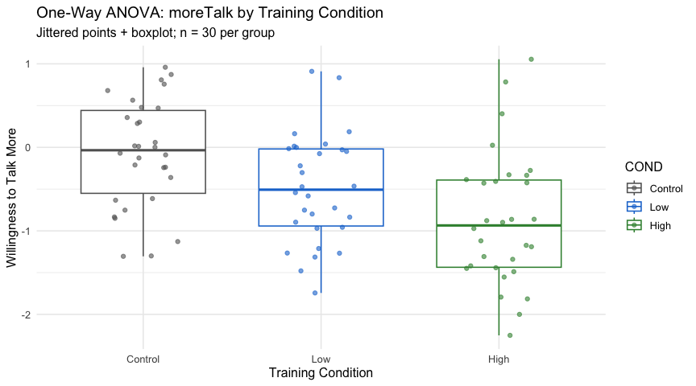
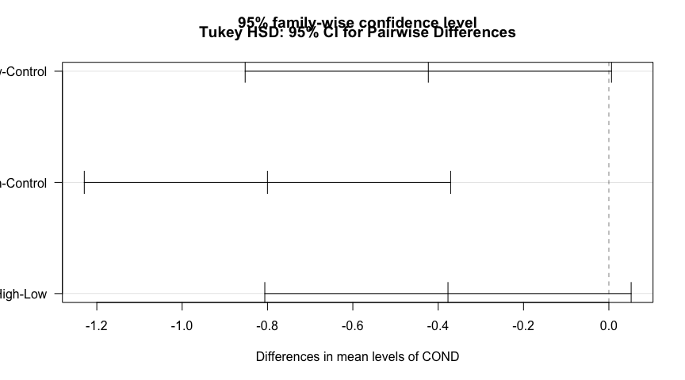
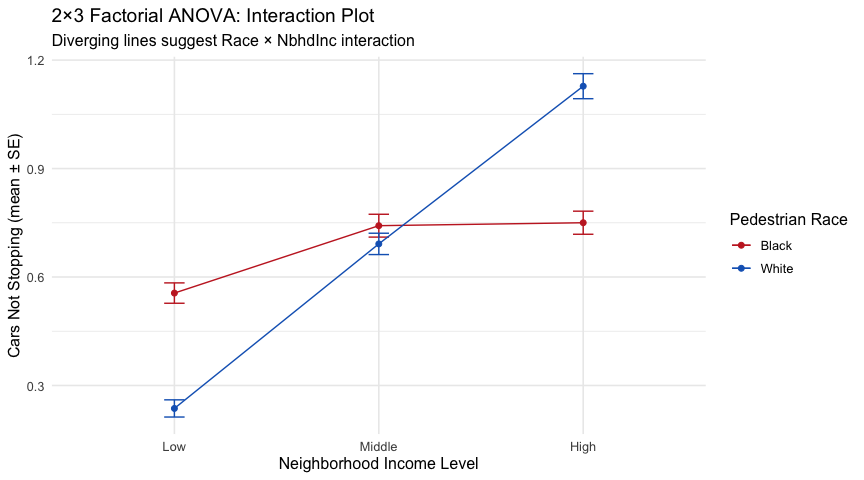
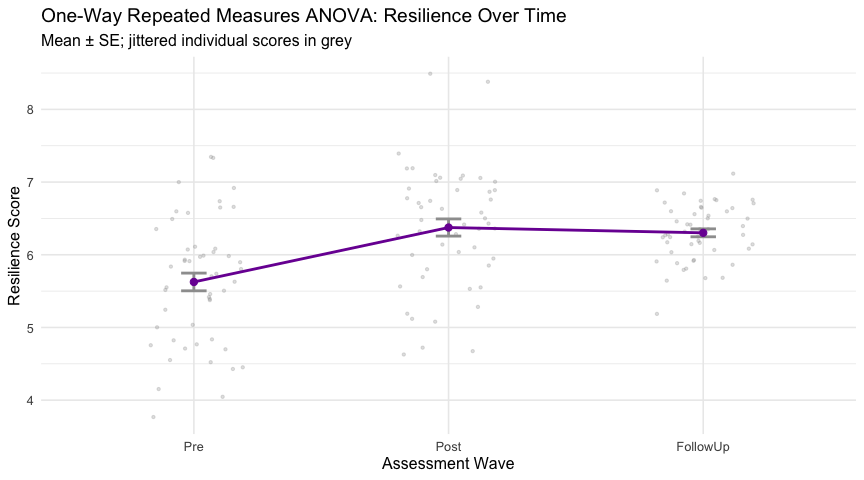
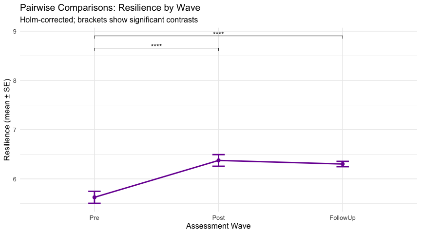
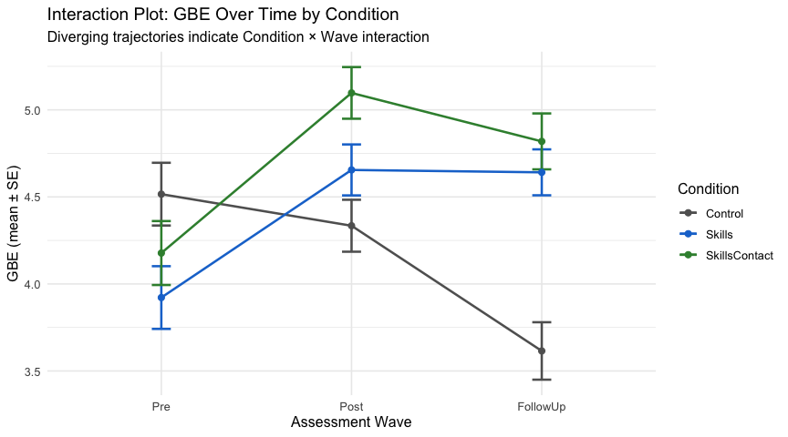
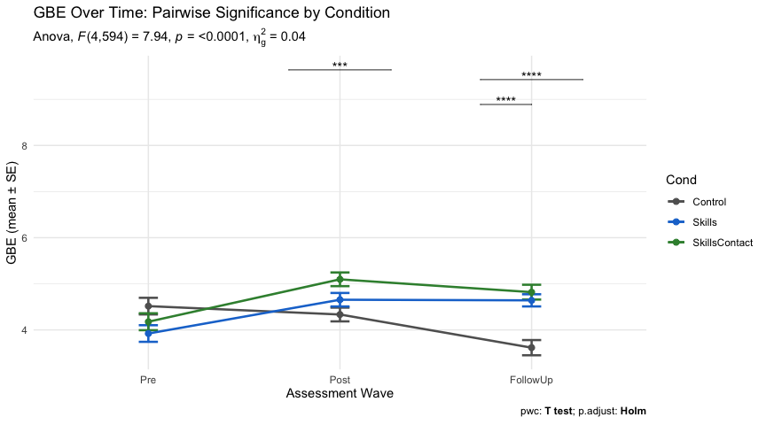

# Four ANOVA Designs and Why the Design Choice Is the Finding

**Mintay Misgano, PhD**
*One-way, factorial, repeated-measures, and mixed analysis of variance*

---

## Abstract

Analysis of variance (ANOVA) is usually taught as one test, but it is a family of designs, and the choice among them is a substantive decision rather than a clerical one. This report applies four ANOVA designs to four simulated social-science datasets — a one-way between-subjects design, a 2×3 factorial, a one-way repeated-measures design, and a 3×3 mixed design — drawn from published work in cross-cultural communication, pedestrian safety, resilience, and prejudice reduction. Each analysis defines its method and assumptions, checks those assumptions, runs the omnibus test, follows significant effects with appropriately corrected comparisons, and reports effect sizes. The recurring lesson is that the design determines what is knowable: a null average can conceal a strong interaction, a repeated-measures structure can detect change a between-subjects design would miss, and a baseline equivalence check can distinguish a real program effect from pre-existing group differences.

---

## 1. Introduction

The four ANOVA designs differ along three structural axes, and the appropriate design follows directly from how a study was built.

The **number of factors** separates one-way from factorial designs. A one-way ANOVA examines a single grouping factor; a factorial design crosses two or more, which makes it possible to test an *interaction* — whether the effect of one factor changes across the levels of another. Interactions are frequently the most important result in applied behavioral research, and as Study 2 shows, they can exist even when neither factor has a main effect.

The **between- versus within-subjects** distinction separates independent-groups designs from repeated-measures designs. A between-subjects factor compares different people across conditions; a within-subjects factor compares the same people across conditions or time. Repeated-measures designs are more powerful because each person serves as their own control, removing stable individual differences from the error term — but they carry an extra assumption (sphericity) and require data in long format with a participant identifier.

**Mixed designs** combine the two, with at least one between-subjects factor and at least one within-subjects factor. They are the standard for longitudinal intervention research, where participants are assigned to conditions and then measured repeatedly, and where the question of interest is almost always the condition-by-time interaction.

Cutting across all three axes is the problem of **multiple comparisons**: an omnibus test establishes that *some* difference exists, and each follow-up comparison spends additional Type I error. Each design below therefore pairs its omnibus test with an explicit correction method.

---

## 2. Method

### 2.1 Designs and data

All four datasets are simulated from population parameters reported in published studies. Simulation makes the data fully shareable and the results exactly reproducible while preserving each original study's design structure; the trade-off, addressed in the Limitations, is that simulated distributions are smoother than field data.

| Study | Design | Source (simulated) | N | DV | Factor(s) |
|---|---|---|---|---|---|
| 1 | One-way between-subjects | Tran & Lee (2014) | 90 (30/group) | `moreTalk` (willingness to talk more) | Training condition (Control, Low, High) |
| 2 | 2×3 between-subjects factorial | Coughenour et al. (2017) | 180 (30/cell) | `NotStop` (cars not yielding) | Race × Neighborhood income |
| 3 | One-way repeated measures | Amodio et al. (2018) | 50 (×3 waves) | `Resilience` | Wave (Pre, Post, Follow-Up) |
| 4 | 3×3 mixed | Brenick (2019) | 300 (×3 waves) | `GBE` (group-based exclusion) | Condition (between) × Wave (within) |

### 2.2 The four methods, defined

**One-way between-subjects ANOVA (Study 1).** This is the test of whether the means of three or more independent groups differ on a continuous outcome. It partitions total variance into a between-groups component (differences among condition means) and a within-groups component (variation among people in the same condition), and compares them as a ratio. It assumes independent observations, approximately normal residuals within each group, and homogeneity of variance across groups (Field, 2018). *Alternative considered:* with only one factor, an independent-samples *t*-test would handle two groups, but with three conditions a series of *t*-tests would inflate the familywise error rate; ANOVA tests all three simultaneously under a single error rate. Where variances are badly unequal, Welch's ANOVA is the robust alternative — not needed here because Levene's test was non-significant.

**Two-way factorial ANOVA (Study 2).** A factorial design crosses two factors so that every combination of levels is represented, and decomposes the outcome into two main effects plus their interaction. The interaction term is what a one-way design cannot provide: it tests whether the effect of race on yielding depends on neighborhood income. Assumptions match the one-way case, applied across all six cells (Field, 2018). *Alternative considered:* running two separate one-way ANOVAs (one for race, one for income) would discard exactly the interaction that turns out to carry the finding, and would not control error across the two analyses.

**One-way repeated-measures ANOVA (Study 3).** When the same participants are measured under every level of a factor — here, three time points — a repeated-measures ANOVA models the within-person correlation by removing each participant's average level from the error term. This typically yields much greater power than a between-subjects design with the same number of observations. The added assumption is *sphericity*: the variances of all pairwise differences between levels are equal (Field, 2018). *Alternative considered:* a between-subjects one-way ANOVA on the same data would treat the three waves as independent groups, ignoring that each person appears three times, violating independence and wasting the design's power. A linear mixed-effects model is a more flexible alternative that also handles missing waves; repeated-measures ANOVA is appropriate here because the design is balanced and complete.

**Mixed-design ANOVA (Study 4).** A mixed design contains at least one between-subjects factor (Condition) and at least one within-subjects factor (Wave) in the same model, and tests both main effects and their interaction. It is the canonical analysis for a randomized intervention measured over time, because the Condition × Wave interaction is the formal test of whether groups changed *differently* (Field, 2018). It carries the union of the earlier assumptions, including sphericity for the within factor and homogeneity of between-cell covariances, assessed with Box's M. *Alternative considered:* analyzing change scores or each wave separately would fragment the question; the mixed model keeps the full trajectory in one error structure and supports targeted follow-ups.

### 2.3 Evaluation metrics, defined before use

Because the same indicators recur across the four studies, they are defined here once, before any results appear.

- **F-statistic.** The ratio of explained variance (between groups, or due to a factor) to unexplained variance (residual). Under the null hypothesis it is centered near 1; values substantially above 1, evaluated against its degrees of freedom (DFn, DFd), indicate group separation larger than chance (Field, 2018).
- **p-value.** The probability of an F at least this large if the null were true. Throughout, α = .05.
- **η² (eta-squared).** The proportion of total variance attributable to a factor, used for the between-subjects designs (Studies 1–2). Benchmarks: ≈ .01 small, ≈ .06 medium, ≥ .14 large (Cohen, 1988).
- **Generalized eta-squared (ges).** Reported by the `rstatix` package for the repeated-measures and mixed designs (Studies 3–4). It is designed to be comparable across between- and within-subjects designs, which ordinary η² is not, and is the recommended effect size for designs containing repeated measures (Olejnik & Algina, 2003; Bakeman, 2005). The Cohen benchmarks above are used as a rough guide.
- **Shapiro-Wilk test.** A test of normality; a *non-significant* result (p > .05) indicates no detectable departure from normal, supporting the ANOVA assumption (Field, 2018).
- **Levene's test.** A test of homogeneity of variance across groups; again, *non-significant* supports the assumption (Field, 2018).
- **Mauchly's test of sphericity / Greenhouse-Geisser correction.** Mauchly's test checks the sphericity assumption for within-subjects factors; when it is violated, the Greenhouse-Geisser epsilon adjusts the degrees of freedom downward to keep the test valid (Field, 2018).
- **Box's M test.** A test of equality of covariance matrices across between-subjects groups in a mixed design; non-significant supports the assumption (Field, 2018).
- **Tukey HSD, Holm, and Bonferroni corrections.** Methods for controlling the familywise Type I error rate across multiple comparisons. Tukey HSD is used for all-pairwise contrasts after a one-way design; Holm is a uniformly more powerful step-down alternative to Bonferroni used for the factorial and repeated-measures pairwise tests; Bonferroni is applied to the simple-main-effect omnibus tests in the mixed design (Field, 2018).

All analyses were conducted in R (R Core Team, 2024) with `rstatix`, `car`, `lsr`, `ggpubr`, and `psych`.

---

## 3. Results

### 3.1 Study 1 — One-way ANOVA: communication-training intensity

Assumption checks were clean: Shapiro-Wilk was non-significant in every condition (Control p = .374, Low p = .631, High p = .335) and Levene's test supported equal variances, *F*(2, 87) = 0.55, *p* = .578. The omnibus test was significant, *F*(2, 87) = 9.89, *p* < .001, η² = .185 — a large effect, with roughly 19% of the variance in willingness-to-talk aligned with training condition.

*What to read here:* compare the box centers left to right. The means descend monotonically against intuition — Control *M* = −0.07, Low *M* = −0.49, High *M* = −0.87 — so more intensive training is associated with *lower*, not higher, stated willingness. The boxes overlap substantially, which previews that not every pairwise gap will be reliable.

The Tukey HSD comparisons confirm exactly that. Only the High-vs-Control contrast clears the threshold (difference = −0.80, 95% CI [−1.23, −0.37], *p* < .001). The Low-vs-Control gap (−0.42, *p* = .054) and the High-vs-Low gap (−0.38, *p* = .097) both fall just short.

*What to read here:* an interval that crosses the vertical zero line is a non-significant difference. Only the High–Control interval sits entirely left of zero. The takeaway is methodological as much as substantive: a significant omnibus test licenses follow-ups, but it does not certify that every pair differs — here the overall effect is carried by a single contrast.

### 3.2 Study 2 — Factorial ANOVA: the interaction is the finding

Variances were homogeneous across all six cells, *F*(5, 174) = 0.55, *p* = .737. The omnibus factorial ANOVA returns a result that would be badly misread if only the main effects were reported: the main effect of **Race was essentially zero**, *F*(1, 174) = 0.01, *p* = .912, η² < .001, while the **Race × Neighborhood-Income interaction was large and significant**, *F*(2, 174) = 68.06, *p* < .001, η² = .213 (alongside a very large main effect of income, *F*(2, 174) = 164.29, *p* < .001, η² = .514).

*What to read here:* follow each colored line across the income axis and note that they cross. The racial gap does not merely shrink or grow — it *reverses sign*. Simple-main-effects tests of race within each income level localize the interaction precisely: in **low-income** blocks more drivers fail to yield to the Black pedestrian (*M* = 0.56 vs. 0.24), *F*(1, 58) = 74.98, *p* < .001, ges = .564; in **middle-income** blocks the gap is non-significant (0.74 vs. 0.69), *F*(1, 58) = 1.36, *p* = .249; and in **high-income** blocks the gap reverses to disadvantage the White pedestrian (1.13 vs. 0.75), *F*(1, 58) = 64.35, *p* < .001, ges = .526. Because these two large, opposite effects cancel when averaged, the main effect of race is null. *Why it matters:* a one-way analysis of race alone would have concluded "no racial difference in yielding" and missed two strong, opposing context-specific biases. The interaction is not a nuance on top of the finding — it *is* the finding.

### 3.3 Study 3 — Repeated-measures ANOVA: change that holds

The same 50 participants were measured three times, and assumptions held: Shapiro-Wilk was non-significant at every wave (Pre p = .667, Post p = .127, Follow-Up p = .636), with no extreme outliers. The omnibus within-subjects test was significant, *F*(2, 98) = 17.63, *p* < .001, ges = .18 (a large effect; Greenhouse-Geisser correction is reported in the workflow where sphericity is at issue).

*What to read here:* track the bold mean line across waves against the grey individual paths. Resilience climbs from Pre (*M* = 5.63) to Post (*M* = 6.38) and then sits essentially flat to Follow-Up (*M* = 6.30). The Holm-corrected paired comparisons make the pattern exact: Pre→Post is a significant gain, *t*(49) = −5.00, *p* < .001; Pre→Follow-Up remains significantly above baseline, *t*(49) = −4.85, *p* < .001; and Post→Follow-Up does not differ, *t*(49) = 0.58, *p* = .568 — the improvement is *maintained*, not transient.

*Why it matters:* the within-subjects design removes stable person-level differences in baseline resilience from the error term, which is why a sample of 50 cleanly detects an effect that a between-subjects design of the same size would likely miss. The substantive payoff — distinguishing a durable gain from a short-lived bump — depends on having measured the follow-up wave at all.

### 3.4 Study 4 — Mixed-design ANOVA: equivalence first, divergence later

Assumptions were satisfied: normality held in all nine cells, Levene's test was non-significant within each wave (Pre p = .897, Post p = .844, Follow-Up p = .058), and Box's M supported homogeneous covariances, *p* = .372. The omnibus mixed ANOVA returned a significant main effect of Condition, *F*(2, 297) = 9.49, *p* < .001, ges = .019; a significant main effect of Wave, *F*(2, 594) = 6.88, *p* = .001, ges = .016; and the key **Condition × Wave interaction**, *F*(4, 594) = 7.94, *p* < .001, ges = .036.

*What to read here:* note that the three condition lines begin nearly on top of one another at Pre and fan out by Follow-Up. The simple-main-effect tests of Condition within each wave quantify that separation and are the reason the interaction matters: at **Pre-test the conditions are statistically indistinguishable**, *F*(2, 297) = 2.70, *p*~adj~ = .207 — exactly what random assignment should produce, and the baseline-equivalence check that licenses a causal reading. Differences then **emerge at Post**, *F*(2, 297) = 6.70, *p*~adj~ = .003, ges = .043, and **grow by Follow-Up**, *F*(2, 297) = 17.99, *p*~adj~ < .001, ges = .108.

*What to read here, with a correction to the prior write-up:* the Holm-corrected pairwise tests at Follow-Up show that **both training arms differ from Control** (Control vs. Skills *p*~adj~ < .001; Control vs. Skills+Contact *p*~adj~ < .001), but the **two training arms do not differ from each other** (Skills vs. Skills+Contact *p*~adj~ = .413). The data therefore do *not* support the claim that adding experiential contact produced more durable change than skills training alone — that contrast is non-significant. A second feature deserves an honest reading: it is the Control group whose group-based-exclusion score *declines* across waves (Control Follow-Up *M* = 3.62, versus Skills 4.64 and Skills+Contact 4.82), so the divergence reflects the trained groups remaining elevated relative to a falling control rather than a clean training-driven reduction. Because these are simulated data, this pattern is best read as a demonstration that the mixed design can detect *and localize* a condition-by-time interaction — including establishing baseline equivalence — rather than as a substantive claim about any real intervention.

---

## 4. Comparative design logic

| Feature | One-way | Factorial (2×3) | Repeated measures | Mixed |
|---|---|---|---|---|
| Independent variables | 1 between | 2 between | 1 within | 1 between + 1 within |
| Tests an interaction | No | Yes | No | Yes |
| Removes individual differences | No | No | Yes | For the within factor |
| Sphericity assumption | No | No | Yes | Yes (within factor) |
| Requires a participant ID | No | No | Yes | Yes |
| Follow-up approach used | Tukey HSD | Simple main effects + Holm | Paired, Holm | Simple main effects (Bonferroni) + Holm pairwise |
| Effect size reported | η² | η² | ges | ges |

---

## 5. Discussion

### 5.1 What each design buys

The four studies make the abstract point concrete. The one-way design is the entry case and showed that a significant overall effect can still rest on a single pairwise contrast (Study 1). The factorial design supplied the sharpest lesson: a null main effect of race coexisted with a large, sign-reversing interaction, so the design that could not test an interaction would have returned the wrong conclusion (Study 2). The repeated-measures design converted a modest sample into a powerful test of change and, by including a follow-up wave, distinguished a durable gain from a temporary one (Study 3). The mixed design combined both capabilities and, through its baseline-equivalence check, separated a genuine over-time divergence from pre-existing group differences (Study 4).

### 5.2 Recommendations for analysis practice

These follow directly from the results above. **First, in any factorial design, inspect the interaction before interpreting main effects** — Study 2's null race main effect would otherwise be reported as "no bias," when in fact two strong opposing biases exist. **Second, never treat a significant omnibus test as evidence that all groups differ**: Study 1's effect was carried solely by the High-vs-Control contrast, so the corrected pairwise tests, not the omnibus F, are what support any specific claim. **Third, when an outcome is measured repeatedly, use a within-subjects design and measure a follow-up wave**: Study 3's "gains are maintained" conclusion is only possible because Post→Follow-Up was tested and found non-significant. **Fourth, in intervention studies, confirm baseline equivalence before reading the interaction as an effect**: Study 4's Pre-test simple-main-effect test (*p*~adj~ = .207) is what allows the later divergence to be attributed to condition rather than to a head start, and the non-significant Skills-vs-Skills+Contact follow-up contrast is a reminder to claim only the comparisons the data actually license.

### 5.3 Limitations

All four datasets are simulated from published population parameters. This guarantees reproducibility and shareability but produces distributions smoother than typical field data, so the assumption checks pass more cleanly than they often would in practice; with real data, decisions about skew, missing waves, and robust alternatives (Welch's ANOVA, permutation tests, or linear mixed-effects models for unbalanced repeated measures) would carry more weight. The Study 4 outcome direction, in particular, should be read as an illustration of the mixed design's inferential machinery rather than as a finding about a real program.

---

## References

Amodio, A., Collins, E., & Moss, M. (2018). Empowering youth with disability: A study of resilience and mindfulness. *Journal of Applied Developmental Psychology.*

Bakeman, R. (2005). Recommended effect size statistics for repeated measures designs. *Behavior Research Methods, 37*(3), 379–384. https://doi.org/10.3758/BF03192707

Brenick, A. (2019). Teaching tolerance through empathy and contact. *Journal of Social Issues.*

Cohen, J. (1988). *Statistical power analysis for the behavioral sciences* (2nd ed.). Lawrence Erlbaum.

Coughenour, C., Clark, S., Singh, A., Claw, E., Abelar, J., & Huebner, J. (2017). Examining racial bias as a potential factor in pedestrian crashes. *Accident Analysis & Prevention, 98*, 96–100. https://doi.org/10.1016/j.aap.2016.09.031

Field, A. (2018). *Discovering statistics using IBM SPSS statistics* (5th ed.). SAGE.

Olejnik, S., & Algina, J. (2003). Generalized eta and omega squared statistics: Measures of effect size for some common research designs. *Psychological Methods, 8*(4), 434–447. https://doi.org/10.1037/1082-989X.8.4.434

R Core Team. (2024). *R: A language and environment for statistical computing.* R Foundation for Statistical Computing. https://www.R-project.org/

Tran, A. G. T. T., & Lee, R. M. (2014). You speak English well! Asian Americans' reactions to an (in)validation of linguistic identity. *Journal of Counseling Psychology, 61*(3), 451–461. https://doi.org/10.1037/cou0000034

---

*All datasets are simulated from published population parameters. R packages: rstatix, ggpubr, psych, car, lsr.*
