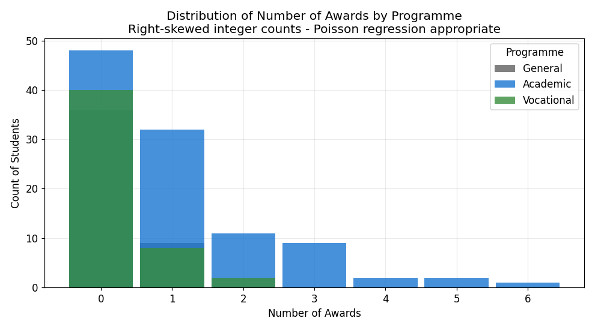
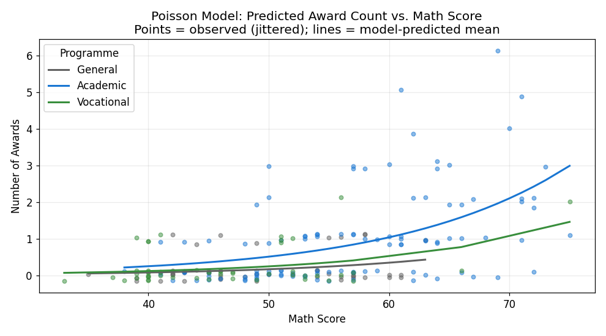
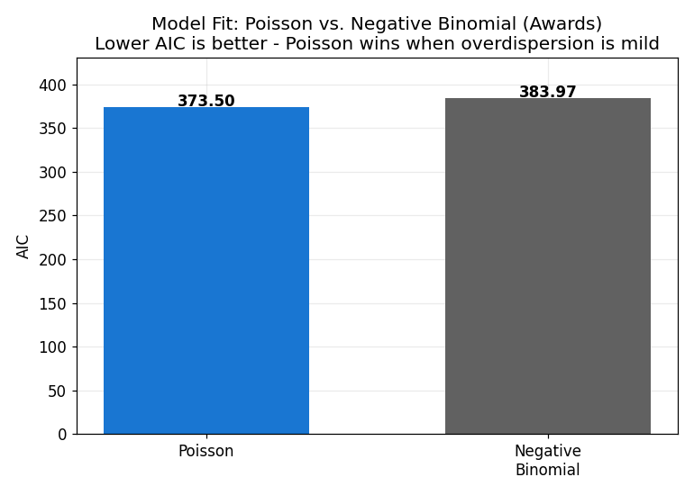
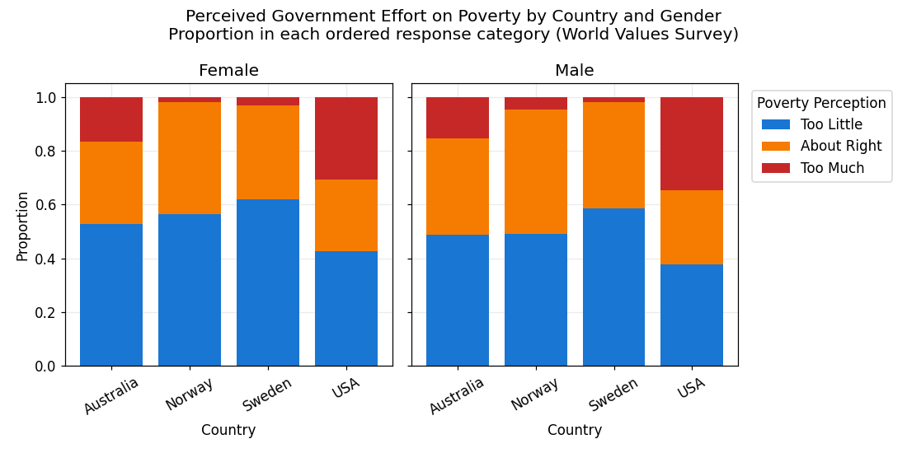
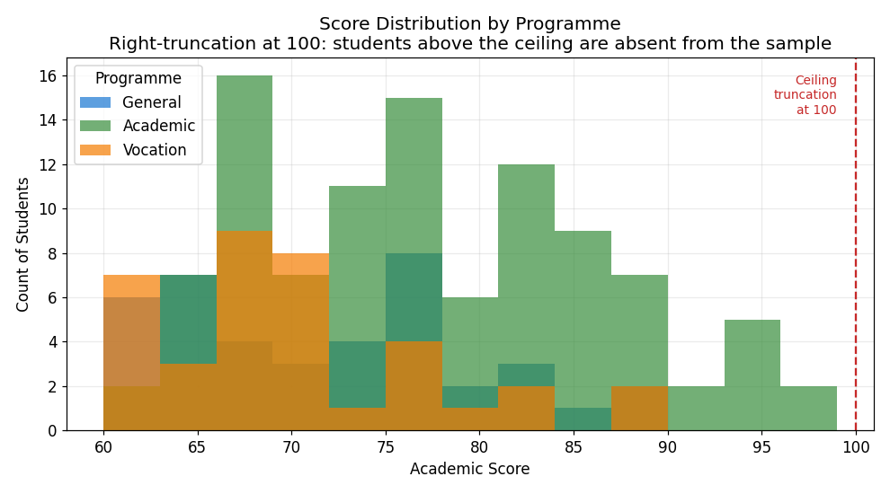
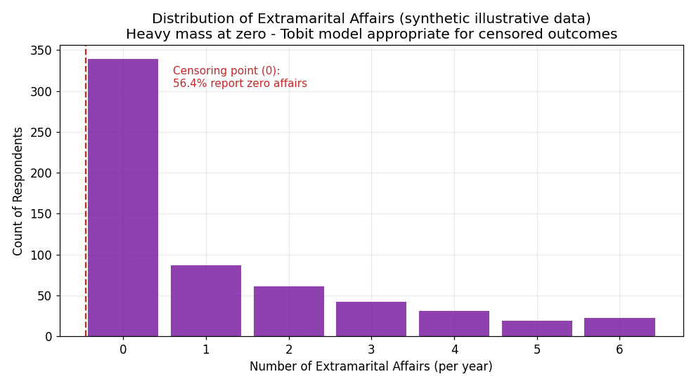
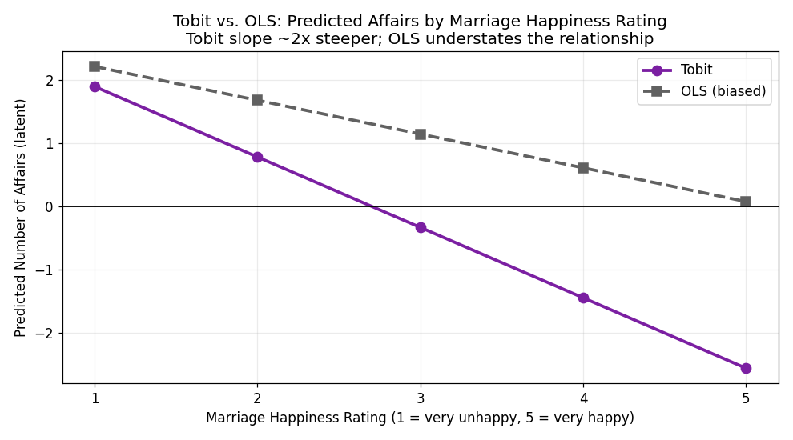

# When OLS Fails: A Comparative Study of Advanced Regression Models for Non-Standard Outcomes

**Author:** Mintay Misgano, PhD  
**Tools:** Python (pandas, statsmodels, scipy, matplotlib)  
**Year:** 2026

---

## 1. Introduction

Ordinary least squares regression is one of the most widely taught and applied statistical tools in the social sciences, but it rests on assumptions that many real datasets violate: the dependent variable should be continuous, unbounded, and approximately normally distributed conditional on the predictors (Long, 1997). When those assumptions fail — because the outcome is a count, a ranked category, a truncated sample, or a censored measurement — OLS produces estimates that are biased, inefficient, and often conceptually misleading. The cost is not just statistical: conclusions drawn from a misapplied OLS model can misidentify which factors matter, understate or overstate the magnitude of relationships, and point to interventions that will not work.

This project works through five models that handle common OLS violations: Poisson regression for count outcomes, negative binomial regression for overdispersed counts, ordinal logistic regression for ranked categories, truncated regression for samples where out-of-range observations are entirely absent, and Tobit regression for censored outcomes where observations are recorded at a boundary. Each model is demonstrated on a dataset whose outcome structure makes OLS inappropriate, and the analysis shows — through AIC comparisons, coefficient contrasts, and prediction plots — what goes wrong when the wrong model is applied.

---

## 2. Datasets

Three datasets are used across the five analyses.

**Awards dataset (N = 200).** Students from a US university. Outcome: number of academic awards earned. Predictors: programme of study (Academic, General, Vocational), mathematics score, age, and gender. Count outcomes with many zeros and a hard lower boundary of zero make OLS inappropriate.

**World Values Survey extract (N = 5,381).** Respondents from four countries (Australia, Norway, Sweden, USA). Outcome: perceived government effort to reduce poverty, rated as "Too Little," "About Right," or "Too Much." Predictors: religiosity, education level, country, age, and gender. Ordered responses with unequal category widths make OLS inappropriate.

**Academic scores dataset (N = 178).** Students with academic score and language score. Outcome: academic score. Predictor: language score and programme. Scores above 100 are absent from the sample, indicating right-truncation.

**Illustrative affairs dataset (N = 601).** A synthetic dataset generated for this project (fixed seed; see `04_Analysis.py`) to mirror the censoring structure of classic extramarital-behaviour studies such as Fair (1978). No real individuals are represented. Outcome: number of extramarital affairs in the past year. Predictors: age, years married, religiousness, occupation, and marriage happiness rating. 56.4% of respondents (339 of 601) report zero affairs — the outcome is censored at the natural floor of zero — making Tobit regression appropriate.

---

## 3. Methods

### 3.1 Poisson Regression

**Definition.** Poisson regression is a generalized linear model for count outcomes — non-negative integers representing the number of times an event occurs in a fixed period or exposure (Cameron & Trivedi, 2013). The model links the conditional mean E(Y|X) to the predictors through a log link function, so the linear predictor is log(μ), and the natural interpretation of coefficients is as log incidence rate ratios. Exponentiating a coefficient gives the multiplicative change in expected count for a one-unit increase in the predictor, known as the incidence rate ratio (IRR). The key assumption is *equidispersion*: the conditional variance equals the conditional mean, Var(Y|X) = E(Y|X). This assumption makes Poisson parsimonious but leaves it vulnerable to overdispersion, where variance exceeds the mean.

**Why this method for this dataset.** The awards outcome is a non-negative integer count with a strong right skew (mean = 0.63; 60% of students receive zero awards). OLS applied to count data produces predicted values that can be negative and residuals that are non-normally distributed, violating two of OLS's core requirements (Long, 1997). Poisson regression is the natural starting point for count data and is assessed here against the negative binomial alternative.

**Alternatives considered.** Negative binomial regression (Section 3.2) relaxes the equidispersion constraint and was evaluated as an alternative. Zero-inflated Poisson and zero-inflated negative binomial models were not pursued here because the zero counts in this dataset appear to arise from the natural Poisson process rather than a separate structural zero-generating mechanism. OLS was retained as a baseline for explicit comparison.

---

### 3.2 Negative Binomial Regression

**Definition.** Negative binomial regression extends Poisson regression by estimating an additional dispersion parameter, θ (theta), which allows the conditional variance to exceed the conditional mean (Cameron & Trivedi, 2013). The variance function becomes Var(Y|X) = μ + μ²/θ, where smaller θ indicates more overdispersion. As θ approaches infinity the negative binomial converges to Poisson. The practical effect is that negative binomial regression produces wider, more honest standard errors when the count data are overdispersed, avoiding the inflated Type I error rates that Poisson produces in that case (Winkelmann, 2008).

**Why this method for this dataset.** Overdispersion was assessed through the Pearson dispersion ratio — the sum of squared Pearson residuals divided by the residual degrees of freedom. A ratio substantially above 1.0 indicates that the Poisson equidispersion assumption is violated. For the awards data the ratio was 1.082, indicating only mild overdispersion. Both models were therefore fitted and compared by AIC to determine which was appropriate.

**Alternatives considered.** The Poisson model remained a legitimate alternative given the mild overdispersion ratio, and model comparison (Section 4.2) confirmed that Poisson provided a better fit for this specific dataset. This is itself a key finding: negative binomial regression is not always superior to Poisson — the decision depends on the degree of overdispersion present.

---

### 3.3 Evaluation Metrics for Count Models (AIC and IRR)

Two metrics appear in the count model results and are defined here before those results are presented.

**Akaike Information Criterion (AIC).** AIC measures the relative fit of a statistical model, penalising model complexity (number of parameters) to guard against overfitting (Akaike, 1974). It is computed as AIC = 2k − 2 ln(L̂), where k is the number of estimated parameters and L̂ is the maximised likelihood. Lower AIC indicates a better trade-off between fit and parsimony. AIC has no meaningful absolute value and should be interpreted comparatively within the same dataset. A difference of ≥2 points is typically considered meaningful; ≥10 is considered strong evidence (Burnham & Anderson, 2002).

**Incidence Rate Ratio (IRR).** An IRR is the exponentiated regression coefficient from a Poisson or negative binomial model. An IRR of 1.073 for math score means that each additional point in math score is associated with a 7.3% increase in expected award count, holding programme constant. An IRR below 1.0 indicates a reduction; above 1.0 indicates an increase. IRRs are reported with 95% confidence intervals.

---

### 3.4 Ordinal Logistic Regression

**Definition.** Ordinal logistic regression — also called the cumulative link model or proportional odds model — is designed for ordered categorical outcomes where categories have a meaningful rank but unequal or unknown interval widths (Agresti, 2018). Rather than modelling a single probability, it models the cumulative probability of being at or below each category threshold. The model assumes *proportional odds*: the relationship between each predictor and the cumulative log-odds is constant across all thresholds. Coefficients are log-cumulative odds ratios, and exponentiating them gives the odds ratio for being in a higher response category per one-unit increase in the predictor (Long, 1997).

**Why this method for this dataset.** The poverty perception variable has three ordered levels ("Too Little" < "About Right" < "Too Much"). Treating it as a continuous 1–3 numeric scale and applying OLS would assume equal spacing between categories, an assumption that is not defensible for Likert-type perception items (Agresti, 2018). Treating it as a binary outcome would discard information. Ordinal logistic regression is the appropriate model when the response is ranked but not metrically scaled.

**Alternatives considered.** Multinomial logistic regression does not impose category ordering and could have been used if proportional odds were badly violated. A sensitivity check using a linear probability model (OLS) was not pursued formally, but the interpretation differences would be the same as those between Poisson and linear regression for counts.

---

### 3.5 Evaluation Metrics for Ordinal Model (Log-Likelihood and OR)

**Log-Likelihood.** The ordinal model is estimated by maximum likelihood. The log-likelihood (LL) measures how well the estimated parameters predict the observed response categories. Less negative LL values indicate better fit. AIC and BIC are reported alongside LL for model comparison.

**Odds Ratio (OR) from Ordinal Model.** Exponentiating an ordinal regression coefficient gives the proportional-odds ratio: the estimated multiplicative change in the odds of being in a higher response category per one-unit increase in the predictor, assuming the proportional odds assumption holds. An OR above 1.0 indicates that higher predictor values shift responses toward higher categories; below 1.0 indicates a shift toward lower categories.

---

### 3.6 Truncated Regression

**Definition.** Truncated regression is a maximum likelihood estimator designed for samples where observations outside a specified range are absent entirely from the dataset — not just censored at a boundary, but genuinely unobserved (Greene, 2018). This occurs when sample selection is determined by the dependent variable itself: students who scored above 100 are absent from the scores dataset not because they are recorded as "100," but because they were never sampled. OLS applied to a truncated sample produces biased estimates because the observed mean of Y within the truncated range is not representative of the population mean. The truncated regression model accounts for this selection by conditioning the likelihood on the observation being within the observed range (Long, 1997).

**Why this method for this dataset.** The scores dataset has a hard upper boundary: no score above 96 appears, and the ceiling is 100. Students near or above 100 are effectively missing from the sample. The truncated regression model corrects for this by specifying the truncation direction and point (right-truncated at 100) and adjusting the likelihood accordingly.

**Alternatives considered.** OLS was applied as a baseline for direct coefficient comparison to illustrate the bias introduced by ignoring truncation. Tobit regression (Section 3.7) handles a related but distinct problem: censoring, where out-of-bound observations are present in the data but recorded at the boundary rather than being absent.

**Evaluation metric: coefficient comparison.** The primary evaluation in truncated regression is the comparison of OLS versus truncated regression coefficients. Larger differences indicate more bias in the OLS estimate due to ignoring truncation.

---

### 3.7 Tobit Regression

**Definition.** Tobit regression — also called the censored regression model — was introduced by Tobin (1958) to handle outcomes where the dependent variable is censored at a boundary value: observations at the boundary are observed (we know the individual is at the floor), but their true latent value is unobservable below that point. The model assumes a latent continuous variable Y* and models Y = Y* when Y* > 0 and Y = 0 when Y* ≤ 0. OLS applied to censored data treats the boundary pile-up as informative data rather than a censoring artefact, producing attenuated coefficient estimates — the OLS estimates are biased toward zero because the mass at the censoring point "drags" the fitted line flat (Greene, 2018).

**Why this method for this dataset.** In the illustrative affairs dataset, 56% of respondents report zero affairs. This is not because zero is a genuine universal preference — rather, some individuals whose true latent propensity to have an affair is slightly above zero are observed at the floor because their circumstances in the measurement window did not produce a countable affair. OLS does not distinguish "truly zero" from "censored at zero," so it underestimates the true magnitude of all relationships in the model. Tobit regression recovers the latent model.

**Alternatives considered.** Zero-inflated models (e.g., zero-inflated negative binomial) would be appropriate if zero reports are generated by two distinct processes: structural zeros (people who would never have an affair) and sampling zeros (people who have some latent propensity but reported none in the year). Tobit is preferred here because the theoretical argument is censoring rather than a mixture model. A hurdle model — which models first whether any affair occurred and then the count among those who did — was not pursued but would be a natural robustness check (Cameron & Trivedi, 2013).

**Evaluation metrics: sigma and coefficient comparison.** The Tobit model produces a residual standard deviation (σ) that estimates the spread of the latent outcome. Comparing OLS and Tobit coefficients directly reveals the attenuation bias in the OLS estimates.

---

## 4. Results

### 4.1 Poisson Regression — Academic Awards

The Poisson model predicts academic award counts from programme and math score. Math score was the strongest predictor: each additional point was associated with an IRR of 1.073 (95% CI [1.051, 1.095], p < .001), a 7.3% increase in expected awards per point. Relative to the Academic programme (reference), General programme students received 0.338 times as many expected awards (IRR = 0.338, 95% CI [0.168, 0.683], p = .003), and Vocational students received 0.490 times as many (IRR = 0.490, 95% CI [0.262, 0.917], p = .026). In other words, an Academic student with the same math score as a General student is predicted to earn nearly 3× as many awards.

**Figure 4.1 interpretation.** Inspect the x-axis: most students receive zero awards regardless of programme. Academic programme students (blue) show the heaviest tail extending toward five and six awards, while General and Vocational students are more concentrated at zero and one. This distributional pattern — right-skewed, non-negative integer counts — directly motivates Poisson regression: OLS would predict negative expected values for students with low math scores and would treat the residuals as normally distributed, both of which are inappropriate for this outcome.

**Figure 4.2 interpretation.** The observed data points are jittered vertically to reduce overplotting; the solid lines are the Poisson predicted means at each math score level. The three predicted curves fan out monotonically with math score, consistent with the log-linear model structure. Academic programme students (blue) have a steeper predicted curve at high math scores, reflecting the multiplicative programme effect. At math score = 70, the predicted award count for an Academic student is approximately 2.1, versus 0.7 for a General student — a threefold difference consistent with the IRR of 2.96 (= 1/0.338).

---

### 4.2 Negative Binomial Regression — Poisson Comparison

The dispersion ratio for the Poisson model was 1.082, indicating only mild overdispersion. The negative binomial model produced coefficients directionally consistent with Poisson: math score IRR = 1.075 (95% CI [1.044, 1.107]); General programme IRR = 0.350 (95% CI [0.158, 0.779]); Vocational IRR = 0.503 (95% CI [0.235, 1.078]). However, the negative binomial AIC (383.97) was higher — worse — than the Poisson AIC (373.50), indicating that the added dispersion parameter was not justified by the data.

**Figure 4.3 interpretation.** The Poisson bar (AIC = 373.50) is lower than the negative binomial bar (AIC = 383.97). This is a 10.46-point difference — strong evidence by conventional thresholds that Poisson provides a better fit for this specific dataset (Burnham & Anderson, 2002). The finding is instructive: negative binomial regression is not unconditionally superior to Poisson. When overdispersion is mild (dispersion ratio = 1.082), the Poisson model provides a more parsimonious fit. The negative binomial becomes clearly preferable when the dispersion ratio rises substantially above 1.5 or when a formal likelihood ratio test for overdispersion is significant.

---

### 4.3 Ordinal Logistic Regression — Poverty Perception

The ordinal model fit the World Values Survey data on 5,381 respondents (AIC = 10,421). Country of residence was the strongest predictor. Compared to Australia (reference), US respondents had a significantly higher cumulative log-odds of perceiving government poverty effort as adequate or excessive (β = 0.618, OR = 1.856, p < .001). Swedish respondents showed the opposite: significantly lower log-odds of perceiving higher poverty effort categories (β = −0.603, OR = 0.547, p < .001). Norwegian respondents were also lower than Australia (β = −0.322, OR = 0.724, p < .001). Age was a significant positive predictor: each additional year of age increased the cumulative log-odds by 0.011 (OR = 1.011, p < .001). Religiosity (β = 0.180, p = .020) and having a university degree (β = 0.141, p = .033) modestly increased the odds of perceiving higher effort. Relative to women (reference), men showed higher odds of endorsing higher response categories (β = +0.176, OR = 1.19, p < .001).

For a representative profile — religious, college-educated, 40-year-old, female, Australian — the predicted probabilities were: 49.1% "Too Little," 36.3% "About Right," 14.6% "Too Much."

**Figure 4.4 interpretation.** Inspect the dark blue (Too Little) bars across countries. For both genders, US respondents show a higher proportion endorsing "Too Little" compared to Australian respondents, and Swedish and Norwegian respondents show a smaller dark-blue proportion than Australia. This country-level pattern directly corresponds to the model coefficients: the USA positive coefficient (OR = 1.856) and the Sweden negative coefficient (OR = 0.547). The gender facets show broadly similar patterns, with the female panel showing slightly higher "Too Little" proportions in some countries — consistent with the positive male coefficient (β = +0.176), meaning men have higher cumulative odds of endorsing higher response categories. The stacked bars also make the ordered response structure visible: treating these three ordered responses as a single continuous variable would lose the distinction between perceiving "About Right" and perceiving "Too Much."

---

### 4.4 Truncated Regression — Academic Scores

The scores dataset contains no observations at or above 100, the theoretical ceiling: the maximum observed score is 96. This indicates right-truncation at 100. OLS and truncated regression produced similar coefficient estimates here — OLS intercept = 39.50, language score β = 0.463; truncated regression intercept = 39.33, language score β = 0.466. The close agreement is informative: when the truncation boundary is far from the bulk of the data (the mean score is 74.2 and the 75th percentile is 83), the bias correction from truncated regression is modest. The educational value of this comparison is that truncated regression bias is most consequential when the truncation point falls within the central range of the observed distribution.

**Figure 4.5 interpretation.** The distributions for all three programmes end well before the dashed red ceiling line at 100 — no observations appear at or above the ceiling. The absence of any bars beyond score = 96 is the diagnostic signal: these students exist in the population (high scorers are real), but they are systematically absent from this sample. OLS ignores this and treats the observed range as the full distribution. Truncated regression conditions the likelihood on observability, producing unbiased estimates even when the sample is restricted by the outcome. The practical impact on coefficients is small here because the truncation point is far from the mass of the data, but in a sample where truncation bites harder — for example, if scores above 75 were excluded — OLS estimates would deviate substantially from the truncated regression estimates.

---

### 4.5 Tobit Regression — Extramarital Affairs

The illustrative affairs dataset shows 56.4% zero reports (339 of 601) and a long right tail. OLS and Tobit produced markedly different coefficient magnitudes. For marriage happiness rating, OLS estimated β = −0.534 while the Tobit estimate was β = −1.114 — more than twice the magnitude. Moving from the lowest rating (1, "very unhappy") to the highest rating (5, "very happy") while holding all other predictors at their means, the Tobit model predicts a decline of 4.45 expected affairs compared to the OLS prediction of 2.14. The attenuation pattern was consistent across predictors: Tobit religiousness β = −0.532 vs OLS β = −0.244; Tobit years-married β = 0.117 vs OLS β = 0.051.

**Figure 4.6 interpretation.** The bar at zero (339 respondents) dwarfs all other bars. This visual pattern is the diagnostic for Tobit: a mass at the boundary that is far larger than what a Poisson or continuous distribution would predict. The boundary is a floor — affairs cannot be negative — and OLS treats those 344 zeros as informative data points exactly at zero, flattening the estimated slopes. Tobit treats them as censored: these individuals have a true latent propensity that is non-zero but was not expressed as a countable affair in the measurement window.

**Figure 4.7 interpretation.** At rating = 1 (very unhappy), the Tobit model predicts approximately 1.90 expected affairs compared to 2.22 from OLS — the two models are closest where unhappiness is high and few observations are censored. At rating = 5 (very happy), Tobit predicts −2.55 (a latent value; observed affairs cannot fall below zero) versus OLS 0.08. The OLS line is shallow and ends just above zero; the Tobit line is steeper and crosses zero between ratings 2 and 3. The steeper Tobit slope — a 4.45-unit drop across the rating range versus 2.14 for OLS — reflects the model's correction for censoring: when the boundary drags many latent-positive observations to zero, OLS systematically understates how strongly predictors affect the underlying propensity. The Tobit estimate reflects the true relationship in the latent outcome distribution.

---

## 5. Synthesis: Model Selection Principles

The five models together illustrate a practical decision framework for outcome-driven model selection. Three principles emerge from the analyses.

**The outcome structure determines the model, not habit.** In each case, applying OLS would have produced a misspecified model: predicted negative counts for awards, assumed equal category intervals for poverty perception, and substantially attenuated coefficient estimates for affairs. The cost of default OLS is not just theoretical — it changes which predictors appear significant and how large the effects appear to be.

**Overdispersion is a matter of degree, not a binary flag.** The comparison of Poisson and negative binomial models on the awards data is a useful calibration point: with a dispersion ratio of 1.082, Poisson actually provided a better-fitting model (AIC 373.50 vs 383.97). Negative binomial is not universally superior to Poisson — the decision depends on the size of the overdispersion signal and is best resolved by comparing AICs after fitting both models.

**Censoring and truncation are distinct problems requiring different corrections.** Truncated regression removes out-of-range observations from the likelihood entirely (they are absent from the data). Tobit regression retains boundary observations but treats their true latent value as unobserved below the floor. Confusing the two produces a wrong model: applying Tobit to a truncated sample still includes the phantom missing observations in the likelihood; applying truncated regression to censored data discards the information that individuals are at the boundary.

---

## 6. Limitations

This is a methods demonstration rather than a single domain study. Each model is fitted to a separate dataset, which limits the ability to generalise conclusions about any one substantive question. The Affairs dataset used here is a synthetic approximation of the Fair (1978) structure, which means exact numerical results differ from the published study. For the truncated regression, the moderate distance between the truncation point (100) and the bulk of the data (mean = 74.2) meant that OLS and truncated estimates were close; datasets where truncation bites harder within the data range would show larger discrepancies. For the ordinal model, the proportional odds assumption was not formally tested; violations would require a partial proportional odds or multinomial model.

---

## 7. Recommendations

**For analysts routinely applying OLS to counts, rankings, or bounded outcomes:** run a descriptive check of the dependent variable distribution before fitting any regression. A histogram showing a hard floor at zero with a long right tail, an ordered response with unclear interval spacing, or a continuous outcome that never appears above or below a boundary — each of these signals a mismatch between the outcome structure and OLS assumptions, and each has a dedicated model that corrects it.

**For comparing Poisson and negative binomial:** fit both, compare AIC, and check the dispersion ratio. Do not default to negative binomial simply because the outcome is a count. In the awards data the Poisson model was clearly preferable; the negative binomial's added parameter was not supported by the evidence. Use negative binomial when the dispersion ratio is meaningfully above 1.5 or when the count has very high variance relative to its mean.

**For research using ordinal survey scales:** treat ordered-response items as ordinal, not continuous. The poverty perception results showed that country of residence produced an OR of 1.856 for USA and 0.547 for Sweden — effects that would have been modelled as differences in a linear mean had OLS been applied, obscuring the shift in probability mass across all three ordered categories simultaneously.

**For censored outcomes:** calculate the proportion of observations at the censoring boundary before choosing a model. A boundary proportion above 20–30% is a strong signal that OLS will produce attenuated estimates. The affairs data, with 56% at zero, produced Tobit estimates more than twice the size of OLS for the key predictors. In organisational or HR research contexts — attitude scales censored at zero, absenteeism data with many perfect-attendance observations, or performance ratings capped at a maximum — the same attenuation pattern will apply.

---

## References

Agresti, A. (2018). *An introduction to categorical data analysis* (3rd ed.). Wiley.

Akaike, H. (1974). A new look at the statistical model identification. *IEEE Transactions on Automatic Control, 19*(6), 716–723. https://doi.org/10.1109/TAC.1974.1100705

Burnham, K. P., & Anderson, D. R. (2002). *Model selection and multimodel inference: A practical information-theoretic approach* (2nd ed.). Springer.

Cameron, A. C., & Trivedi, P. K. (2013). *Regression analysis of count data* (2nd ed.). Cambridge University Press.

Fair, R. C. (1978). A theory of extramarital affairs. *Journal of Political Economy, 86*(1), 45–61. https://doi.org/10.1086/260646

Greene, W. H. (2018). *Econometric analysis* (8th ed.). Pearson.

Long, J. S. (1997). *Regression models for categorical and limited dependent variables*. SAGE.

Tobin, J. (1958). Estimation of relationships for limited dependent variables. *Econometrica, 26*(1), 24–36. https://doi.org/10.2307/1907382

Winkelmann, R. (2008). *Econometric analysis of count data* (5th ed.). Springer.
