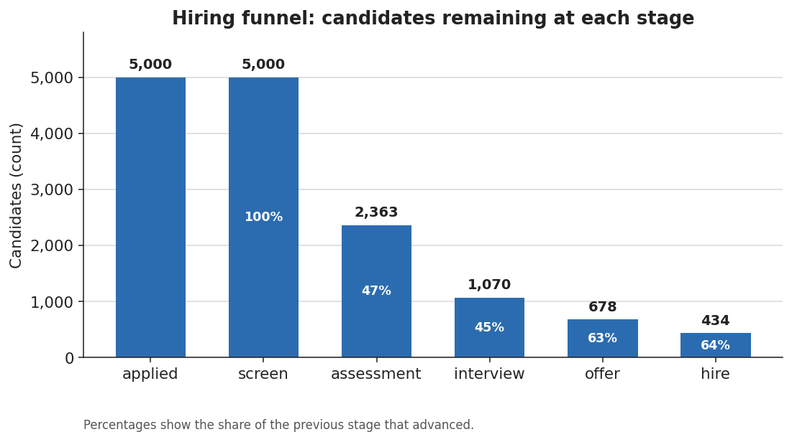
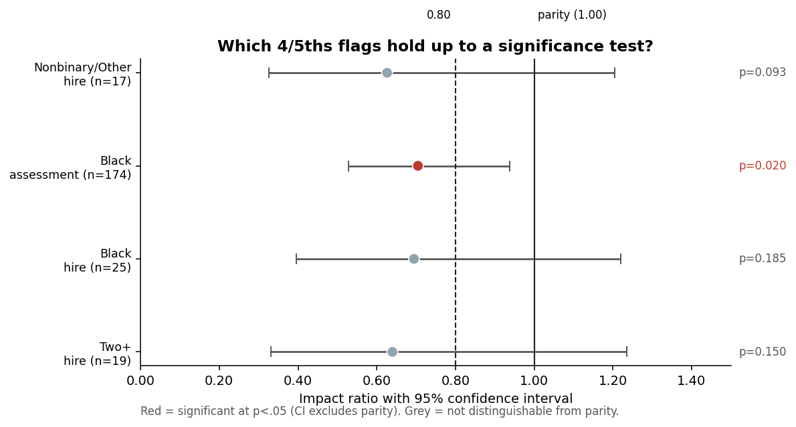

# Hiring & Selection Pipeline Analytics — Summary

**Author:** Mintay Misgano, PhD

## The problem

Hiring runs candidates through a series of gates — application, recruiter screen, assessment, interview, offer, hire — and every gate removes people. Leaders need to know two things at once: where the pipeline loses the most candidates, and whether different demographic groups are clearing those gates at similar rates. This project builds the full workflow to answer both, using a synthetic candidate pipeline (no real candidate data) and a relational schema, SQL metrics, and an adverse-impact fairness screen.

## What the analysis found

**Two early gates do almost all the filtering.** Of 5,000 applicants, 434 are hired — an 8.7% overall yield. The drop is not spread evenly: only 47% of screened candidates advance past the assessment, and only 45% of those advance past the interview. The later gates are far more permissive (63% of interviewees get offers, 64% of offers convert to hires). So the assessment and interview stages, not the offer or hire stages, are where the pipeline gets narrow.

**The fairness screen points at the same gate.** Using the 4/5ths rule — a standard check that flags any group passing a stage at less than 80% of the top group's rate — most stages came back clean, with groups advancing at similar rates. The rule raised four flags in total, but a follow-up significance test shows that only one holds up. At the **assessment** stage, Black candidates passed at 35.6% versus 50.6% for the top group (an impact ratio of **0.70**), and a statistical test confirms that gap is unlikely to be chance (*p* = 0.02). The other three flags — all at the hire stage, each on fewer than 30 candidates — are too small to distinguish from normal variation, so they are logged to re-check later, not acted on.

The assessment flag is the one to act on: it is statistically reliable, it sits on a large group (174 candidates), and it lands on the gate that already filters the most people.

## What to do about it

The assessment gate is both the heaviest filter and the only reliable fairness flag, so it is the priority. The recommended next steps are to document the assessment's job-relatedness and the basis for its cut score before changing any decisions, test whether a defensible alternative cut score narrows the gap, and set a minimum-sample rule (for example, n ≥ 30) so the small hire-stage flags are not mistaken for established differences.

The screen is a review trigger, not a verdict: a flag means "look closer here," and the look-closer steps — validity evidence, cut-score sensitivity, sample-size guardrails — are spelled out in the full report.

## Where to look

- **`02_Project_Report.md`** — full method definitions, the complete adverse-impact screen, figure walkthroughs, and references.
- **`docs/Results_Snapshot.md`** — the generated funnel and adverse-impact tables.
- **`03_Analysis_Notebook.ipynb`** — the executed, narrated workflow.
