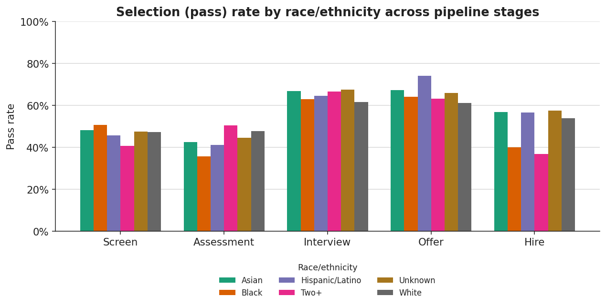
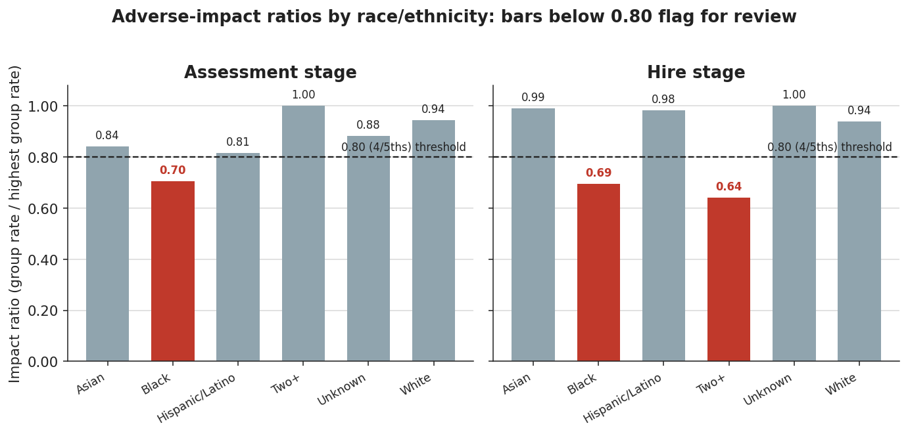
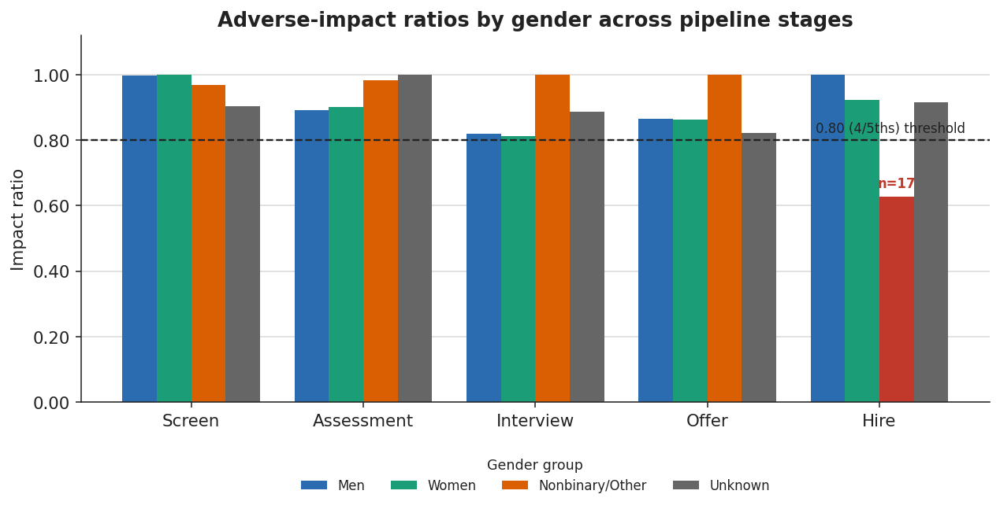

# Hiring & Selection Pipeline Analytics — Project Report

**Author:** Mintay Misgano, PhD

## Problem and questions

Organizations run candidates through a sequence of selection gates — application, recruiter screen, assessment, interview, offer, and hire — and each gate removes people. Two questions follow from that structure, and they have to be answered together. First, an efficiency question: where does the pipeline lose the most candidates, and are those losses where the process intends them to be? Second, a fairness question: do candidates from different demographic groups advance through those gates at similar rates, or does a particular stage thin one group faster than others? A selection system can look efficient in aggregate while producing uneven advancement underneath, so the funnel and the subgroup analysis are not separate reports — they are the same report read at two levels of resolution.

This case study builds the full analytic workflow end to end on a synthetic candidate pipeline: a relational schema, SQL extraction of funnel and subgroup metrics, an adverse-impact screen against the 4/5ths rule, and decision-ready documentation. The dataset is synthetic and was generated for this project; it contains no real candidate records (see *Data and privacy*). The synthetic generator deliberately seeds small subgroup differences so the screening and interpretation logic has something to detect — the point of the project is the workflow and the judgment around it, not an empirical claim about any real employer.

Three questions drive the analysis:

1. **Funnel.** Where do candidates leave the pipeline, and what are the stage-to-stage conversion rates?
2. **Subgroup advancement.** Do selection (pass) rates differ across race/ethnicity and gender groups at each stage?
3. **Adverse-impact screen.** Do any subgroup differences fall below the 4/5ths (80%) threshold that conventionally triggers deeper review, and how should those flags be qualified?

## Data and privacy

All data in `data/` is **synthetic**, produced by `data/generate_data.py` with a fixed random seed so the pipeline is fully reproducible. No proprietary hiring data, no real candidate records, and no organization's actual selection outcomes are used anywhere in the project. The demographic fields (`gender_group`, `race_ethnicity_group`) exist only so the fairness-screening logic can be demonstrated; their distributions are generator parameters, not measurements of a real applicant pool.

The relational model has four tables. `candidates` holds one row per candidate with requisition, job family, location, source channel, application date, and the two synthetic demographic grouping fields. `pipeline_events` is an event-level table — one row per candidate per stage — carrying a `stage_outcome` of `pass`, `fail`, or `withdrawn`, which is the grain the funnel and subgroup metrics are computed from. `assessments` carries a work-sample-style score and pass flag. `outcomes` holds synthetic early-tenure retention and performance fields, included to show where post-hire validation evidence would attach but not analyzed here. Modeling the pipeline as a stage-events table rather than a set of wide per-stage columns is a deliberate choice: events extend cleanly to new stages, support late-arriving and withdrawn records without schema changes, and let every metric be expressed as an aggregation over the same table.

## Methods

### Funnel and stage-to-stage conversion

The funnel counts distinct candidates present at each stage, and the **stage-to-stage conversion rate** is the count at a stage divided by the count at the immediately preceding stage. Conversion rate is the natural unit for a sequential process because it isolates the gate: a 45% assessment-to-interview conversion describes that one transition, independent of how large the top of the funnel was. The alternative — reporting only cumulative yield (hires ÷ applicants) — compresses six different gates into a single number and hides which gate is doing the filtering, so it is reported once for context but not used to localize loss.

### Selection ratio (subgroup pass rate)

For each stage, the **selection ratio** for a group is the number of candidates from that group who pass the stage divided by the number who reached it. In the selection literature this is the group's *pass rate* or *selection rate*, and it is the quantity the 4/5ths rule operates on (Cascio & Aguinis, 2019). Computing it per stage rather than only end-to-end matters because a group can advance at parity through five gates and diverge at one; an end-to-end rate would average that signal away. Pass rates are computed separately by `race_ethnicity_group` and by `gender_group` so each protected dimension is screened on its own.

### Adverse-impact screen and the 4/5ths rule

The **adverse-impact ratio** compares a focal group's selection ratio to the highest selection ratio observed among the comparison groups at the same stage. The **4/5ths (80%) rule**, codified in the *Uniform Guidelines on Employee Selection Procedures* (Equal Employment Opportunity Commission et al., 1978), states that a selection rate for any group that is less than four-fifths (80%) of the rate for the group with the highest rate is generally regarded by enforcement agencies as evidence of adverse impact warranting further scrutiny. Concretely, if the highest-passing group at a stage clears 50% and a focal group clears 35%, the ratio is 0.70, which is below 0.80 and flags.

Two design decisions are worth stating. First, the comparison baseline here is the **maximum** observed group rate at the stage, which is the strictest reading of the rule and the one most likely to surface a flag for review; some practitioners instead benchmark against the majority or the total-applicant rate, which is more lenient (Biddle, 2006). The maximum baseline was chosen because the goal of a *screen* is sensitivity — it should over-include candidates for review rather than miss them. Second, the 4/5ths rule is a practical rule of thumb, not a statistical test. It does not account for sample size, so with small subgroup counts the ratio is unstable and can flag on a handful of candidates; significance tests and confidence intervals for the impact ratio (Morris & Lobsenz, 2000) and simulation work on the rule's behavior (Roth et al., 2006) both caution that ratios from small cells should not be read as findings. That caution is applied directly in the results below.

The screen is explicitly **not** a legal conclusion or a validation study. Following professional standards (Society for Industrial and Organizational Psychology, 2018), a flag is a trigger for review — minimum-sample-size rules, job-relatedness and validity evidence, cut-score sensitivity analysis, and assessment-design review — not a determination that a stage is unlawful or invalid.

### Statistical inference for the flags

Because the 4/5ths rule is a point comparison that ignores sample size, each flag is followed with two inferential checks that ask whether the observed gap is larger than sampling noise. The first is a **two-proportion z-test**, which tests the null hypothesis that the focal group and the comparison group (the stage's highest-passing group) share one underlying pass rate; the test pools the two samples to estimate that common rate, forms a standard error from it, and returns a z-statistic and a two-sided p-value (Agresti, 2018). The second is a **95% confidence interval on the impact ratio**, computed on the log scale in the manner of a relative-risk interval (Morris & Lobsenz, 2000): it gives the range of impact-ratio values consistent with the data, and — decisively — whether that range includes 1.00 (parity). A flag whose interval sits entirely below 1.00 reflects a difference distinguishable from parity at 95% confidence; a flag whose interval straddles 1.00 does not.

The two-proportion z-test was chosen over a chi-square test of independence (which is algebraically equivalent here for a 2×2 comparison but does not give a signed direction) and over Fisher's exact test (more appropriate when expected cell counts are very small). For the assessment-stage cells the normal approximation is sound; for the small hire-stage cells the z-test and the wide confidence interval already converge on the same conclusion — *not distinguishable from parity* — so an exact test would not change the decision, though it is the natural next refinement noted in the limitations.

### Metric definitions

These are the quantities that appear in the results tables and figures; each is defined here before it is used.

| Metric | Definition | Range | How to read it |
|---|---|---|---|
| **Stage count** | Distinct candidates present at a stage | 0 to top-of-funnel size | Absolute volume surviving to the stage |
| **Stage-to-stage conversion rate** | Stage count ÷ prior-stage count | 0 to 1 | Share of the prior stage that advanced; lower = a stronger filter at that gate |
| **Selection ratio (pass rate)** | Group passes ÷ group candidates at the stage | 0 to 1 | The group's chance of clearing that gate |
| **Adverse-impact ratio** | Group selection ratio ÷ highest group selection ratio at the stage | 0 to ~1 | 1.00 = parity with the top group; **< 0.80 flags** under the 4/5ths rule |
| **Minimum-n caveat** | Subgroup candidate count at the stage | count | Ratios from cells below a practical threshold (often n ≈ 30) are unstable and read as provisional |
| **Two-proportion z-test (z, p)** | Test that focal and comparison groups share one pass rate | z: any real; p: 0–1 | Larger \|z\| and **p < .05** indicate the gap is unlikely under chance |
| **95% CI on the impact ratio** | Range of impact-ratio values consistent with the data | lower–upper around the ratio | If the **upper bound < 1.00**, the gap is distinguishable from parity; if it spans 1.00, it is not |

## Results

### The funnel concentrates its loss in two early gates


The funnel runs from 5,000 applicants to 434 hires, an overall yield of 8.7%. Reading the conversion labels between bars locates where that attrition happens. Every applicant receives a recruiter screen (5,000 → 5,000), but only **47%** of screened candidates advance to assessment (5,000 → 2,363) and only **45%** of those advance to interview (2,363 → 1,070). The two later gates are far more permissive: 63% of interviewed candidates receive offers (1,070 → 678) and 64% of those convert to hires (678 → 434). The takeaway is that the assessment and the post-assessment interview gate together account for the large majority of the pipeline's filtering — roughly four of every five candidates who are screened are gone by the time interviews finish. For an efficiency review this is where cycle-time and pass-through questions belong; for a fairness review it is also the first place to look, because the stage that filters the most candidates is the stage where a subgroup difference does the most damage.

### Subgroup pass rates track together at most gates, and separate at assessment



Reading the figure stage by stage, the groups move together at the screen, interview, and offer gates — the bars within each of those clusters sit in a tight band, with no group dramatically above or below the others. The assessment cluster is the visible exception. There, the **Black** group passes at **35.6%** while the highest group (Two+) passes at **50.6%** and White passes at **47.8%** — a gap of roughly 12 to 15 percentage points that is wider than the spread at any other early gate. The hire cluster also shows a dip for the Black (40.0%) and Two+ (36.8%) groups relative to Unknown (57.6%) and Asian (56.9%), but that cluster rests on far smaller candidate counts and is read with caution below. The pattern to carry forward is that the assessment gate is both the heaviest filter in the funnel *and* the stage with the widest subgroup spread — the two analyses point at the same gate.

### The adverse-impact screen flags assessment robustly and hire provisionally



The impact-ratio view normalizes each group against the top group at the stage and draws the 0.80 line so flags are unambiguous. At the **assessment** stage, the Black group's ratio is **0.70** (n = 174), clearly below the dashed threshold, while every other group sits at or above 0.81. This is the screen's most defensible flag: the cell is large enough that the ratio is stable, and it lands on the gate that the funnel already identified as the pipeline's main filter. At the **hire** stage, two bars fall below the line — Black at **0.69** (n = 25) and Two+ at **0.64** (n = 19) — and a separate run of the gender dimension flags Nonbinary/Other at 0.63 (n = 17). These three hire-stage flags share a weakness: each rests on fewer than 30 candidates, the range where the 4/5ths ratio is known to be unstable (Roth et al., 2006), so a small number of different outcomes would move them across the line. They are recorded as provisional review items, not findings.

Screening the **gender** dimension separately tells a calmer story. Across the screen, assessment, interview, and offer gates every gender group sits at or above 0.80, and the only flag is Nonbinary/Other at the hire stage (impact ratio 0.63) — a single cell of 17 candidates.



Reading across the gender figure, the Men, Women, and Unknown bars hold a tight band near and above the threshold at every stage; the one red bar (Nonbinary/Other at hire) is the lone exception and is annotated with its sample size precisely because n = 17 is too small to carry weight on its own. The complete screen across all stages and both demographic dimensions appears in `docs/Results_Snapshot.md`; the screen, interview, and offer stages produced no flags on either dimension.

### Only the assessment flag survives a significance test

The 4/5ths rule produced four flags, but it cannot say which reflect a real difference and which are small-sample noise. Adding a two-proportion z-test and a 95% confidence interval to each flag resolves that directly.


The figure is a forest plot: each flagged cell is a point estimate of the impact ratio with its 95% interval, against the 0.80 screening line and the 1.00 parity line. Reading it top to bottom, three of the four intervals **cross 1.00** — Nonbinary/Other at hire (ratio 0.63, 95% CI [0.33, 1.21], *z* = −1.68, *p* = .093), Black at hire (0.69, [0.40, 1.22], *p* = .185), and Two+ at hire (0.64, [0.33, 1.24], *p* = .150). Each of those flags rests on fewer than 30 candidates, the interval is wide enough to include parity, and none reaches significance, so they are *not distinguishable from parity* on this data. Only the **assessment-stage Black** cell stands apart: ratio 0.70, 95% CI [0.53, 0.94], *z* = −2.33, *p* = .020. Its interval lies entirely below 1.00 and its p-value clears the .05 threshold, so it is the one flag the evidence supports as a real gap rather than a sampling artifact — and it sits on the heaviest-filtering gate. This is the analytic payoff of pairing the rule of thumb with inference: it separates the one flag worth acting on from the three worth only re-measuring.

## Interpretation and recommendations

The funnel and the fairness screen converge on one gate. The assessment stage filters the largest share of the pipeline (a 47% pass-through that removes more than half of screened candidates) and is also the only early gate where a subgroup falls below the 4/5ths threshold on a sample large enough to trust — and the only flag of the four that survives a significance test (Black candidates, impact ratio 0.70, 95% CI [0.53, 0.94], *p* = .020). That convergence is what makes the assessment stage the priority, and it motivates the following actions:

1. **Treat the assessment-stage flag as the lead review item, not the hire-stage flags.** The recommendation follows from the evidence: the assessment flag rests on n = 174, the heaviest filtering gate, and a confidence interval that excludes parity, whereas the three hire-stage flags (Black n = 25, Two+ n = 19, Nonbinary/Other n = 17) all carry intervals spanning 1.00 and p-values above .09 — not distinguishable from parity. Resolve the assessment gate first; hold the hire-stage flags for re-measurement once more candidates accumulate.
2. **Assemble job-relatedness and validity evidence for the assessment.** A flagged selection procedure is defensible when it is demonstrably job-related (Society for Industrial and Organizational Psychology, 2018). The action that follows from a flag at assessment is to document what the assessment measures, its link to job performance, and the basis for its cut score — before changing any decisions.
3. **Run a cut-score sensitivity analysis at assessment.** Because the gap is at a scored gate, recompute subgroup pass rates and impact ratios across a range of plausible cut scores to test whether a defensible alternative threshold narrows the gap without sacrificing job-relatedness.
4. **Add minimum-n guardrails before any stage is acted on.** Adopt an explicit reporting threshold (for example, suppress or mark ratios for cells with n < 30) so provisional small-sample flags like the hire-stage ones are never mistaken for established differences.

Each recommendation names the result that motivates it and the population it applies to; none is a generic best practice detached from the evidence above.

## Limitations

The dataset is synthetic, so the substantive content of these flags is illustrative — the value of the project is the workflow, the screening logic, and the documentation discipline, not a generalizable empirical claim. The 4/5ths rule is a screening heuristic rather than a statistical test, which is why each flag here is paired with a two-proportion z-test and a confidence interval (Agresti, 2018; Morris & Lobsenz, 2000); for the small hire-stage cells, Fisher's exact test would be a more exact next step, though it reaches the same not-distinguishable-from-parity conclusion the wide intervals already show. The screen also considers one stage and one demographic dimension at a time and does not model intersectional groups or adjust for legitimate, job-related covariates such as requisition or role family, both of which a production analysis would add. Finally, withdrawals are present in the event data but are treated here as non-passes; a production workflow would separate voluntary withdrawal from rejection, since the two carry different meaning for both efficiency and fairness.

## Reproduce

```bash
python3 analysis/run_analysis.py       # builds the SQLite DB, runs the SQL, writes analysis/outputs/ + docs/Results_Snapshot.md
python3 analysis/make_figures.py       # renders the funnel, subgroup, and adverse-impact figures into docs/figures/
python3 analysis/inferential_tests.py  # z-tests + impact-ratio CIs; writes impact_inference.csv + the CI figure
```

## References

Agresti, A. (2018). *Statistical methods for the social sciences* (5th ed.). Pearson.

Biddle, D. (2006). *Adverse impact and test validation: A practitioner's guide to valid and defensible employment testing* (2nd ed.). Gower.

Cascio, W. F., & Aguinis, H. (2019). *Applied psychology in human resource management* (8th ed.). Pearson.

Equal Employment Opportunity Commission, Civil Service Commission, Department of Labor, & Department of Justice. (1978). Uniform guidelines on employee selection procedures. *Federal Register, 43*(166), 38290–38315.

Morris, S. B., & Lobsenz, R. E. (2000). Significance tests and confidence intervals for the adverse impact ratio. *Personnel Psychology, 53*(1), 89–111. https://doi.org/10.1111/j.1744-6570.2000.tb00195.x

Roth, P. L., Bobko, P., & Switzer, F. S. (2006). Modeling the behavior of the 4/5ths rule for determining adverse impact: Reasons for caution. *Journal of Applied Psychology, 91*(3), 507–522. https://doi.org/10.1037/0021-9010.91.3.507

Society for Industrial and Organizational Psychology. (2018). *Principles for the validation and use of personnel selection procedures* (5th ed.). https://doi.org/10.1017/iop.2018.195
