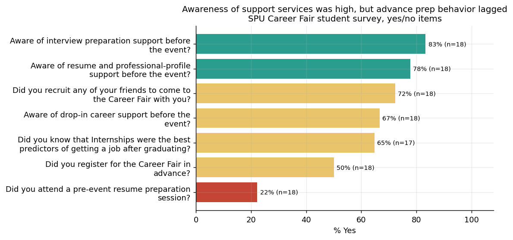

# Career Fair Program Analytics — Summary

**Author:** Mintay Misgano, PhD

## The problem

A university had just run its annual career fair and needed to decide where to invest for next year. The planning team had three data sources that had never been looked at together: employer registration records, a post-event student survey, and a post-event employer survey. The question was simple — *was this a good event, and what's the single highest-value thing to fix?* — but it required turning three messy exports into one clear picture.

## What I did

I combined the registration records with both surveys and summarized each survey question two ways: the share of people who agreed or strongly agreed with it (the "% favorable" rate), and the average 1-to-5 rating. That makes every item directly comparable, so the strongest and weakest parts of the event rise to the top immediately. To protect respondents, the published data is aggregated — no individual responses appear, only the per-question totals (17–20 people answered each item).

## What I found

**The event ran beautifully but didn't deliver enough candidates.** Employers loved the experience — 90% rated the atmosphere positively and 89% praised the registration process — but only **45% felt they met enough qualified candidates** and **42% felt student turnout matched the school's size**. So the weak spot isn't operations; it's candidate supply and quality.

**Students enjoyed the fair but weren't prepared for it.** Students rated nearly everything positively (83% called it a valuable use of time), but the lowest-scoring student item was their own readiness — only **44% felt well-prepared** to talk to employers, and just **22% had attended a pre-event resume session** even though 83% knew interview support existed. Awareness was high; the prep behavior didn't follow.

## What I recommend

1. **Grow prepared-candidate volume, not the event itself.** Because employers scored turnout (42%) and qualified-candidate volume (45%) lowest while rating logistics 80–90%, the next cycle should push attendance through the channels that already work — email and the career-services newsletter drove most awareness — rather than redesigning a well-run event.
2. **Close the preparedness gap with a required-feeling prep step.** Since students were aware of support (78–83%) but only 22% used it, a short, default-on "how to talk to employers" module promoted earlier in the cycle directly targets the 44% preparedness score and the employer concern that students weren't ready (55%).
3. **Fix the small ergonomics irritant.** The bistro-table setup was the only logistics item employers disliked (37% favorable, and just 26% preferred it to standard tables), so switching back to standard tables is a cheap, evidence-backed win.

*Descriptive evaluation of a single event; respondent counts are small (17–20 per item), so treat these as direction-setting signals for planning rather than precise population estimates.*
