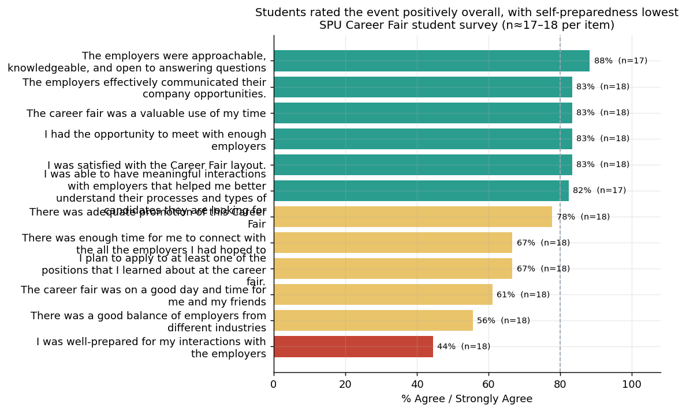
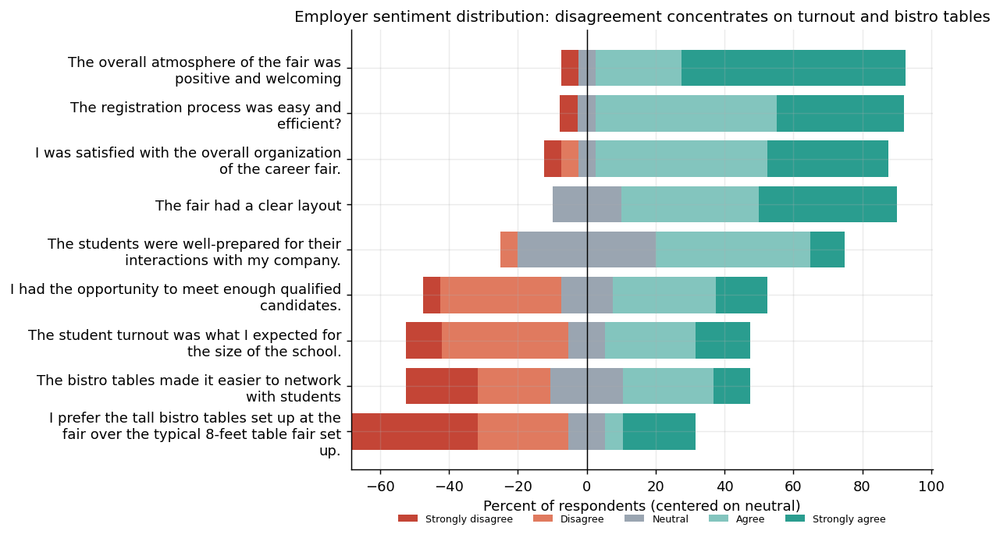
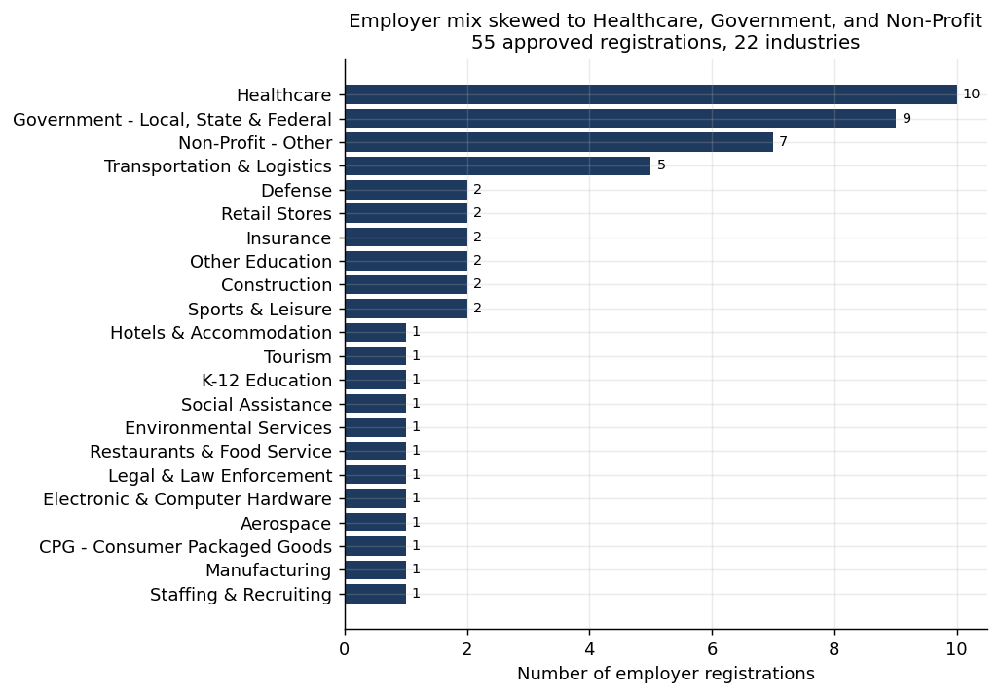

# Career Fair Program Analytics — Project Report

### Evaluating a University Career Fair from Registration Records and Stakeholder Surveys

- **Author:** Mintay Misgano, PhD
- **Tools:** Python (pandas, matplotlib)
- **Data:** Aggregated SPU Career Fair registration records and post-event student/employer surveys

> **Data and privacy note:** This is a real program evaluation of the SPU Career Fair. The original inputs (employer registration export, student survey, employer survey) contained contact fields and row-level responses and are not published. Every table in `data/` is an aggregate summary — per-question counts, favorable rates, and frequency distributions — so no individual respondent can be identified. All results below are computed on those aggregated tables (17–20 respondents per survey item; 55 employer registrations).

---

## Abstract

This project evaluates a single university career fair by integrating three previously siloed data sources — employer registration records, a post-event student survey, and a post-event employer survey — into one decision-ready assessment. Survey items were summarized using the percentage of favorable responses and the mean 1-to-5 Likert score; registration records were summarized as frequency distributions of industry, employment type, and target student year. The evaluation found a sharp divergence in employer sentiment: logistics and atmosphere were rated 80–90% favorable, but meeting enough qualified candidates (45%) and student turnout (42%) were rated lowest. Students rated the event positively overall (83% favorable on overall value) but rated their own preparedness lowest (44%), with only 22% having attended a pre-event resume session despite 83% being aware such support existed. The strongest evidence-backed lever for the next cycle is therefore prepared-candidate supply, not event operations.

---

## 1. Program and evaluation question

A university career services team runs an annual career fair that connects students and alumni with employers. After the event, the team holds registration records and two voluntary feedback surveys, but had never analyzed them together. The evaluation was commissioned to answer a planning question rather than a research question: given finite staff time before the next cycle, *where is the highest-value improvement?*

This is a program evaluation, which Rossi et al. (2019) define as the systematic application of social-research methods to assess how a program is designed, implemented, and experienced, in order to inform decisions about it. The orientation here is **formative** — the goal is to improve the next instance of the program, not to render a final summative verdict — so the analysis prioritizes interpretable, stakeholder-facing signals over inferential modeling.

The evaluation supports four concrete questions:

1. What did participation look like (how many employers and representatives, and what mix)?
2. Which industries and opportunity types were represented?
3. How did students and employers rate the experience?
4. What does the feedback imply for the next cycle?

---

## 2. Data and methods

### 2.1 Data sources

Three exports were aggregated into the published tables: an **employer registration record** (55 approved registrations, 106 total representatives), a **student experience survey** (≈17–18 responses per item), and an **employer experience survey** (≈19–20 responses per item). Registration contact fields and all free-text comments were removed before aggregation; only counts and distributions are published.

### 2.2 How the surveys were summarized

Both surveys use **Likert items** — statements rated on an ordered agreement scale (Strongly disagree → Strongly agree). The Likert format, introduced by Likert (1932), assigns ordered response categories that are conventionally scored 1–5 for summary purposes. Two complementary summaries were computed for every item, following standard practice for ordinal survey data (Boone & Boone, 2012):

- The **favorable rate** (% Agree or Strongly Agree), a "top-box" summary that collapses the two positive categories into a single, stakeholder-friendly percentage. Top-box scoring is widely used in experience measurement because it is interpretable without statistical training and is robust to how respondents use the middle of the scale (Sauro & Lewis, 2016).
- The **mean Likert score (1–5)**, which retains information about the full distribution and distinguishes between items that are merely "not favorable" and items that are actively negative.

Reporting both guards against the known weakness of each: a favorable rate hides whether the remainder is neutral or hostile, while a mean can mask polarization. Where the two diverge, the full response distribution is inspected directly (Section 3.3).

**Yes/No items** were summarized as **% Yes**, and **multi-value registration fields** (employment types, job types, target school years) were split on their delimiter and summarized as frequency tables with shares.

### 2.3 Why descriptive summaries, and what else could have been used

The analysis is deliberately descriptive. Three richer alternatives were considered and set aside for specific reasons:

- **Inferential significance testing** (e.g., chi-square or t-tests comparing items or groups) would impose a hypothesis-testing frame that the data cannot support: with 17–20 respondents per item and a voluntary, self-selected sample, p-values would be underpowered and misleading, and the planning question does not require them (Fowler, 2014). Reporting favorable rates with their response counts is more honest about what the data can bear.
- **A composite satisfaction index** (averaging items into one score) would be more compact but would erase exactly the divergence that matters here — the gap between logistics and candidate value — so item-level reporting was retained.
- **Driver analysis / regression of overall satisfaction on item ratings** would identify which items most predict overall sentiment, but requires respondent-level data, which is intentionally not published, and a larger sample for stable coefficients. It is noted as a future extension if respondent-level data and multiple event cycles become available.

### 2.4 Metric definitions

| Metric | What it measures | Range | What a "good" value looks like |
|---|---|---|---|
| **Favorable rate (% Agree/Strongly Agree)** | Share of respondents choosing the top two agreement categories | 0–100% | In event/experience surveys, ≥80% favorable is a common benchmark for "clearly working"; <50% signals a real problem area (Sauro & Lewis, 2016) |
| **Mean Likert score** | Average of 1–5 coded responses for an item | 1.0–5.0 | ≥4.0 is strong; ~3.0 is neutral/mixed; <3.0 indicates net disagreement (Allen & Seaman, 2007) |
| **% Yes** | Share of Yes responses on a binary item | 0–100% | Interpreted relative to intent: high awareness (≥75%) is expected; behavior items are judged against the awareness they should produce |
| **Share (%)** | Proportion of a categorical/multi-value field in one category | 0–100% | Interpreted as mix/representation, not quality |

These thresholds are interpretive conventions, not pass/fail rules; they orient the reader to what each number implies before the results appear.

---

## 3. Results

### 3.1 Employer experience: strong logistics, weak candidate value

**What to inspect:** the vertical ordering and the color break. **What is visible:** the top four items — atmosphere (90%, mean 4.45), registration process (89%, 4.16), overall organization (85%, 4.05), and clear layout (80%, 4.20) — all clear the 80% favorable benchmark, while the bottom four collapse: student preparedness as seen by employers (55%, 3.60), meeting enough qualified candidates (45%, 3.15), expected student turnout (42%, 3.00), and the bistro-table setup (37%, 2.84). **Why it matters:** the favorable rate falls 25 percentage points from "clear layout" (80%) to "qualified candidates" (45%) with nothing in between, which means employer dissatisfaction is not diffuse — it is concentrated entirely on candidate supply/quality and one furniture decision, not on how the event was run. That rules out an operations redesign as the priority.

### 3.2 Student experience: positive overall, weakest on self-preparedness

**What to inspect:** which items sit at the top versus the bottom. **What is visible:** students rated employer approachability highest (88%, mean 4.35) and rated the fair a valuable use of time (83%, 4.22), satisfactory layout (83%, 4.06), and effective employer communication (83%, 4.28) strongly. The lowest items are application intent (67%, 3.78), good day/time (61%, 3.44), industry balance (56%, 3.61), and — lowest of all — "I was well-prepared for my interactions with employers" (44%, 3.50). **Why it matters:** the only student item that falls below 50% favorable is the one students control themselves, and it mirrors the employer view that students were under-prepared (55%). Two independent vantage points converging on the same gap is stronger evidence than either alone, and it locates the problem upstream of the event itself.

### 3.3 Employer sentiment distribution: where disagreement actually sits

**What to inspect:** how far each bar extends to the left of the neutral line. **What is visible:** the favorable items show almost no left-extension, whereas "qualified candidates" carries 8 of 20 in the disagree range, "expected turnout" 9 of 19, and "bistro tables made networking easier" 8 of 19. **Why it matters:** this confirms the low favorable rates in 3.1 are driven by genuine disagreement, not by respondents parking in the neutral category — so the mean scores near 3.0 reflect real polarization. It distinguishes an item that is *quietly unremarkable* from one that is *actively disliked*, and the bistro-table item is the clearest case of the latter (only 26% preferred it to standard tables).

### 3.4 Participation mix

**What to inspect:** the long bars at the top. **What is visible:** Healthcare (10), Government — Local/State/Federal (9), and Non-Profit – Other (7) together make up 26 of 55 registrations (47%), with Transportation & Logistics (5) next; the remaining 18 industries appear once or twice each. Opportunity types skew toward full positions (Job 60%, Internship 22%) and full-time work (Full-Time 58%, Part-Time 42%), and the target-student mix is led by Seniors (27) and Juniors (25). **Why it matters:** the employer pool is concentrated in service and public-sector fields recruiting mainly graduating students for full-time roles. That context sharpens the turnout finding — these employers came to hire soon-to-graduate candidates, so under-supply of prepared seniors is a direct mismatch with who registered, not a generic "more students" problem.

### 3.5 Awareness versus preparation behavior

**What to inspect:** the gap between awareness items and the single behavior item. **What is visible:** students were broadly aware of support — interview prep (83% Yes), resume/profile support (78%), drop-in support (67%) — yet only 22% attended a pre-event resume session and only 50% registered in advance. **Why it matters:** the preparedness gap in 3.2 is not an awareness failure, it is a conversion failure: students knew help existed and did not take it. That is a more tractable problem (lower the friction / raise the default) than building awareness from scratch, and it points to a specific intervention rather than a communications campaign.

---

## 4. Key findings

The event is operationally strong and experientially positive, but it under-delivers prepared candidates to the employers who registered. Three findings carry the most evidential weight: (1) employer dissatisfaction is concentrated on candidate volume/quality (45% and 42% favorable) rather than logistics (80–90%); (2) students and employers independently identify student preparedness as the weakest point (44% student self-rating; 55% employer rating); and (3) the preparedness gap is a conversion problem — awareness of support is high (78–83%) but uptake is low (22% attended a resume session).

---

## 5. Recommendations

1. **Grow prepared-candidate volume through the channels that already work.** *Motivating result:* employers rated turnout (42%) and qualified-candidate volume (45%) lowest while rating logistics 80–90%, and email (50% of awareness) plus the career-services newsletter (28%) drove most student awareness. *Action and population:* concentrate next-cycle outreach on email and newsletter targeting of seniors and juniors (who already dominate the attendee mix) rather than redesigning a well-run event. *Why it follows:* the weak dimension is supply, and the highest-yield acquisition channels are already identified in the data.

2. **Convert existing awareness into preparation with a low-friction, default-on prep step.** *Motivating result:* student preparedness was the lowest student item (44%) and was echoed by employers (55%), yet only 22% attended a resume session despite 83% knowing support existed. *Action and population:* embed a short "how to talk to employers" micro-module into the registration flow for all student registrants and surface it earlier in the cycle. *Why it follows:* the bottleneck is uptake, not awareness, so reducing the effort to prepare attacks the measured gap directly.

3. **Revert the bistro-table layout to standard tables.** *Motivating result:* the bistro-table items were the only logistics items below 50% favorable (37% "easier to network," 26% "prefer over standard tables"), with disagreement concentrated rather than neutral (Section 3.3). *Action and population:* use standard 8-foot tables at the next fair. *Why it follows:* this is the one operational element the data flags as actively disliked, and it is the cheapest of the three changes to make.

---

## 6. Limitations

Respondent counts are small (17–20 per survey item) and the surveys are voluntary, so results indicate direction rather than precise population values and may reflect self-selection by more engaged participants (Fowler, 2014). The student check-in count was not captured in the registration export (recorded as 0), so attendance is inferred from registrations and survey volume rather than measured directly. Free-text feedback was excluded from the published data, removing some diagnostic nuance. Finally, the evaluation is descriptive and single-cycle: it is not linked to downstream application or hire outcomes, so it supports next-cycle planning rather than ROI estimation or causal claims.

---

## References

Allen, I. E., & Seaman, C. A. (2007). Likert scales and data analyses. *Quality Progress, 40*(7), 64–65.

Boone, H. N., & Boone, D. A. (2012). Analyzing Likert data. *Journal of Extension, 50*(2), Article 48.

Fowler, F. J. (2014). *Survey research methods* (5th ed.). SAGE Publications.

Likert, R. (1932). A technique for the measurement of attitudes. *Archives of Psychology, 22*(140), 5–55.

Rossi, P. H., Lipsey, M. W., & Henry, G. T. (2019). *Evaluation: A systematic approach* (8th ed.). SAGE Publications.

Sauro, J., & Lewis, J. R. (2016). *Quantifying the user experience: Practical statistics for user research* (2nd ed.). Morgan Kaufmann.
