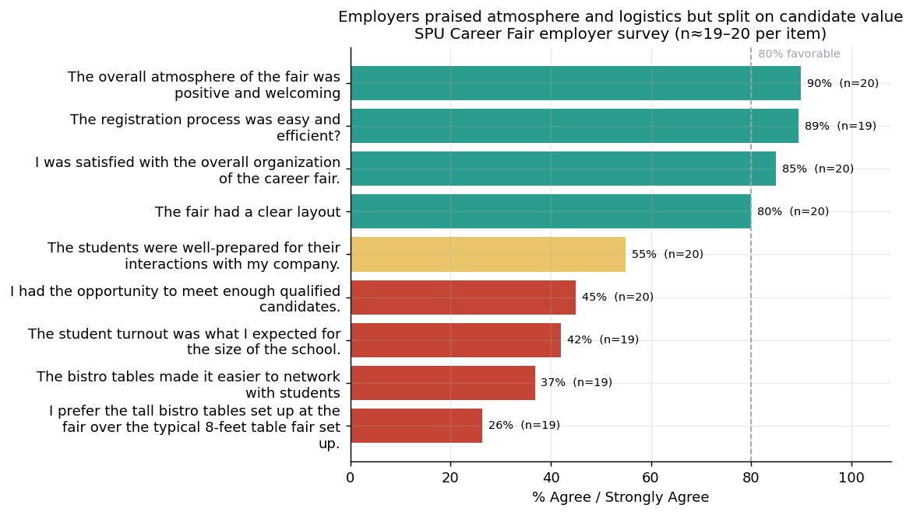

# Career Fair Program Analytics

**Author:** Mintay Misgano, PhD · **Tools:** Python (pandas, matplotlib), survey + registration data, markdown reporting

A university career services team had run its annual career fair and wanted to know one thing before planning the next cycle: *what actually worked, and where should we put our limited effort to improve it?* This project answers that question by combining employer registration records with post-event student and employer surveys into a single, decision-ready read of the event.

> **About the data:** This is a real program evaluation of the SPU Career Fair. To protect respondents, no person-level records are published here — the repository contains only aggregated counts and item-level survey summaries (17–20 responses per question). All analysis below is performed on those aggregated tables.

## What the evaluation found

The event was a logistical success but a candidate-market disappointment for employers. Employers rated the **atmosphere (90% favorable)** and **registration process (89%)** highly, yet only **45% agreed they met enough qualified candidates** and just **42% felt student turnout matched the school's size**. Students rated the fair positively across the board (83% called it a valuable use of time) but were least confident in **their own preparedness (44%)** — and only **22% had attended a pre-event resume session**. The pattern is consistent: the program runs well, but it is under-supplying prepared candidates to a healthcare-, government-, and non-profit-heavy employer pool.

## Where to go next

- **[01_Project_Summary.md](01_Project_Summary.md)** — a 3-minute, plain-language read of the findings and recommendations, for a recruiter or program lead.
- **[02_Project_Report.md](02_Project_Report.md)** — the full write-up: metric definitions, methods, every figure with an evidence walkthrough, and recommendations traced back to specific results.
- **[03_Analysis_Notebook.ipynb](03_Analysis_Notebook.ipynb)** — the executed analysis that reads the aggregated tables and produces every figure.
- **[docs/](docs/)** — leader brief, metrics spec, and the results snapshot.

## Repository guide

| Path | Purpose |
|---|---|
| `01_Project_Summary.md` | Recruiter-facing overview (plain language, findings-first) |
| `02_Project_Report.md` | Full program-evaluation write-up with figures and references |
| `03_Analysis_Notebook.ipynb` | Executed analysis that builds the figures from `data/` |
| `data/` | Aggregated survey and registration summary tables (no person-level data) |
| `docs/` | Leader brief, metrics spec, results snapshot, and `figures/` |
| `analysis/build_public_data.py` | Script that aggregates the original private exports into the public tables |

## Limitations

Survey results describe respondents only (17–20 per item), so they indicate direction rather than precise population values, and the analysis is descriptive — it supports next-cycle planning, not causal or ROI claims, because the data are not yet linked to downstream application and hire outcomes.
